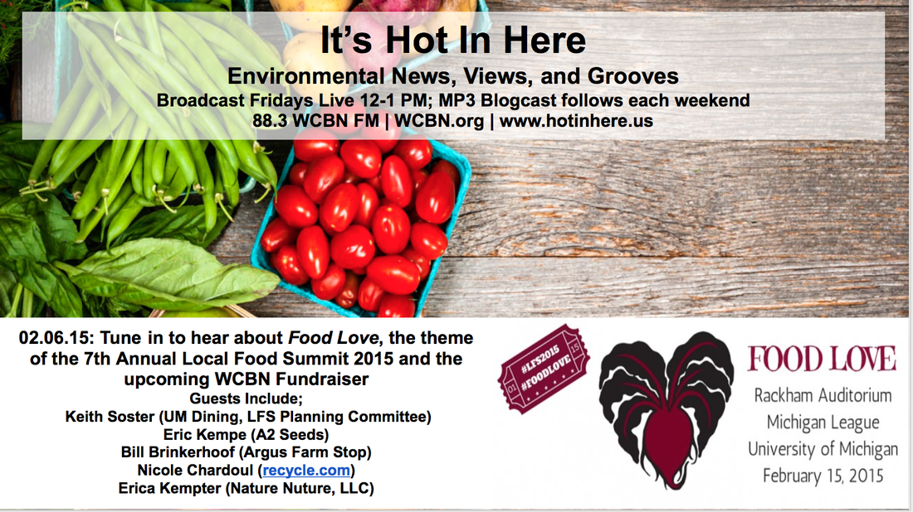
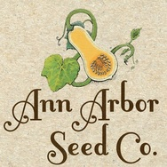
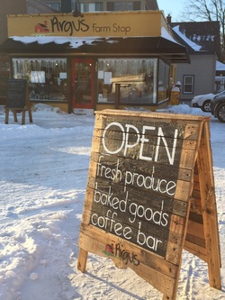
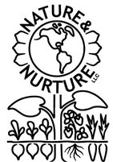
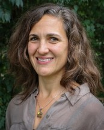
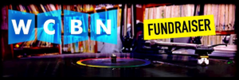

Oh how we love food! This week's show focused on **_Food Love_**, the theme of the [7th Annual Local Food Summit 2015](http://localfoodsummit.org) and the ongoing [WCBN Fundraiser](http://WCBN.org)! Our wonderful hosts, **Rebecca Baylor** and **Andrea Kraus** were joined by wonderful guests including **Keith Soster, Eric Kempe, Bill Brinkerhoff, and Nicole Chardoul!** 

<!--more-->

**Keith Soster** ([ksoster@umich.edu](mailto:ksoster@umich.edu)) is the director of Student Engagement for University Dining Services here at the University of Michigan, and the lead organizer of the Food Planning Committee for the Local Food Summit! **Keith** is heavily involved in the coordination of the Local Food Summit. He is hosting a session titled "A Valentine for the Local Vendor and helps people to learn about UM's unique local purchasing goals and brainstorming new, exciting strategies for local foods.

* * *

**Eric Kempe** ([eric@a2seeds.com](mailto:eric@a2seeds.com)) is the Co-founder of [Ann Arbor Seed Company](http://www.a2seeds.com), a local seed company founded in 2012. Ann Arbor Seeds is committed to bringing sustainable, small-scale, local agricultural principles to the business of saving and selling seeds. **Eric** is also involved in the Local Food Summit and will be hosting a breakout session called, "Local Seed Soulmates."

* * *

**Bill Brinkerhoff** is the owner of [Argus Farm Stop](http://www.argusfarmstop.com) (AFS), a direct-to-consumer market for local producers, local on W. Liberty and Second Street. Argus Farm Stop strives to provide a new way for local farmers and producers to reach their customers profitably. AFS connects over 70 local farmers directly to their consumers. AFS's Mantra is "_Our future is local."_

Fun Fact: Products are OWNED and PRICED by the producer (no brokers or intermediaries allowed) so customers know where their food comes from. This is a sharp contrast to the traditional system of food sales, as evidenced by the Food Chains film, which was screened at the Ross School of Business this past Thursday. At the Local Food Summit, Laura Barch and Scott Fleck from AFS will be hosting a breakout session all about AFS's first year of operations.

* * *

**Erica Kempter** is the Co-owner of [Nature Nurture LLC](http://www.natureandnurture.org), a small locally-owned organic gardening business. **Erica** was educated in Horticulture, Environmental Studies and Sustainable Agriculture. Erica and Nature Nurture strive to create environmentally sustainable and edible landscapes and gardens that enrich the quality of life of the Ann Arbor community. **Erica** will be hosting a breakout session on "Local Seed Soulmates" with **Eric** at the Local Food Summit.

* * *

**Nicole Chardoul** is from [recycle.com](http://recycle.com) and the [Washtenaw Food Policy Council](http://washtenawfoodpolicycouncil.wordpress.com). She wears many hats! **Nicole** has Master Gardener Advanced Certification and a Professional Engineer License. The mission of the WFPC is to have a healthy community and thriving local food system that provides easy access to healthy and culturally appropriate food for all residents of Washtenaw County. WFPC also promotes a food system that fosters economic development and a local economy within and around the local food system.

* * *

Event Date: Sunday, February 15, 2015 - 8:30am Location: Rackham Auditorium - Keynote, morning sessions / Michigan League - Breakfast, lunch, and afternoon sessions.[Registration is now open](http://www.localfoodsummit.org/) for the 7th Annual Local Food Summit. The theme this year is Food Love with Keynote Speaker Judy Wicks, founder of White Dog Cafe. To register and learn more about this event including the tentative agenda, how to submit your food stories for the story slam, and how to nominate your favorite organization for this year's Local Food Victories please visit their website: [http://www.localfoodsummit.org/](http://www.localfoodsummit.org/)

**Donate to WCBN!**WCBN's annual fundraiser is running until February 15. Your support during these ten days puts new music on the shelf and fixes broken turntables; we need you for our day to day. We ask now that you “resubscribe” to the free-form radio that you love. Please donate to keep us running, we cannot exist without your support. Give us a call or donate online, and keep listening. Call **(734) 763–3500** or [Donate Online](http://wcbn.org/donate)
