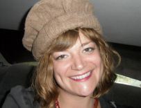

**_Happy Valentine's Day!_**  We had a wonderful celebration of love in the studio yesterday! Along with our regular hosts, **Pearl Zeng** ([zhuzeng@umich.edu](mailto:zhuzeng@umich.edu)), and **Rebecca Hardin** ([rdhardin@umich.edu](mailto:rdhardin@umich.edu)), our latest member of the team, **Bailey Schneider** ([baschn@umich.edu](mailto:baschn@umich.edu)), joined us in the studio. We celebrated Valentine's Day and shared our love with the Founders and family of IHIH, including **Jennifer Johnson**, **Hugh Stimson**, **Rachel Chatterdon Bair****.** We also discussed the ongoing fundraiser at [WCBN](http://wcbn.org).

<!--more-->

**Andrea Kraus** interviewed one of the show's founders, **Jennifer Johnson** ([jenniferjohnsonlee@gmail.com](mailto:jenniferjohnsonlee@gmail.com))**.  Jennifer** pioneered _It's Hot In Here_ back in 2008 as she transitioned from an M.S. to a Ph.D. student at SNRE. At the University of Michigan's SNRE, **Jennifer** studied fish, people, and ideas about fish and people in and around Nyanja Nalubaale (Lake Victoria) where she conducted fieldwork since 2007. **Jennifer** wrote her dissertation on women’s vernacular work in Uganda’s fisheries to provide fresh perspectives and theoretical insights on this Great African Lake. She has worked professionally on fisheries issues for the Marine Fish Conservation Network, the National Oceanic and Atmospheric Administration’s Great Lakes Environmental Research Laboratory, and the Blue Ocean Institute, and holds a M.S. in Environmental Policy and Planning from the University of Michigan's SNRE and B.A. in International Political Economy from the Colorado College. **Jennifer** is now at Yale University, where she is now a postdoctoral fellow.

* * *

**Hugh Stimson** ([hugh@hughstimson.org](mailto:hugh@hughstimson.org)) is a geoinformatics consultant in beautiful Vancouver, Canada. One time at a party in Ann Arbor he told **Jennifer Johnson** and **Sarah Cweik** they should come on his radio show and play some music, and instead they showed up planning to do an environmental talk show, so he went with it.

**Hugh** has a background in ecology and environmental GIS, and now likes to work with progressive organizations on projects that muddle together science, politics, policy and public communication. And maps. But not, unfortunately, radio broadcast. **Hugh** called in with the company of his two-year-old daughter and discussed how his concerns about climate change have only amplified since having a child.

* * *

**Rachel Chadderdon Bair** ([rachel.chadderdon@gmail.com](mailto:rachel.chadderdon@gmail.com)) came to _It’s Hot in Here_ with an interest in pubic dialogue on environmental issues, and a deep love of music born in part of her own musical career with the band Hullaballoo, and writing and performing her own songs. **Rachel** directs the _Double Up Food Bucks (DUFB) program_. She works with market managers, farmers, and community partners to implement the program and bring new customers to participating farmers’ markets. She also oversees several special projects to test new technologies for wireless mobile EBT processing and DUFB in grocery stores; coordinates evaluation of the program; and works with FFN’s policy team and other strategic partners to communicate results.  She participates in a Technical Working Group for a USDA project to evaluate farmers’ market incentive programs, as well as in the Michigan Food Policy Council’s Access Task Force. **Rachel** earned a Master of Public Health degree in Health Behavior and Health Education and a Master of Science in Natural Resources from the University of Michigan in 2010. In 2008, she managed the _Downtown Ypsilanti Farmers Market_, the third market in Michigan to begin accepting electronic SNAP benefits.

* * *

Our latest member of the team, **Bailey Schneider** ([baschn@umich.edu](mailto:baschn@umich.edu)) made her studio debut during the IHIH Love Fest. **Bailey** is our undergraduate staff member that works behind the scenes at _It's Hot In Here._ **Bailey** is in LSA and is majoring in the Program in the Environment. She wants to pursue either a PhD or an M.D. after her undergraduate work, but is still undecided. **Bailey** is originally from Scottsdale, Arizona, but moved to the island of Kaua\`i, Hawaii for high school. She has a background in activism and research in ecology, sustainable food systems, environmental effects of pesticides, and coral reefs. She is involved in several student organizations at the University of Michigan, including but not limited to, Kappa Kappa Gamma sorority, Divest and Invest Campaign, Hillel, and Maize Rage.

* * *

**Donate to WCBN!** WCBN's annual fundraiser is running until February 15. Your support during these ten days puts new music on the shelf and fixes broken turntables; we need you for our day to day. We ask now that you “resubscribe” to the freeform radio that you love._Give us a call or donate online, and keep listening._ Call (734) 763–3500 [Donate Online](http://wcbn.org/donate)
