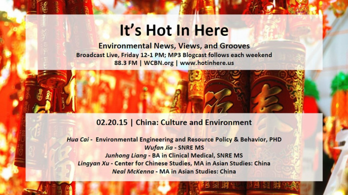
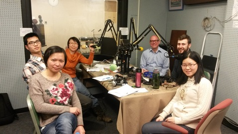
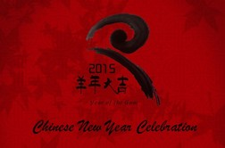
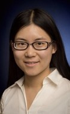
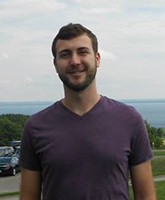

_**Happy Chinese New Year!**_   Our incredible co-hosts, **Pearl Zeng** and **Sam Molnar**, celebrated the Chinese New Year and discussed Chinese Culture and Environmental perspectives. Our co-hosts were joined by five guests, **Hua Cai, Wufan Jia, Junhong Liang, Lingyan Xu,** and **Neal McKenna.** We would like to give special thanks to our oh-so-talented audio engineer, **Tex,** who did his best to navigate through all the Chinese songs and help us with the show. We also want to thank **Zeqi Zhu** (SNRE MS) for helping record interviews during the SNRE Chinese New Year celebration, and thank **Jose Alfaro** (SNRE Faculty), **Yuanyuan Cui** (SNRE MS), **Luis Cecco** (SNRE MS) and **Stevia Morawski** (SNRE MS) for sharing with us their experience of the celebration.<!--more-->

We discussed the annual **SNRE Chinese New Year Celebration**, that occurred this past Thursday, February 19th, 2015, in the Ford Commons of the Dana Building. This celebration of the Chinese Spring Festival included fun festivities  and lots of delicious dumplings! Festive opportunities included Chinese characters and calligraphy, Chinese games, Introduction to the Chinese Zodiac, Chinese paper cutting, and a Chinese traditional dance demonstration!

Later in the show, we discussed the **Chinese Spring Festival origins and traditions, Chinese Cuisines, Chinese Medical and Medicine, and Transportation in Beijing, China.** 

For more information on how people are travelling during the Spring Festival Period in China, you can refer to a "Chun Yun" map -- http://qianxi.baidu.com/.

You can learn more about Chinese Cuisine by watching the show - A Bite of China - http://english.cntv.cn/special/a\_bite\_of\_china/homepage/index.shtml.

* * *

**Hua Cai** ([caih@umich.edu](mailto:caih@umich.edu)), is currently a graduate student at the University of Michigan, pursing a joint Ph.D. Degree in environmental engineering and resource policy & behavior. Her dissertation research focuses on understanding the environmental implications of electric vehicles using big-data informed travel patterns. Her broader research interests include sustainable cities, energy-water nexus, clean technology development, and system analysis.

* * *

**Wufan Jia** [(wufanj@umich.edu](mailto:wufanj@umich.edu)) is currently a Masters student at the University of Michigan School of Natural Resources and Environment. **Wufan** chose SNRE because of its super interdisciplinary approach to research in environmental issues. **Wufan** believes that we can find interactions with business, law, public policy, public health, and engineering based on environmental studies, and that she can develop a career in various fields from this strong and active community at SNRE.

* * *

**Junhong Liang** ([liangjh@umich.edu](mailto:liangjh@umich.edu)) is currently a graduate student at the University of Michigan School of Natural Resources and Environment. He has a BA in Chinese Medicine and  **Junhong** has a particular interest in Behavior, Education and Communication. **Junhong** is looking to either join a nonprofit board or do skills-based volunteering. **Junhong** worked as a teaching and marketing assistant for DAKANG Psychology Group. He assisted in the preparation and execution of psychology courses.

* * *

**Lingyan Xu** ([lingyan@umich.edu](mailto:lingyan@umich.edu)) works at the Center for Chinese Studies, and has a MA in Asian Studies: China. She specializes in Traditional Chinese Fiction and Drama, Material Culture in Ming-Qing China. **Lingyan**  has a BA in East Asian Languages, Literatures and Linguistics of Smith College.

* * *

**Neal Mckenna** ([nxm@umich.edu](mailto:nxm@umich.edu)) is a Masters student in Asian Studies: China. **Neal** has a special research interest in New Media Use and Response to Societal Change, and US-China Relations. **Neal**  focused on Chinese Studies at the University of Redlands in California and has worked as an English teacher and marketing associate in China. **Neal's** current interests center on the globalization and urbanization of China's cities and communities, particularly policy reform, the plight of grant works and improved East-West engagement through stronger cross-cultural communication and legal interpretation.
