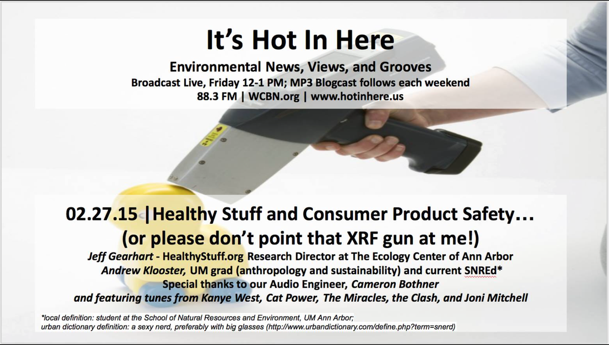
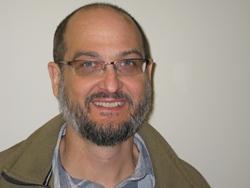
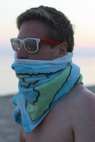

We kicked off spring break with a show on _Healthy Stuff and Consumer Product Safety_. Our hosts, **Rebecca Hardin** and **Andrea Kraus** were joined by toxic stuff guru, **Jeff Gearhart** from [HealthyStuff.org](http://HealthyStuff.org) and the Research Director at **[The Ecology Center of Ann Arbor](http://www.ecocenter.org)**, and **Andrew Klooster**, a University of Michigan graduate (anthropology and sustainability) and current SNREd! We also discussed the importance of [Recycle Ann Arbor.](http://recycleannarbor.org) You can learn more about their work at [HealthyStuff.org](http://HealthyStuff.org). We would like to give a special thanks to our talented Audio Engineer, **Cameron Bothner.** 

<!--more-->

**Jeff Gearhart**, MS, is the Research Director at **the University of Michigan Ecology Center of Ann Arbor** & [HealthyStuff.org.](http://HealthyStuff.org) He holds an MS in Environmental Science from the University of Michigan. Mr. Gearhart has worked for over 20 years on air quality, pollution prevention, life cycle assessment, green chemistry and consumer product testing. He is the author or co-author of 15 studies on toxic chemicals in products. Jeff’s work has also promoted meaningful and positive changes in how manufacturers develop products and address compliance with laws, regulations and voluntary guidelines regarding chemical use and toxicity. These changes are facilitated since his method allows rapid testing of products. \*An example of consumer engagement from a producer side: [http://www.waterrightinc.com/pages/meet-the-owners](http://www.waterrightinc.com/pages/meet-the-owners)

* * *

**Andrew Klooster** did his undergraduate work in sustainability and anthropology at the University of Michigan, and is a current SNRE Graduate Student in Environmental Justice. He is a research assistant at the Ecology Center. He was also a Research and Operational Intern at the New England Literature Program.

* * *

Hope you enjoyed this weeks show. Have a wonderful spring break!
