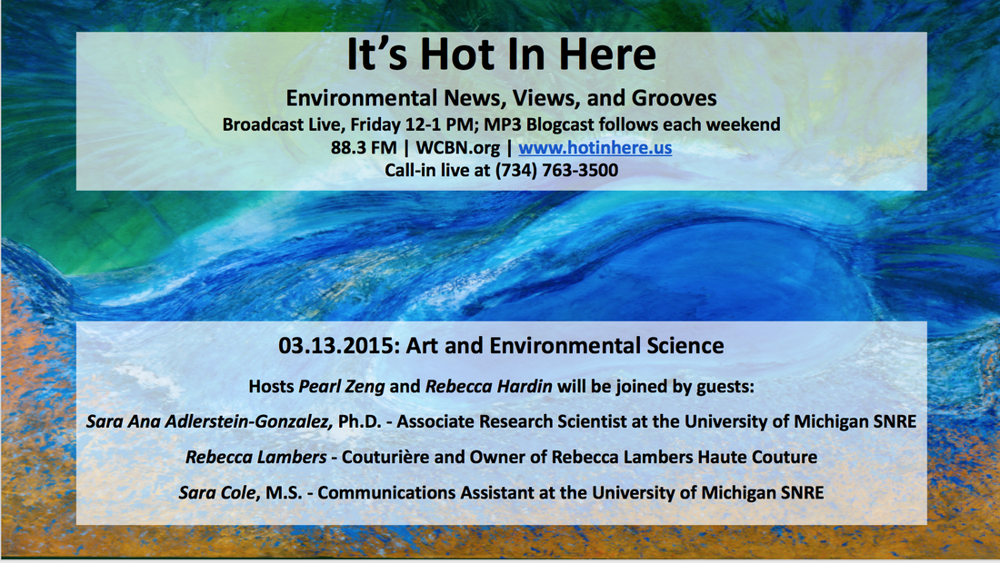

After a week long hiatus over spring break, we are back! Hope you all enjoyed your spring break as much as we did! In addition to the environmental news, views and grooves that you love, this week's show focused on **Art and Environmental Science**. Our lovely hosts, **Rebecca Hardin** ([rdhardin@umich.edu](mailto:rdhardin@umich.edu)) and **Pearl Zeng** ([zhuzeng@umich.edu](mailto:zhuzeng@umich.edu)) were joined by three interesting guestsincluding **Sara Cole, M.S.,** ([sacole@umich.edu](mailto:sacole@umich.edu)), a recent Graduate of the Behavior, Education and Communication Program at the University of Michigan SNRE and a current Communications Assistant at the University of Michigan SNRE, **Sara Anna Adlerstein Gonzalez****, Ph.D.,** ([adlerste@umich.edu](mailto:adlerste@umich.edu)) an Associate Research Scientist at the University of Michigan SNRE that has particular interests in bridging art and science, especially environmental science, she teaches courses to share her perspectives on creativity and consciousness, sustainable development in South America and messing with messy data, and **Rebecca Lambers** ([rl@rebeccalambers.com](mailto:rl@rebeccalambers.com)) a Couturière and environmentally conscious designer and owner of _Rebecca Lambers Couture_.<!--more-->

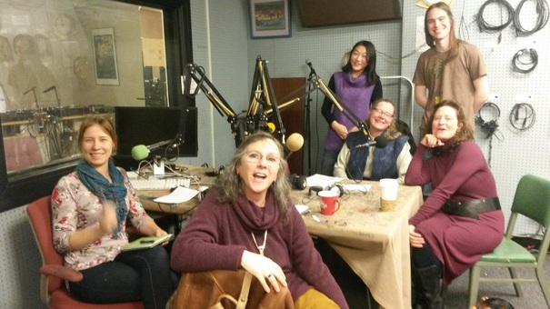

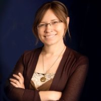

**Sara Cole, M.S.,** ([sacole@umich.edu](mailto:sacole@umich.edu)) is a recent Graduate of the Behavior, Education and Communication Program at the University of Michigan SNRE and a current Communications Assistant at the University of Michigan SNRE. **Sara** was a track leader for her focus of study. **Sara** is committed to engaging diverse audiences in a variety of environmental issues through education, outreach and service -- in ways that benefit people and the environment; that promote the advancement of science and scientific literacy; that inspire people to work toward a more just and sustainable world. As a current Communications Assistant at the University of Michigan Snre, **Sara** assists with writing and editing content for publications, graphic design, photography, event planning and the management of SNRE social media. **Sara** is dedicated to making sure all SNRE communications reach a broad audience while fulfilling the mission of SNRE and the University of Michigan. During her graduate work, **Sara** worked as a Graduate Research Assistant at the University of Michigan Museum of Zoology, lead tours through the Division of Birds that highlight the value of natural history collections, and supervised student researchers and artists using the collections.

* * *

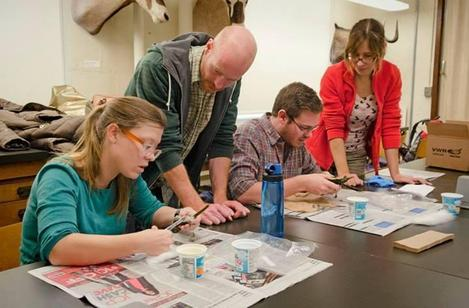

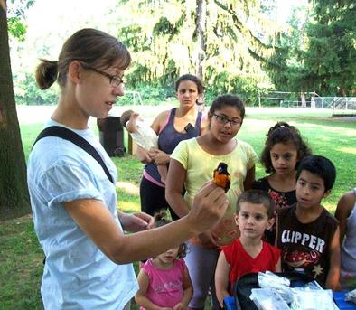

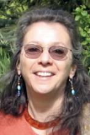

**Sara Anna Adlerstein Gonzalez****, Ph.D.,** ([adlerste@umich.edu](mailto:adlerste@umich.edu)) is an Associate Research Scientist at the University of MichiganSNRE that has particular interests in bridging art and science, especially environmental science, she teaches courses to share her perspectives on creativity and consciousness, sustainable development in South America and messing with messy data. As an Associate Research Scientist, **Sara** investigates processes at the ecosystem level using statistical modeling. Her main interest in research is to understand ecological processes and population dynamics of aquatic organisms at the ecosystem level, in particular those aspects that are relevant to resource management. Recently **Sara** has been investigating spatial and temporal scales needed to study the spatial distribution of fish abundance and obtain indices of abundance of fish populations in marine and freshwater ecosystems. Since fish, as other aquatic organisms, cannot be directly observed large scale population studies must rely on analysis of data from scientific surveys or commercial operations. The analysis of this information requires specialized statistical modeling. Currently **Sara's** focus is in the Great Lakes.

**Sara** is also the gallery organizer and curator of the University of Michigan SNRE Enviro Art Gallery: [http://www.snre.umich.edu/gallery](http://www.snre.umich.edu/gallery).  She believes that "the gallery draws attention to the intersecting values, both artistically and scientifically, of art and the environment. Because of the way SNRE’s curriculum embraces interdisciplinary fields, it is a natural place to host this gallery. We are bringing art to our school to strengthen our sense of community and facilitate dialogue among students, faculty and staff in the spirit of green-building philosophy." The Enviro Art Gallery features local and national artists whose work speaks to how people interact and understand the environment. The exhibits rotate about every eight weeks and are presented in five showcases in the Dana Building’s first floor commons.

Her work can also be viewed at her website: [https://saraadlerstein.wordpress.com/](https://saraadlerstein.wordpress.com/).

Performance: Mapping the River - a multimedia collaborative performance about the cycle of water and the relationship between culture and water using the Huron River as a model - [https://www.youtube.com/watch?v=pbjAUG3A-VI](https://www.youtube.com/watch?v=pbjAUG3A-VI)

* * *

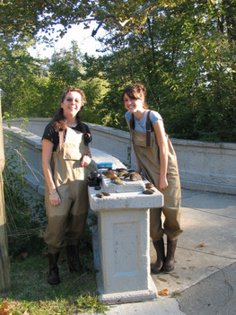

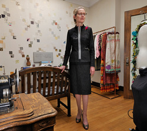

**Rebecca Lambers** ([rl@rebeccalambers.com](mailto:rl@rebeccalambers.com)) is a  Couturière and the environmentally conscious designer and owner of _Rebecca Lambers Couture_. **Rebecca** practices couture: the art of dressmaking by melding of a designer’s aesthetic sense with fine fabrics, master workmanship and interactive process. **Rebecca**'s artwork is inspired by nature and the environment. She consciously uses art to understand science and nature. Her work is displayed at the Enviro Art Gallery in SNRE: [http://www.snre.umich.edu/gallery](http://www.snre.umich.edu/gallery), and at [http://rebeccalambers.com/main/snre/slider.html](http://rebeccalambers.com/main/snre/slider.html).

Rebecca Lambers, Couture: [http://rebeccalambers.com](http://rebeccalambers.com), is located at 201 E. Liberty Street, Suite 4, Ann Arbor, MI 48109. Showroom open by appointment only or for public exhibitions 734.475.8988. Viewing through windows 9-5 on weekdays.

* * *

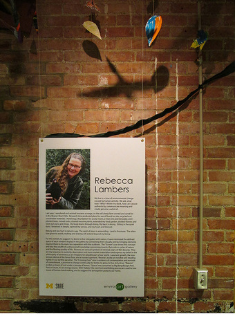

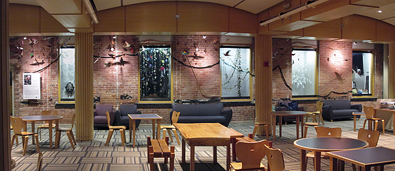

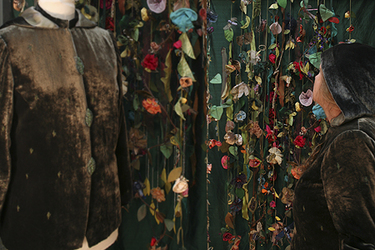

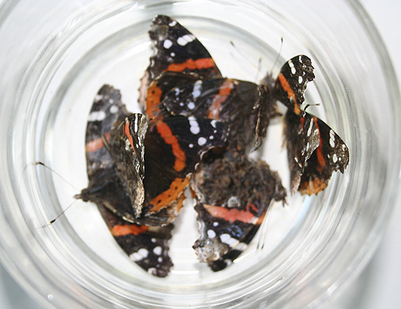

We hope you enjoyed the show! See you next Friday live at 12-1 PM on 88.3 WCBN FM and at [WCBN.org](http://wcbn.org)!
