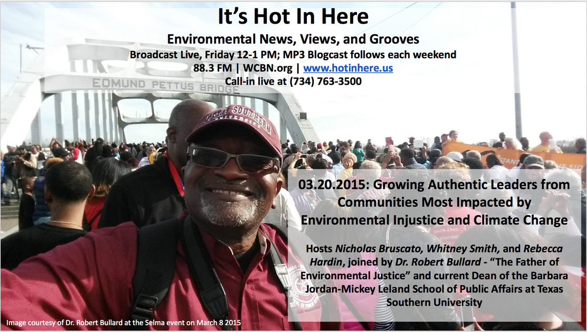
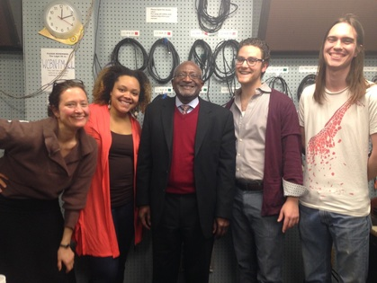
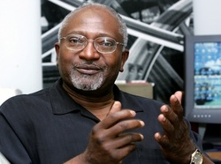
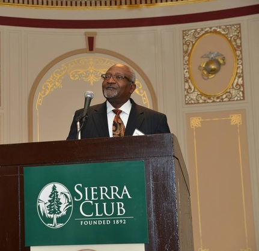

On this week's show, our hosts **Rebecca Hardin, Whitney Smith** and **Nicholas Bruscato** discussed **Growing Authentic Leaders from Communities Most Impacted by Environmental Injustice and Climate Change** with the distinguished **Dr. Robert Bullard** \- "The Father of Environmental Justice" and current Dean of the [Barbara Jordan-Mickey Leland School of Public Affairs at Texas Southern University](http://bjmlspa.tsu.edu/the-dean/). 

**_What is Environmental Justice?_** Environmental Justice is the fair treatment and meaningful involvement of all people regardless of race, color, national origin, or income with respect to the development, implementation, and enforcement of environmental laws, regulations, and policies (Environmental Protection Agency, 2015). [The Principles of Environmental Justice can be viewed here](http://www.ejnet.org/ej/principles.html)

<!--more-->

Prior to becoming the Dean of the Bara Jordan-Mickey Leland School of Public Affairs at Texas Southern University, **[Dr. Robert Bullard](http://bullardrd@TSU.EDU)** was the founder of the Environmental Justice Resource Center at Clark Atlanta University. He received his doctoral degree from the Iowa State University. He is better known as the "[Father of Environmental Justice.](http://grist.org/article/dicum/)" He is one of the **Leaders and the Best**, and a **Victor** for Environmental and Social Justice.

**Dr. Robert Bullard** says he was “drafted” into the world of Environmental Justice while working as an Environmental Sociologist in Houston, Texas in the 1970s. In Houston, **Dr. Bullard** worked on the siting of garbage dumps in black neighborhoods and identified systematic patterns of environmental injustice. Dr. Bullard has authored eighteen books that address sustainable development, environmental racism, urban land use, industrial facility siting, community reinvestment, housing, transportation, climate justice, emergency response, smart growth, and regional equity, including, [Dumping in Dixie](http://www.powells.com/partner/25450/biblio/61-0813367921-3), which is widely regarded to fully articulate the concept of Environmental Justice, and [The Quest for Environmental Justice: Human Rights and the Politics of Pollution](http://www.powells.com/partner/25450/biblio/7-1578051207-1).

**Dr. Bullard** has been one of the leading academic and activist voices of Environmental Justice. He was a founder of the First National People of Color Environmental Leadership Summit in 1991, at which the [organizing principles](http://www.ejnet.org/ej/principles.html) of modern environmental justice were created. Dr. Bullard also assisted the Clinton administration in writing the watershed executive order that required all federal agencies to consider Environmental Justice. **Dr. Bullard** stands at the forefront of achieving Environmental Justice goals, and bringing consciousness of the issues at stake to modern environmentalists. Dr. Bullard has also worked on a Ford Foundation-funded study of how governmental actions have endangered the health and welfare of African Americans. In addition, Dr. Bullard has worked with recent events including the Selma, Alabama march and the [Hurricane Katrina](http://grist.org/article/katrina3/) devastation. He has testified as an expert witness and served as a technical advisor on hundreds of civil rights lawsuits and public hearings over the past three decades.

* * *

**Dr. Bullard** expressed that his work is inspired and energized by "people who fight. People who do not let the garbage trucks and landfills and the petrochemical plants roll over them. That has kept me in this movement for the last 25 years. And in the last 10 years, we’ve been winning: lawsuits are being won, reparations are being paid, apologies are being made. These companies have been put on notice that they can’t do this anymore, anywhere." However, he is conscious that the fight against environmental is not over. There is much to be done. -- "Globally we've got a long way to go, but the fact is we don't have a lot of time -- I think that reality will force collaboration. An awareness that we do in the developed world doesn't just impact us is now pretty much a given. But we have to move that to another level of action and policy: the framework that environmental justice has laid out can resonate across a lot of developing countries."

**Dr. Bullard's Honors and Accolades**

- In 1990, he was the first environmental justice scholar to receive the National Wildlife Federation (NWF) [Conservation Achievement Award in Science](http://www.nwf.org/pdf/connie-2013/connie-winners-historical-through-2012.pdf).
- 2007 CNN People You Should Know, [Bullard: Green Issue is Black and White](http://www.cnn.com/2007/US/07/17/pysk.bullard/index.html "blocked::http://www.cnn.com/2007/US/07/17/pysk.bullard/index.html").
- In 2008, _Newsweek_ named him one of [13 Environmental Leaders of the Century](http://www.bet.com/news/national/photos/2011/04/top-black-environmentalists.html#!042111-news-national-environment-robert-bullard).
- Co-op America honored him with its Building Economic Alternatives Award (BEA).
- In 2010, _The Grio_ named him one of the “[100 Black History Makers in the Making](http://www.thegrio.com/black-history/)”
- _Planet Harmony_ named him one of [Ten African American Green Heroes](http://www.blacknews.com/news/planet_harmony101.shtml).
- [Everyday Heroes: 50 Americans Changing the World One Nonprofit at a Time](http://tinyurl.com/8ly2588)
- First African-American to receive the [Sierra Club John Muir Award](http://tinyurl.com/qgzh8v4). And in 2014, the Sierra Club named its new [Environmental Justice](http://www.sierraclub.org/planet/2014/08/sierra-club-names-new-environmental-justice-award-after-dr-robert-bullard) [Award](http://www.sierraclub.org/planet/2014/08/sierra-club-names-new-environmental-justice-award-after-dr-robert-bullard)after Dr. Bullard.

**A few links pertaining to Dr. Bullard's work;**

- HBCU Consortium to Hold Climate Change Conference in New Orleans | Dr Robert Bullard | Father of Environmental Justice [http://bit.ly/1LFkPLq](http://bit.ly/1LFkPLq)
- A Call to Diversify Green Groups and Equitable Funding of People of Color Environmental Justice Groups | OpEdNews [http://bit.ly/1LFiQH1](http://bit.ly/1LFiQH1)
- Environmental Justice Leaders to Hold Tribunal at Selma 50th Anniversary Commemoration | OpEdNews [http://bit.ly/1LFjmol](http://bit.ly/1LFjmol)
- Why a U.S. "Southern Initiative" on Climate Justice is Needed | OpEdNews [http://bit.ly/1LFkcBs](http://bit.ly/1LFkcBs)

 

**Dr. Bullard's Upcoming Events**  **03.19.2015:** [Dr. Robert D. Bullard to Speak at University of Michigan School of Natural Resources and Environment](http://drrobertbullard.com/events/robert-bullard-to-speak-at-university-of-michigan-school-of-natural-resources-and-environment/)  S.T. Dana Building, Room 1040 University of Michigan School of Natural Resources 440 Church St Ann Arbor, MI 481090 **03.26.2015:** [Dr. Robert D. Bullard to Give Keynote Speech at Third Annual HBCU Cliamte CHange Conference in New Orleans](http://Robert%20D.%20Bullard%20to%20Give%20Keynote%20at%20Third%20Annual%20HBCU%20Climate%20Change%20Conference%20in%20New%20Orleans%20Dillard%20University,%20Professional%20School%20Building%20\(PSB\),%202601%20Gentilly%20Blvd,%20New%20Orleans,%20LA%2070122%2005:00%20PM) Dillard University Professional School Building (PSB) 2601 Gentilly Blvd New Orleans, LA 70122 5:00 PM **04.15.2015:** [Dr. Robert D. Bullard is Speaker for 5th Annual Kelch Lecture at Temple University](http://Robert%20D.%20Bullard%20is%20Speaker%20for%205th%20Annual%20Kelch%20Lecture%20at%20Temple%20University%20April%2015%20Walk%20Auditorium%20at%20Ritter%20Hall,%20Temple%20University,%20Philadelphia,%20PA%2006:00%20PM)  Walk Auditorium at Ritter Hall Temple University Philadelphia, PA, 6:00 PM

E-Mail: [drrobertbullard@gmail.com](mailto:rbullard@cau.edu) Twitter: [www.Twitter.com/@DrBobBullard](http://www.twitter.com/DrBobBullard) Website: [http://drrobertbullard.com](http://drrobertbullard.com)
