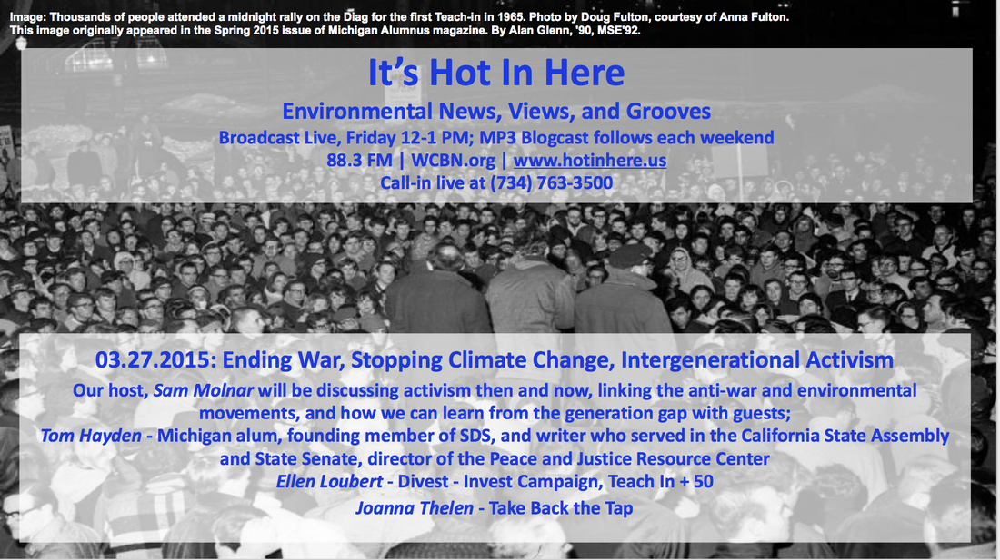

Today's show was about how to end the war against the planet! We brought together activists from the 1960's anti-war movement and the modern environmental movement to commemorate the [50th Anniversary](http://sites.lsa.umich.edu/teach-in-50/) of the first [Teach-In](http://bentley.umich.edu/exhibits/dissent/teachins.php) against the Vietnam War right here at the Univeristy of Michigan in 1965. In the studio our hosts, **Sam Molnar** and **Andrea Kraus** were joined by guests; [**Tom Hayden**](http://tomhayden.com), **Richard Mann**, **Ellen Loubert**, and **Joanna Theilin**. Our mission was to find out what can the young learn from the elders? What can the elders can learn from the young? And how to stop war and climate change in one fall of the axe.

<!--more-->

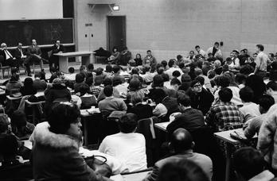

The teach-in included classes and seminars like this one.

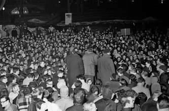

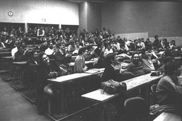

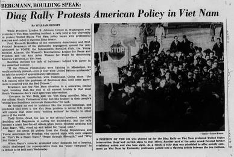

Three thousand attendees—three times as many as expected—packed Angell Hall, the Fishbowl, and the Diag on the night of March 24 1965.

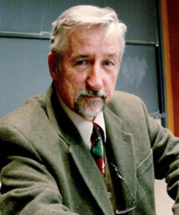

[**Tom** **Hayden**](http://tomhayden.com/) is a Michigan alum, social and political activist, author, and politician, and director of the Peace and Justice Resource Center in Culver City, California. **Tom** is best known for his major role as an anti-war, civil rights, and radical intellectual counterculture activist. He may have been the single greatest figure in the 1960s student movement. _The Nation_ magazine recently named him one of the 50 greatest progressives of the 20th century.

**Tom** was a student editor at the University of Michigan, a founding member of Students for a Democratic Society in 1961, and author of the Port Huron Statement. In 1964, **Tom** worked as a door-to-door community organizer in the inner city of Newark, New Jersey, part of an effort to create a national poor people's campaign for jobs and empowerment. During the Vietnam War, **Tom** was a leader in the anti-war movements, teach-ins, and demonstrations. In 1965, **Tom** traveled to Vietnam to meet Vietnamese people, promote peace talks and facilitate American POW releases.

After half a century of activism, politics and writing, **Tom** is still a leader in the movements against the wars in Afghanistan, Iraq and Pakistan, for eradicating sweatshops, defending the environment and combatting climate change, and reforming politics through a more participatory democracy. During his time at the University of Michigan, he was a leader of the student, civil rights, peace and environmental movements of the 1960s, and went on to serve 18 years in the California legislature and senate, where he chaired labor, higher education and natural resources committees.

In addition to being a member of the editorial board and a columnist for _The Nation_ magazine, **Tom** is regularly published in the _New York Times_, _Guardian_, _Los Angeles Times_, _San Francisco Chronicle_, _Boston Globe_, _Denver Post_, _Harvard International Review_, _Chronicle of Higher Education_, _Huffington Post_ and other weekly publications. As Director of the [Peace and Justice Resource Center](http://tomhayden.com/pjrc/) in California, he organizes, travels and speaks constantly against the current wars. He also recently drafted and lobbied successfully for Los Angeles and San Francisco ordinances to end all taxpayer subsidies for sweatshops. **Tom** has also authored and edited twenty books, and he has taught most recently at UCLA, Scripps College, Pitzer College, Occidental College, and the Harvard Institute of Politics.

* * *

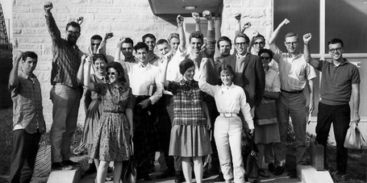

Tom is pictured on the far left.

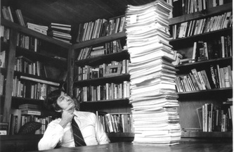

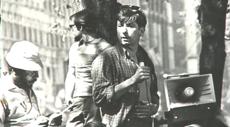

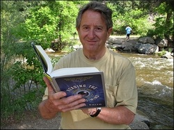

**Richard Mann** is a Professor Emeritus of Psychology at the University of Michigan, where he has taught for forty years about group process, psychology and religion, and spiritual development, and an original organizer of the 1965 Teach-Ins on the Vietnam War in Ann Arbor and elsewhere, 1965-1966. He was the founder of Project Outreach, an ongoing experimental Psychology program at the University.

**Richard** also edits the SUNY Press series of books in Transpersonal and Humanistic Psychology, and he has written three books, _Interpersonal Styles and Group Development, The College Classroom_ and _The Light of Consciousness._  He is the author of many autobiographical papers, files on protests against the Vietnam War, and Materials on the Program for Educational and Social Change, an effort to open University of Michigan courses to the local community in Ann Arbor.

During his time at the University of Michigan in the 1960s, **Richard** helped to organize the original 1965 Teach-In and helped to craft teach-ins and social activism protests at many other universities including Harvard. **Richard** has remained at the University of Michigan as a professor since the 1960s.

* * *

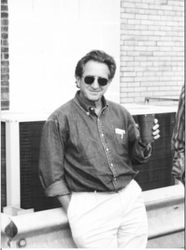

 

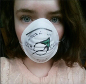

**Ellen Toubert** is from Gladwin, a small town in northern Michigan. She is a University of Michigan undergrad studying the social structures and problems associated with climate change and is a member of [Science for the People](http://umsftp.blogspot.com) as well as a committee chair in the organization [Divest and Invest Campaign University of Michigan.](http://www.divestum.org)

* * *

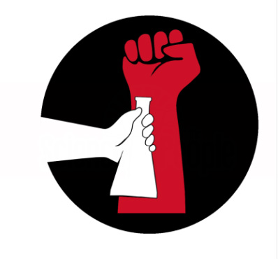

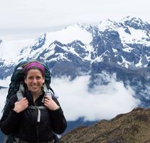

**Joanna Thelin** is from Grand Ledge, Michigan. **Joanna** is a current University of Michigan undergraduate student studying Biopsychology, Cognition and Neuroscience and the Program in the Environment at SNRE. She is part of a student group called[Beat the Bottle](https://csg.umich.edu/upetition/p/beatthebottle/) that is working with [Take Back the Tap](http://www.foodandwaterwatch.org/water/take-back-the-tap/) on the issues surrounding bottled water.  **Joanna** works with others on the U of M campus to encourage others to choose tap water over bottled water and protect essential water resources.

* * *

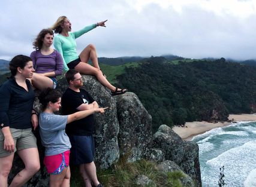

The Teach In + 50 will commemorate the 50th anniversary of the 1965 Teach-Ins at U of M March 27-28, 2015 -Pre-event Rally: 3-4pm, on the Diag -Rally speech by Tom Hayden at 3:45pm, followed by march to Angell Hall -Speaker panels will follow through the weekend
