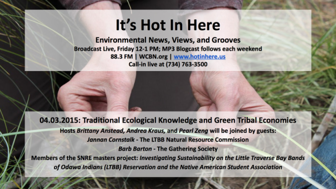
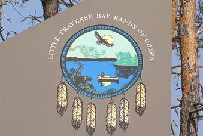
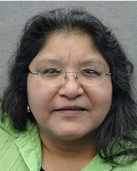
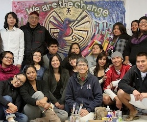
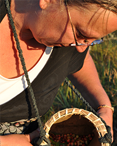
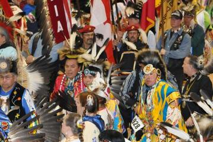
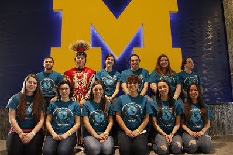

The theme of this week's show is Traditional Ecological Knowledge and Green Tribal Economies. Hosts **Brittany Anstead, Andrea Kraus, Rebecca Baylor** and **Pearl Zeng** were joined by **Jannan Cornstalk** with the LTBB Natural Resource Comission and **Barb Barton** from The Gathering Society**.**

<!--more-->

 **Brittany Anstead** is a masters student at the School of Natural Resources and Environment and will be graduating this summer. She has been studying tribal energy sovereignty and will be building her career around that as well.  She lead the [master's project](http://www.snre.umich.edu/current_students/masters_projects/improving_energy_sustainability_for_the_ltbb_reservation_2015) investigating renewable energy potential as well as assessing energy efficiency and technical/policy instruments for the [Little Traverse Bay Bands of Odawa Indians Reservation](http://www.ltbbodawa-nsn.gov).[Email her.](mailto:bcanstea@umich.edu) 

* * *

**Jannan J. Cornstalk** has been serving on the [LTBB Natural Resources Commission](http://www.stewardshipnetworkconference.org/site/apps/kb/cs/contactdisplay.asp?c=flKVI8OPImJcH&b=8967253&sid=hpIRKTMtFgISL0MxHlH&r=1) as Associate Commissioner for over 2 years and strongly advocates for issues related to water and promulgating on behalf of fellow LTBB citizens for the protection and exercise of treaty rights. She has participated in a Water Walk around Burt Lake in the Tip of the Mitt, done public speaking at Environmental related conferences, meeting and workshops and actively collaborates with people and resources related to the protection of her environment. She served as the Tribal liason with the Stewardship Network Conference planning committee for the January 2015 conference encouraging Native participation and attendance. Jannan is owner of Cornstalk Creations a video production company located in Petoskey, MI. She is a published journalist, photographer, and videographer.

* * *

Black Mesa Water Coalition

**Barb Barton** is an endangered species biologist, wild foods forager, singer-songwriter, and founder of **[The Gathering Society](http://www.thegatheringsociety.com)**. Although she wears many hats, the common thread is connecting people with the Earth. She has worked on wild rice conservation and education since 2008 and is presently involved in several collaborative projects with various Tribes and agencies on restoration. Barb is the facilitator of The Gathering Society, a women’s circle devoted to building bridges between Tribal and Non-tribal communities and keeping traditional knowledge alive. She has worked for The Nature Conservancy, Michigan Natural Features Inventory, and is currently the Aquatic Resource Specialist for the Michigan Department of Transportation. She holds a B.S. in Fisheries and Wildlife from Michigan State University and an M.S. in Ecology from Eastern Michigan University.

* * *

UM Native American Student Association

**[U-M Native American Student Association Hosts 40th Annual Dance for Mother Earth Powwow](http://powwow.umich.edu/home)** On April 4 & 5, 2015 at Skyline High School in Ann Arbor. The Dance for Mother Earth Powwow is hosted by the [UM Native American Student Association](https://www.facebook.com/NASAatUMich), with assistance by the EMU NAISO. At the Powwow, thousands of people from Michigan, across the U.S., and Canada gather to celebrate and learn about Native American culture and traditions. Forty years after a small group of Native American students and community members founded the annual Dance for Mother Earth Powwow in Ann Arbor, it has evolved into a popular community-wide event hosted by the Native American Student Association at the University of Michigan.

UM Native American Student Association
