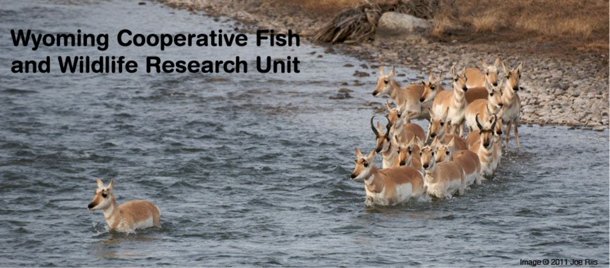

The theme of this week’s segment of _It’s Hot In Here_, the radio show bringing you environmental news, views, and grooves from SNRE students, faculty, and the many practitioners in southeast Michigan and beyond was **Ecology of Fear and Fear of Ecology — Can Science do More to Improve Human-Wildlife Cohabitation?** Our hosts were joined in-studio and by pre-recorded interviews by guests including, **Dr. Matthew Kauffman** from the Wyoming Migration Initiative, **Maurita Holland** from the Washtenaw Citizens for Ecological Balance, and **Mayank Vikas** from the UM School of Natural Resources and Environment.

<!--more-->

**[Dr. Matthew Kauffman](mailto:mkauffm1@uwyo.edu)** is a Professor of Zoology and Physiology at the [University of Wyoming](http://www.uwyo.edu/), director and co-founder of the [Wyoming Migration Initative](http://migrationinitiative.org/), and is also the Leader of the [Wyoming Cooperative Fish and Wildlife Research Unit.](http://www.wyocoopunit.org/) He received his Ph.D. from the University of California - Santa Cruz and did his post-doctoral research and teaching at the University of Montana. **Dr. Kauffman** is broadly trained as an ecologist and has research experience in a wide variety of ecosystems. He has a strong quantitative background with expertise in population and ecosystem modeling and analysis of spatial data. While in Montana, his research focused on predator-prey relationships between gray wolves and elk in the Greater Yellowstone Ecosystem. **Dr. Kauffman** began service at the Wyoming Cooperative Fish and Wildlife Research Unit during the summer of 2006. His current research focuses primarily on large carnivores and ungulates in terrestrial ecosystems. He continues research on Gray wolves and elk in the Greater Yellowstone Ecosystem, and has expanded his research to include moose and grizzly bears in that ecosystem. **Dr. Kauffman** is also conducting research on the effects of natural gas development on mule deer, elk, and pronghorn in the sagebrush biome and habitat fragmentation on avian communities. **Dr. Kauffman** is also conducting research on drought and predation effects on elk migrations in Wyoming, food webs and migration, semi-permeable barriers and migration, influence of elk migration on wolf habitat use, prioritizing migration routes for conservation and stopover ecology of migratory ungulate.

* * *

**[John and Frank Craighead Lecture featuring Professor Matthew](http://www.snre.umich.edu/events/john_and_frank_craighead_lecture_featuring_professor_matthew_kauffman)** **[Kauffman](http://www.snre.umich.edu/events/john_and_frank_craighead_lecture_featuring_professor_matthew_kauffman)** Professor Matthew Kauffman's lecture entitled, _Ungulate Migrations of Wyoming: Ecology and Conservation amid Changing Landscapes._ Wyoming harbors vast, open landscapes still capable of supporting long-distance ungulate (hoofed mammal) migrations. These herds of big game move across rugged landscapes up to 150 miles to access the seasonal habitats that allow them to find adequate forage. Such migrations require animals to cross multiple-use lands, some of which are changing rapidly. Because of this, ungulate migration is difficult to manage and conserve. This talk will describe some of the most pressing challenges to the conservation of ungulate migration routes in Wyoming and the West, and the new conservation tools that are bringing people, agencies, and NGOs together to make these journeys easier for migrating big game.Matt Kauffman and his graduate students are conducting studies on elk, wolves, moose, deer, and bighorn sheep in Wyoming, addressing the influence of habitat condition, drought, predation, human disturbance, and energy development on these species. A primary focus of Kauffman's work is to provide scientific information to groups who seek to manage or conserve Wyoming's wildlife.This lecture is co-sponsored by the University of Michigan Program in the Environment, School of Natural Resources and the Environment, and Museum of Natural History.Link to **Dr. Kauffman's** [Ted-X talk on "Depicting the West"](https://www.ted.com/tedx/events/12369) on April 17, 2015 in Cody, WY.

**[Maurita Holland](mailto:mholland@umich.edu)** is a member of the [Washtenaw Citizens for Ecological Balance](http://wemu.org/term/washtenaw-citizens-ecological-balance) and is an Associate Professor Emerita of Information, School of Information. **Maurita**'s major project is planning student internship project activities in Africa for this year and the near future. **Maurita** talks about a wide range of research and popular press material on many aspects of deer biology and management and problems and solutions for Deer overpopulation and migration in Ann Arbor and Washtenaw County and how it is responsible for increasing home and vehicle damage and is threatening the area's ecological balances and created barriers between humans and wildlife.

* * *

**Mayank Vikas** is a Fulbright-Nehru Masters Fellow and a first year graduate student at the School of Natural Resources and Environment, with interests in wildlife conservation, urban sustainability and mitigation of man-animal conflict. Prior to attending graduate school, Mayank has worked as a lawyer with a non-profit organization working for the conservation of raptors in urban India. He has also worked at corporate law firms in India, where he worked on M&A, private equity transactions and corporate advisory. During the show, Mayank talks about leopards that have co-existed with humans in [urban](http://www.theguardian.com/cities/2014/nov/26/leopards-mumbai-life-death-living-ghosts-sgnp) and [rural](http://timesofindia.indiatimes.com/city/vadodara/Vadodara-villagers-miss-their-vanishing-leopards/articleshow/46619984.cms) India for years, and the increasing [trend of leopard fatalities](http://article.sapub.org/10.5923.j.ije.20120204.01.html) in [conflict situations](http://www.ndtv.com/india-news/leopard-burned-alive-in-uttarakhand-451060), [mob violence](http://timesofindia.indiatimes.com/city/surat/Mob-beats-leopard-to-death-after-it-mauls-6after-it-injures-6-men-in-Surat/articleshow/46581285.cms) and a [sharp decline](http://www.ibtimes.co.uk/india-after-tigers-now-leopard-numbers-said-have-dropped-by-80-100-years-1495075) in the leopard population in India. To learn about man-animal conflict and the problem with forest department responses to these issues, Mayank recommends some [papers](http://www.researchgate.net/publication/47698535_Translocation_as_a_tool_for_mitigating_conflict_with_leopards_in_human-dominated_landscapes_of_India) by [Vidya Athreya](http://www.conservationindia.org/author/vidyaathreya), who works on human-leopard interactions in India.

* * *

\[gallery columns="2" type="rectangular" size="medium" link="file" ids="216,217,218" orderby="rand"\]
