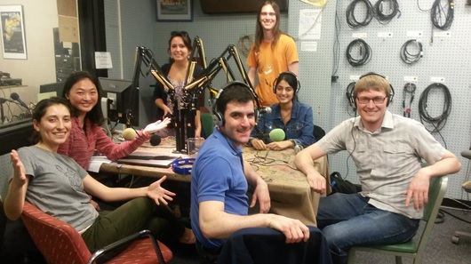
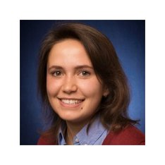

This is weeks show is an **Energy Extravaganza!** Our hosts, **Pearl Zeng** and **Andrea Kraus** talked energy technology, policy, consumer education, and equity with a group of four master's students from SNRE who are wrapping up over a year of work on their capstone projects and theses, **Brett Simon**, **Geoff Burmeister**, **Kate Loshakova**, and **Kiran Chawla**. These individuals have a wide breadth of knowledge relating to the energy industry and energy policy planning. We also discussed what energizes each of them every day.

**Brett Simon** is currently a second year Masters student at the [University of Michigan School of Natural Resources and Environment.](http://snre.umich.edu) His major area of interest is Energy and he is pursuing a degree in Environmental Policy and Sustainable Systems. He received his B.A. Environmental Studies and Mathematics from [New York University.](http://nyu.edu) **Brett** has also served as a Research Assistant at the Center for Sustainable Systems with a research interest in renewable energy systems, and is a member of the Ross Energy Club.

* * *

**Geoff Burmeister** is currently a second year Masters student at the [University of Michigan School of Natural Resources and Environment.](http://snre.umich.edu) He is pursuing a degree in Environmental Policy and Planning. **Geoff** is a MS Candidate at the [University of Michigan Erb Institute for Global Sustainable Enterprise](http://erb.umich.edu), and is receiving his M.B.A. from the [University of Michigan Stephen M. Ross School of Business](https://michiganross.umich.edu), where he is active in the Ross Energy Club. His driving mission in his career is to collaborate with businesses, policymakers, and regulators to advance programs that promote sustainable energy production and consumption and extend the benefits of sustainable energy in an equitable and inclusive way.

* * *

**Kate Loshakova** is currently a second year Masters student at the University of Michigan School of Natural Resources and Environment. She is pursuing a degree in Conservation Ecology and Environmental Policy & Planning. She is also a Research Assistant for the Center for Sustainable Systems and the Northport ENergy Action Taskforce. She is working on the Renewable Energy Community Plan master's project. She also served on the UNFCCC COP Delegation Panel as an educator on Sustainable Systems.

* * *

**Kiran Chawla** is a Master's student at the University of Michigan School of Natural Resources and Environment. She is pursuing a degree is Sustainable Systems and Environmental Policy and Planning. She is also a Graduate Research Assistant and uses multi-criteria Decision Analysis framework to conduct a constrained optimization for determining the optimal energy mix for the growing needs of the power sector. **Kiran** has also volunteered for Green Peace and at Samaritans.
