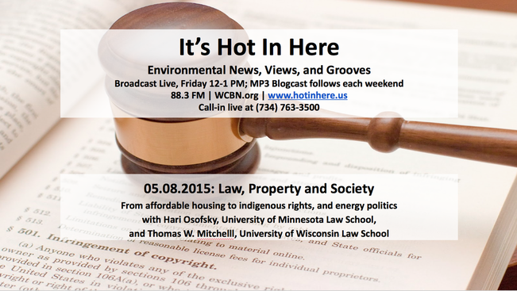
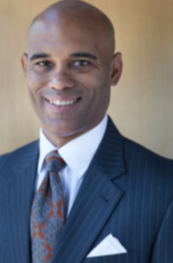

This week’s segment of _It’s Hot In Here_ was **Law, Property and Society.**  **Rebecca Hardin,** our main host and the President-elect of the [Association for Law, Property and Society](http://www.law.uga.edu/association-law-property-society-alps), **H****ari Osofsky,** previous Association president from the University of Minnesota Law School and Department of Geography, and **Thomas Mitchel**l, Professor of Law at the  University of Wisconsin discussed affordable housing, indigenous rights, and energy politics.

The academic conference reflected on those who have been evicted or displaced from their properties. [The Association of Law, Property and Society](http://www.law.uga.edu/sites/default/files/ALPS%202015%20Program.pdf) (ALPS) met at the University of Georgia Law School for its 6th Annual Conference. The ALPS values interdisciplinary dialogue, with legal scholars joined by geographers, anthropologists, urban planners and experts of other fields.

<!--more-->

|   **[Hari M. Osofsky](mailto:hosofsky@umn.edu)** is a Professor of Law, 2014-2015 Julius E. Davis Chair in Law, Faculty Director of the Energy Transition Lab, and Director of the Joint Degree Program in Law, Science and Technology at the University of Minnesota Law School. She is also on the faculty of the Conservation Biology Graduate Program, a Professor of Geography, Environment, and Society, and a Fellow with the Institute on the Environment. **Hari** has over 50 publications on improving governance and addressing injustice in energy and climate change regulation. She was also the former President of the Association for Law, Property and Society.   |          |
| --- | --- |

|          |   **[Thomas Mitchell](mailto:tmitchell@wisc.edu)** is a Professor of Law at the University of Wisconsin Law School, where he directs the Program in Real Estate, Land Use, and Community Development. He also teaches Property, Land Use, REmedies and a seminar course in Rural Development. He has done research and legislative work on property issues impacting poor and minority communities. **Thomas** played an integral role in the drafting of the Uniform Partition of Heirs Property Act, which has promulgated by the National Conference of Commissioners on Uniform State Laws.   |
| --- | --- |
