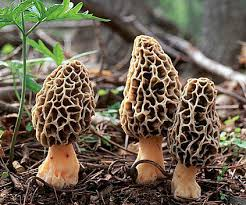
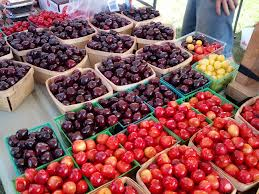

On this week's show, Rebecca Hardin and David Clive discussed our summer broadcasts and their plans for the summer, environmental news including the Santa Barbara Oil Spill, and what's in season including morel mushrooms.<!--more-->

This week's Spotify playlist is available [here](https://open.spotify.com/user/1237079667/playlist/49SsYudf7762DGlX49qQC4). It includes our intro theme songs, the intro themes for our "environmental news" feature (Prince's Sign O The Times), our "What's in Season" feature (The Zombies, Time of the Season) and our input from listeners (Donna Summer's On the Radio).

To kick off a wonderful Michigan summer, we would like to share this video that encompasses our feelings about this season:

<iframe src="http://www.youtube.com/embed/Kr0tTbTbmVA?wmode=opaque" width="300" height="150" frameborder="0" allowfullscreen="allowfullscreen"></iframe>

## Environmental News

Updates on the Santa Barbara Oil Spill Officials from Plains All American Pipeline say they hope the broken section of a pipeline that spilled oil along the California Coast can be removed for investigation this week. The new estimate of the worst-case volume of oil released is 101,000 gallons. That's about 4,200 gallons less than previously thought. Officials say one sea lion, nine pelicans and untold numbers of fish have been killed. Two public beaches are closed until at least June 4th. Find out more about how you can get involved and volunteer [here.](http://www.scpr.org/news/2015/05/26/51982/santa-barbara-oil-spill-how-to-help-volunteer-with/) Obama Administration Issues New Water Protection Act The administration issued a [new rule](http://www.usatoday.com/story/news/nation/2015/05/27/obama-water-regulations-environmental-protection-agency/28003199/) to protect streams and wetlands under the Clean Water Act, a step reported to help keep drinking water safe, especially in the Midwest. However, many oppose this new rule. Farmers and Industry leaders argued the regulation will be costly and ineffective. The Waters of the United States Rule, issued by the EPA and the Army Corps of Engineers, aims to clear the previously murky guidelines about water jurisdiction in the Clean Water Act.

## What's In Season?

In the great mitten state, the talk of summer is cherries, lakeside picnics, blueberries and strawberries, and of course, morel mushrooms. Find out where to find and when and how to pick morels [here.](http://www.motherearthnews.com/organic-gardening/guide-to-hunting-for-morel-mushrooms-zmaz02amzgoe.aspx)

