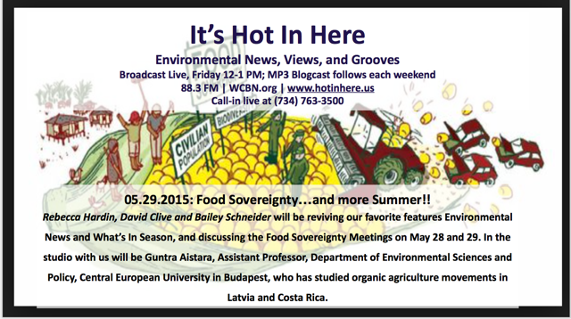
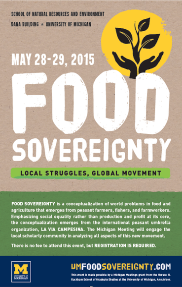

On this week's show we discussed environmental news and the Food Sovereignty Conference: Local Struggles, Global Movement funded by the Horace H. Rackham School of Graduate Studies.

Our guests included **Guntra Aistara**, Assistant Professor, Department of Environmental Sciences and Policy, Central European University in Budapest, who has studied organic agriculture movements in Latvia and Costa Rica, as well as **Annette Aurélie Desmarais,** the Canada Research Chair in Human Rights, Social Justice and Food Sovereignty at the University of Manitoba. Annette is the author of La Vía Campesina: Globalization and the Power of Peasants (2007) that has been published in French, Spanish, Korean, Italian and Portuguese.  <!--more-->She also co-edited Food Sovereignty: Reconnecting Food, Nature and Community (2010) and  Food Sovereignty in Canada: Creating Just and Sustainable Food Systems (2011).

**Our Spotify playlist can be found [here](https://open.spotify.com/user/1237079667/playlist/4vKXQn22hTg13QnmCmQRSp)!**

Sign of the times... Environmental News

During our environmental news segment, we touched on the [latest assessment on Mauritania](http://Sign%20of%20the%20times%E2%80%A6%20Environmental%20news:%20Mauritania%20http://www.irinnews.org/report/101544/food-worries-widen-in-mauritania) by the UN-backed Integrated Food Security Phase Classification (IPC). Among them, nearly half a million people are expected to fall into severe food insecurity by June and be "unable to meet their food needs without external assistance." Mauritania is a country which is affected by climate change, as well as recurrent climate-related shocks, lock the drought. We also discussed the[food crisis in Cameroon](http://www.irinnews.org/report/101514/insecurity-fuels-food-shortages-in-northern-cameroon). The malnutrition rate among children under five, which has been above the World Health Organization's emergency threshold of 15 percent since January, continues to deteriorate, according to the World Food Programme. Farmers have also been experiencing food difficulties
