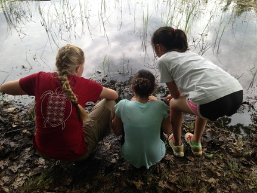
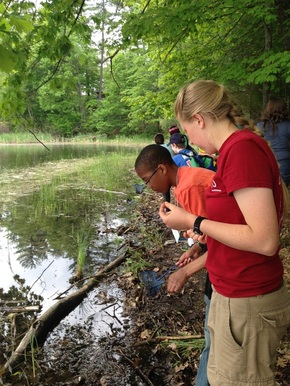

On this week's show: Rebecca Hardin phones in from the wilds of Traverse City to discuss the virtuous adventures of interactive environmental learning; a long time listener, first time caller, and Michigan native fills us in on his favorite outdoor spots for maximizing our Michigan summer enjoyment; IHIH production team member Sam Molnar talks about his exciting work with the Great Lakes Commission; and we listen to new (and old) tracks from JJ's favorite band the Unknown Mortal Orchestra! Links below!

<!--more-->

For more information about Outdoor Education Director David Yuhaus's amazing engaged learning short course curriculum for elementary, middle, and high school students in Northern Michigan's YMCA camp settings: [http://www.hayowentha.org/outdoor-education-middle-elementary-school.htm](http://www.hayowentha.org/outdoor-education-middle-elementary-school.htm)

For a visually stunning article on the wolves of Isle Royale (featured in the active outdoor game students play at Arbutus in Outdoor Ed that Rebecca discussed with us):[http://america.aljazeera.com/features/2014/6/fall-of-the-wildthetrappedwolvesofisleroyale.html](http://america.aljazeera.com/features/2014/6/fall-of-the-wildthetrappedwolvesofisleroyale.html)

For more information about the remarkable middle school instructors who made the Tappan trip happen, see media about the energetic engaged teaching style of [Wendy Raymond](http://news.a2schools.org/tappan-schools-wendy-raymond-taking-the-law-into-her-own-class/), who founded this trip "up north" for that school's sixth graders, [Kathy Coppens,](http://news.a2schools.org/interest-grows-for-students-teachers-and-community-at-tappan-agrarian-garden/) who discovered the Arbutus Outdoor ed option, and [Brit Satchwell](http://satchwell.weebly.com/) who helps keep the administrative and classroom prep end of the expedition running smoothly.

For a remarkable archive of campfire classics for you songsters, check out these [scout songs](http://www.scoutsongs.com/) with lyrics, and other information about what has made them so hand-downable!

Wilhelmina Witt (red t-shirt) showing Tappan Middle School students how to (temporarily) capture frogs, tadpoles, leeches, dragonfly nymphs, fingernail clams, and other creatures at the ponds of Camp Arbutus to learn about their life cycles (above and below)

