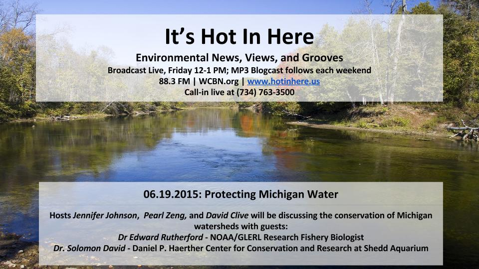
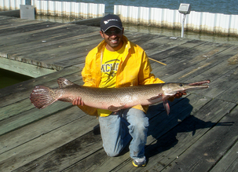

Water conservation is the focus of this week's show as we discussed conservation efforts in the White Lake area, invasive species and their effect on the local food supply, regulating levels of harmful chemicals like PCBs in the Great Lakes, the spotted gar, and more!

For more information about the dark past and revival of the White Lake watershed, go to: [http://www.detroitnews.com/article/20140626/METRO06/306260001](http://www.detroitnews.com/article/20140626/METRO06/306260001)

<!--more-->

Dr. Edward Rutherford is a research fishery biologist at the Great Lakes Environmental Research Laboratory (GLERL), a branch of the National Oceanographic and Atmospheric Administration. The majority of his research deals with invasive species in the Great Lakes and their effects on local food chains and native benthic (bottom dwelling) species.

* * *

Dr. Solomon David completed his M.S. in Aquatic Sciences and his Ph.D. in Aquatic Resource Ecology and Management at the School of Natural Resources and the Environment at the University of Michigan. He is currently a postdoctoral research associate at the Daniel P. Haerther Center for Conservation and Research at the John G. Shedd Aquarium.
