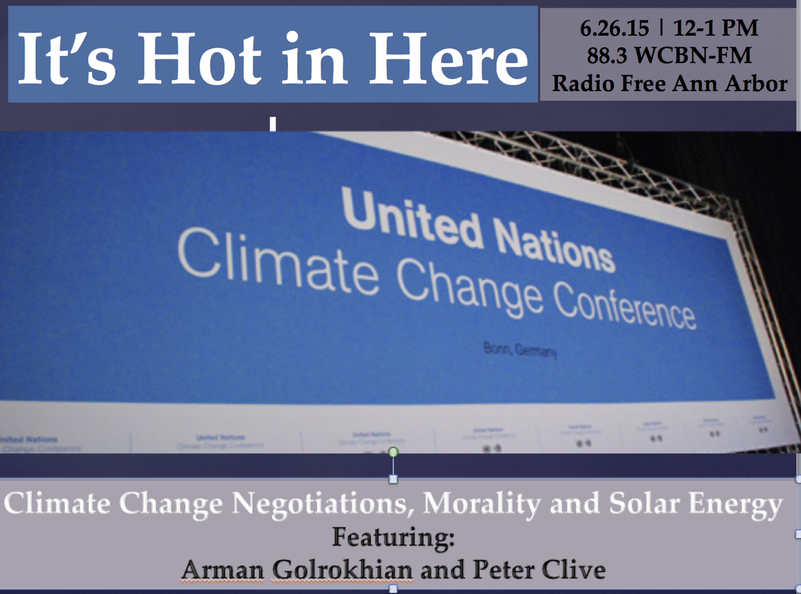
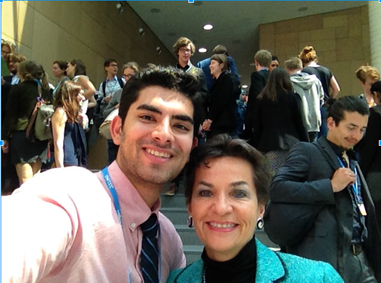
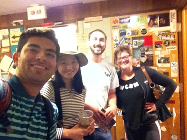

Join your friends on It’s Hot in Here this week as we dive into Climate Change Negotiations, morality in a global context (including the Pope's recent climate change encyclical), and the impressive possibilities of solar energy right here in Michigan. Two special guests (and one special “caller”) are our guides on this political, material, conceptual, and auditory journey:<!--more-->

- Arman Golrokhian, a second-year dual degree student here at the University of Michigan in the School of Natural Resources and Environment and the Ford School of Public Policy, is freshly back from the recent June 2015 Bonn Climate Change Conference in Germany and shares with us his unique insights into what’s at stake re: the potential futures of a global climate catastrophe and the complexities of the negotiation process itself. Arman also debriefed us on theimportance of INDCs (Intended Nationally Determined Contributions) and how INDCs will set the stage for next meaningful steps in climate talks, and how the previous climate change conferences will lead global effort towards the 21st Conference of Parties in Paris this December.
- Peter Clive, home-solar energy producer, father of co-host Dave Clive (and much else), called in to tell us about his own experiences with producing solar energy on his own domestic property, including both potential costs and benefits, and offered great suggestions to others who’d like to do the same.

And now for a few relevant links: [Conference of Parties of the United Nations Convention Framework on Climate Change](http://unfccc.int/bodies/body/6383.php)

[Bonn Climate Change Conferences](https://unfccc.int/meetings/bonn_jun_2015/meeting/8856.php)

[Intended Nationally Determined Contributions (INDCs)](http://unfccc.int/focus/indc_portal/items/8766.php)

[Canadian Astrophysicist and Dr. Hardin’s key climatological interlocutor Hubert Reeves](http://www.thecanadianencyclopedia.ca/en/article/reeves-hubert-feature/)

[Biodiversity and climate change conference held in early 2015 at UNESCO](http://www.unesco.org/new/en/media-services/single-view/news/biodiversity_and_climate_change_conference_to_be_held_at_unesco/#.VY9IM-ffepp)

 

Arman Golrokhian with [Christiana Figueres](https://en.wikipedia.org/wiki/Christiana_Figueres), Executive Secretary of the United Nations Framework Convention on Climate Change (UNFCCC)

* * *

Arman Golrokhian with today's IHIH Team: Pearl Zeng, Sam Molnar and Jennifer Johnson.

* * *
