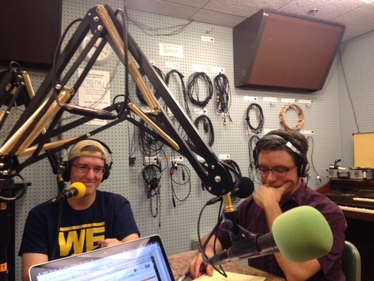
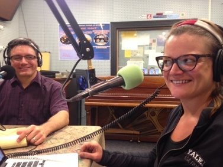

Join us this week for a patriotic (and musical) edition of It's Hot in Here as we discuss symbols of American pride (or are they?), the cultural context from which Jimi Hendrix's rendition of the Star Spangled Banner at Woodstock arose, the newest news concerning the Geddes road expansion and the fate of the surrounding trees, and more!

Mark Clague (see credentials above) studies all forms of music-making in the United States, especially in Chicago, focusing on the functional aesthetic of music and the relationship between music and society.<!--more-->He serves as Executive Editor for Music of the United States of America (MUSA), a scholarly series of critical scores representing the diversity and excellence of composition in the United States. He has presented papers at many prestigious institutions, including the Rock and Roll Hall of Fame where he presented "'This is America': Jimi Hendrix's Reimaginings of 'The Star-Spangled Banner' as Social Comment for Woodstock and Beyond", which we unpacked with Mark on the air.

Links to all things that were hot this week:

Star Spangled Music,a collection of songs celebrating the history of American patriotic song targeting K-12 students, school teachers, scholars, and the general public. Brought to you by the Star Spangled Music Foundarion: [https://www.youtube.com/channel/UCUDPnekB-tDei1AsPh6Pfuw](https://www.youtube.com/channel/UCUDPnekB-tDei1AsPh6Pfuw) [http://starspangledmusic.org/](http://starspangledmusic.org/)

Banner Moments, an exhibit celebrating the bicentennial of the U.S. National Anthem (1814-2014), illustrates the cultural history of the national anthem in American life was organized in part by Mark Clague last year: [http://www.lib.umich.edu/events/banner-moments](http://www.lib.umich.edu/events/banner-moments)

Special guest Mark Clague and co-host Dave Clive listening to some psychedelic rock brought in by Dr. Clague for theshow

* * *

Co-host Jennifer Johnson and Mark Clague sharing some laughs on the air

* * *
