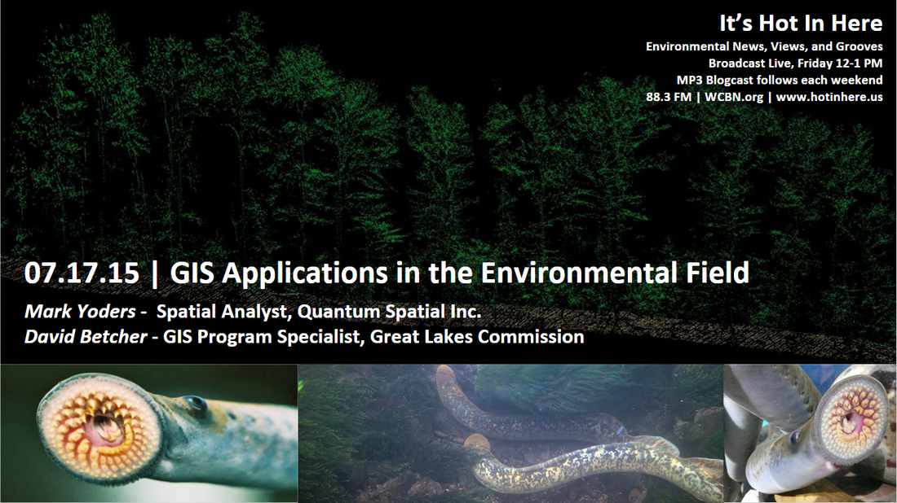
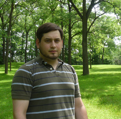
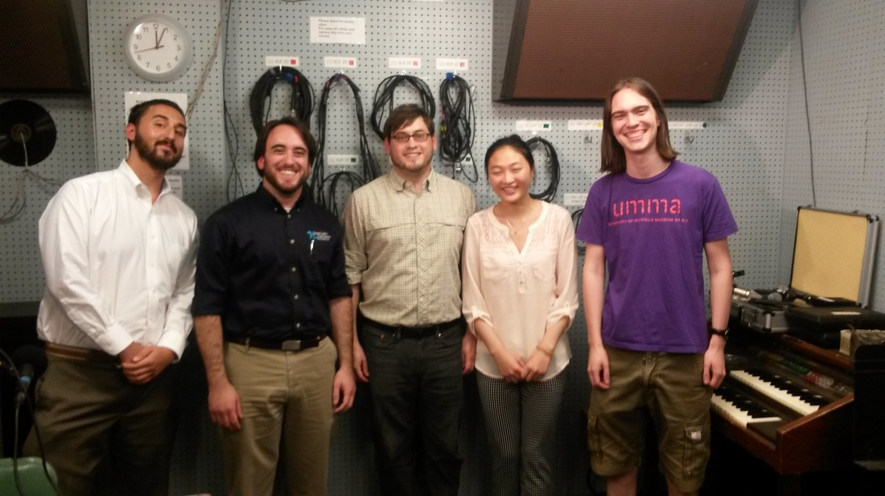

Join us on It’s Hot in Here this week to hear about GIS (Geographic Information System) applications in the Environmental Field -- **Mark Yoders** from Quantum Spatial Inc. shared with us details on a variety of GIS projects involving the environment and **David Betcher** shared specifics on his work with the Great Lakes Communication. We also discussed different GIS technologies, including 3D LiDAR and photogrammetric point clouds, as well as thermal and infrared imagery. All these technologies have revolutionized the ease and precision of large-scale environmental assessments and monitoring, but still rely on field data for verification and expertise across fields to interpret.

<!--more-->

**Mark Yoders**

After master’s in Environmental Informatics at the SNRE of UMich, four years as a utility forester in the midwest, and a bachelor’s in forestry from Ohio State, **Mark** started a full-time career with GIS at Quantum Spatial Inc. **Mark**’s work focuses on environmental monitoring, planning and assessment in areas ranging from electric utility vegetation management to state level timber estimation to monitoring for illicit wastewater discharge into surface waters.

* * *

In the show, **Mark** detailed a few of the projects he has worked on and started the conversation out by describing the process of using LiDAR to measure trees heights. The LiDAR data can then be used with infrared and other imagery to estimate potential declining trees and their ability to fall onto electrical lines. Utility companies use this data to reduce power outages and help prevent forest fires.

**Mark** then goes into a cost-benefit analysis project where the goal is to estimate if fish habitat creation, by anchoring logs in the stream to slow down the river current, usurps the value of extracting that particular piece of timber in that particular location. Mark also explained how LiDAR technologies work and how flights take overlapping pictures that can be used to create 3D imagery.

**David Betcher**

After graduating from the University of Cincinnati with a Bachelor’s degree in Geographic Information Science and working as a GIS intern at Ohio Department of Agriculture, **David** started his career as a GIS program specialist at the Great Lakes Commission. His main projects focus on invasive species and oil spill contingency planning.

* * *

In the studio, **David** first shared with us his project on sea lamprey control in the Great Lakes basin. Sea Lampreys are parasitic fish who attach themselves on fish to feed off them which also can cause damages to water quality and aquatic ecosystem. To help raise awareness, **David** is developing a web-based map viewer to help increase the public’s spatial knowledge of lamprey locations and offer reasons on how barriers in lakes affect sea lampreys.

Later in the show, **David** talked about a new analysis tool he is developing to find leaking pipelines and help pinpoint the origin of a spill. The tool will not only map out the locations of sensitive habitat, water intake, etc., but also show an estimate of how the oil spill will travel and when it would reach open water, based on time of year.

A few relevant links: [GIS: http://www.esri.com/what-is-gis](http://www.esri.com/what-is-gis) [LiDAR: http://oceanservice.noaa.gov/facts/lidar.html](http://LiDAR:%20http://oceanservice.noaa.gov/facts/lidar.html) [Quantum Spatial Inc.: https://quantumspatial.com/](https://quantumspatial.com/) [The Great Lakes Commission: http://glc.org/](http://glc.org/)And last, a studio shot:

**David Betcher** and **Mark Yoders** sandwiched between the IHIH team: **Sam Molnar**, **Pearl Zeng**, and **Cameron Bothner**.
