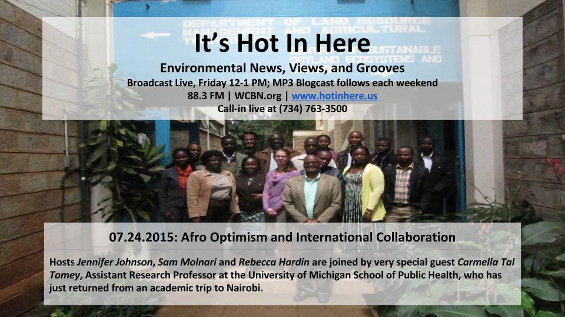
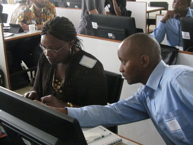
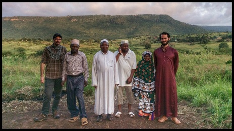
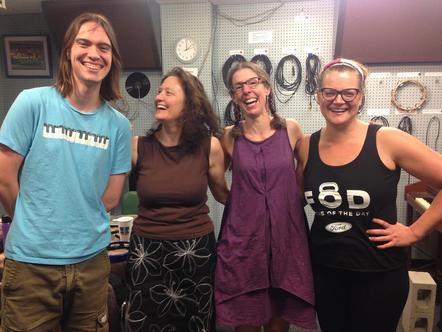

As President Obama touched down in Kenya early on Friday July 24, 2015 [Carmella Tal August](https://sph.umich.edu/faculty-profiles/august_ella.html), Clinical Assistant Research Professor at the University of Michigan School of Public Health, had only recently returned from Nairobi herself. Ella studies complex links between age, place, social and psychological factors, and physical impairment. She has recently expanded from research into what makes for healthy communities here in the U.S. to work within scientific communities overseas. She is developing [pre-publication support services](https://sites.google.com/umich.edu/prepss/home) to complement intimate, face to face workshops where she enables U.S. students and younger scholars to train with their international counterparts for more focused and effective writing, more responsible conduct of research, and more collaborative and productive careers. All of this aims to close age, gender, geographical location and economic gaps in international scientific expert communities. Sign us up! Co-hosts Jennifer Johnson and Sam Molnar peppered this episode with upbeat recent Kenyan dance tracks (playlist [here](https://play.spotify.com/user/1237079667/playlist/0M59WB8M65S95ahe6RC7jo)), as we honed in on Ella’s collaboration with Professor Jesse Njoka, who directs the [Center for Sustainable Dryland Ecosystems and Societies (CSDES)](http://csdes.uonbi.ac.ke/uon_news?page=2) at the University of Nairobi (UoN). Other UoN faculty Judith S. Mbau and Stephen Merithi collaborated with Ella to facilitate the workshop. They are pictured here in a peer review writing exercise they plan to continue using within their own curricula and communities.

SEAS Prof and occasional Hot host Rebecca Hardin convened a “Metaworkshop” with African colleagues from Gabon, Kenya, and Ethiopia in October of that same year, under the auspices of UM’s STEM-Africa initiative (Science, Technology, Environment/Engineering and Medicine/Math), African Studies Center and International Institute, and with support from colleagues at UCLA and Tulane working on a National Science Foundation PIRE grant in equatorial Africa. The meeting reviewed models for academic bridge building that can offer a next generation of scholars in sustainability and global health fields more integrative and collaborative training from early in their careers. It is currently awaited review as an edited volume _Sustaining African Science Partnerships_ in the African Perspectives book series at University of Michigan Press.

Previous Afro-optimist broadcasts on our show abound and the playlists range unapologetically across regions and eras. Our [STEM Africa Partnerships](http://www.hotinhere.us/1/post/2014/03/3-21-14-stem-africa-with-a-conservation-twist-featuring-dr-heather-e-eves.html#comments) broadcast starts with complex polyphonic pipe orchestras from Central African Republic, reflecting on the intricacies of African indigenous knowledge and practice. Then it takes us through Gil Scott Heron’s angry “Whitey on the Moon” poem set to rhythm, reflecting on asymmetric access to science within racist U.S. systems. It ends with Naeto MC singing “Things are Not the same…Ten over Ten” announcing positive change from his platform as the Nigerian “only MC with an MSc.”

In terms of talk, that hour we quote from the vision of STEM Africa leaders here on campus, Mechanical Engineer [Elijah Kannety Asibu](http://asibu.engin.umich.edu/) and Mathematician [Nkem Nkumba](http://planetearthinstitute.org.uk/five-questions-dr-nkem-khumbah/) who have engaged African scientists working internationally in considering scientific needs and strengths on the African continent. We also hear from [Dr. Heather Eves,](https://www.sais-jhu.edu/heves1) founding Director of the Bushmeat Crisis Task Force, who has taught in higher ed settings from the DC metro area to the Caribbean, and mentored many conservation professionals from Cameroon to Kenya. Heather’s persistent constructive engagement parallels the care Ella Tomey takes with her curricular materials. Dr. Eves also address radio as a tool for scientific and policy awareness and debate in African settings, and creative writing as a vehicle for better connections among and between scholars from varied disciplines and the wider publics they seek to engage.

Another Afro-optimist broadcast from 2011 tackled the [Africa-Asia Nexus](http://www.hotinhere.us/1/post/2011/11/environment-information-and-sustainable-development-the-africa-asia-nexus.html), with a mix of Indian and African music. A lively discussion blazed in studio between Anthropologist [Omolade Adunbi](http://bookscombined.com/category/omolade-adunbi/) about his work on oil extraction where his family and friends live and work in the Niger Delta, Geographer [Dr. Bilal Butt](https://bilalmbutt.wordpress.com/) working in his native Kenya on pastoralism in national parks, and the School of Information’s [Dr. Joyojeet Pal](http://joyojeet.people.si.umich.edu/) who hails from Mumbai but has worked on installing high speed wifi cables in rural Rwanda, and studying uptake of laptop technology in rural primary schools in India. You think you know the globalized green academy? Think again…

...and again. Just last year, Dr. Pete Larson led us on an [audio tour of really heavy metal African rock,](http://www.hotinhere.us/1/post/2014/01/13114-malaria-metal-and-detroits-heidelberg-project-et-al.html) while talking about his own metal band and his research on malaria in Kenya. Hot indeed! These days Pete can be found [blogging in English about the interfaces of epidemiology, development and culture,](http://peterslarson.com/) and teaching in Japanese as an Assistant Professor at University of Nagasaki, based in their [Institute of Tropical Medicine Kenya Field Station](http://www.tm.nagasaki-u.ac.jp/nekken/english/facility/project-k.html). Pete also holds down an Adjunct Professor position right here at the UM’s School of Natural Resources and Environment, mentoring UM masters students like Mike Burbidge, pictured below. Mike and others are seeking better field understandings of pastoralism, wildlife management, and spatial and social aspects of zoonotic disease transmission. They live with families and work with Kenyan field research teams.

Pete figured in today’s interview with Ella--especially in her tales of Nairobi nightlife, to which she was introduced right off the plane!  Unlike President Obama, Pete and the Michigan Difference team did not have a heavily armored and defended vehicle. But they did and do make a lot of impact on the lives of students and teachers at UoN (Nairobi), UN (Nagasaki), and UM (that’s right, Michigan). Welcome to the future. The revolution will not be televised. But if Ella Tal Tomey has her way, it will be collaboratively thought out, and carefully written about. Go Blue!

* * *

Pictured left to right: Cameron Bothner, our fabulous radio engineer hosts Rebecca Hardin and Jennifer Johnson, and our wonderful guest Ella August.

Last word on AfroOptimism:  One of our favorite Kenyan bands - Just a Band - and their music video: ["Usinibore"](https://www.youtube.com/watch?v=43XrFVp-fXY)
