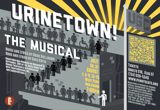

A local artistic and scientific collaboration between Ann Arbor’s [Penny Seats Theatre Company](http://www.pennyseats.org/) and the University of Michigan's [Environmental Biotechnology Group](http://envbiotech.engin.umich.edu/) is offering performances of the musical _[Urinetown](http://www.pennyseats.org/event/264fb53e28b9c2c2b0679a4142ad1bcc)_: _The Musical!_ as well as innovative water conservation research over the next three weekends starting July 30.<!--more-->

The [Environmental Biotechnology Group](http://envbiotech.engin.umich.edu/), an Environmental Engineering research team from the University of Michigan, is studying how human urine and its byproducts can be processed as a safe, effective and eco-minded way to fertilize food crops. The University of Michigan is one of five institutions involved in this ground breaking research. Fittingly, the [Environmental Biotechnology](http://envbiotech.engin.umich.edu/) [Group](http://envbiotech.engin.umich.edu/) will be providing porta-potties for the Penny Seats’ performances of _Urinetown._ 

**_"Urinetown: The Musical!_** is a Tony-award-winning hit written in 2001, and will be performed by The [Penny Seats Theatre Company](http://www.pennyseats.org) July 30, 31, Aug 1, 6, 7, 8, 13, 14, and 15 (all shows at 7 pm). The show is set in an admittedly absurd dystopian future where one must pay to pee, the show lampoons corporate bureaucracy, pie-in-the-sky optimism, revolution without a plan, and the musical theatre genre itself. With a full pit orchestra (led by Richard Alder) on the band shell stage, the action takes place around the audience in the park. Featured performers include Brendan August Kelly (Ypsilanti), Roy Sexton (Saline), David Francis Kiley (Ann Arbor), John DeMerell (Walled Lake), Sarah Ann Leahy (Ann Arbor), Paige Martin (Ann Arbor), Cathy McDonald (Plymouth), Christina McKim (Albion), Jenna Kellie Pittman (Waterford/West Bloomfield), Linda Rabin Hammell (Detroit), Jeff Stringer (Jackson), Maika Van Oosterhout (Ann Arbor), and Daniel Bachelis (Howell). Production photos taken by Scarlett London."

A review of the musical can be found [here](http://reelroyreviews.com/2015/08/03/urinetown-reviewed-enjoyable-two-hours-out-in-the-park-with-fine-singers-actors-and-dancers-and-an-amusing-satirical-musical-comedy/)!

\[gallery type="columns" size="medium" link="file" ids="157,158,159" orderby="rand"\]
