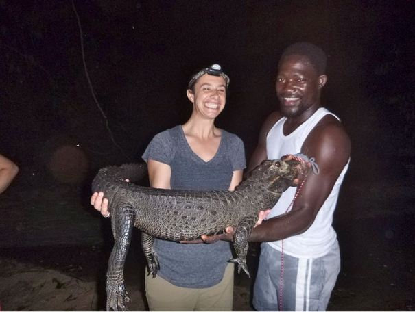

\*Vamping is to repeat a short, simple passage of music until otherwise instructed.

In today’s show, we focus our chat on the Michigan Mackinac pipeline and recent SNRE grad Katie Browne’s experience on capacity-building projects in Gabon. In addition, we vamped about our favorite non-American foods and non-English languages, and shared a letter from Rebecca Hardin in Hyderabad, India about her sustainability-case teaching experience to scholars from around the world.<!--more-->

In the first half of the show, we discussed a 62-year-old hydrocarbon pipeline that runs under the Mackinac straits, explaining why it is so problematic and discussing some of the possible procedures to prevent or cope with a potential spill. Intended to last only fifty years, Line 5 is not only 12 years overdue for replacement, but also highly corroded by zebra mussels, an invasive species with its own troublesome history in the Great Lakes. Underwater cameras have also documented broken support braces, which allow the pipeline to sway ominously. Of particular concern is Line 5’s positioning at a critical juncture between Lake Michigan and Lake Huron where currents are consistently strong; scientists predict a spill could spread in less than a day into both lakes and along a significant stretch of shoreline (see a model in the links below). While the State of Michigan has made a few suggestions to limit potential hazards (e.g. limiting the Line to transport of only hydrocarbons, which would float in a spill, and not tar sands which would quickly sink), more action needs to be taken.

A great place for IHIH listeners to start would be on the website of “Oil and Water Don’t Mix”, a local activist group leading the movement to “Keep oil out of the Great Lakes” - http://www.oilandwaterdontmix.org/

To learn more about Line Five (and you should learn more about Line 5! because Vamping is only the beginning!), check out these other greats sources of information and insight:

- The line five documentary on Vice Motherboard: http://motherboard.vice.com/read/the-aging-oil-pipelines-below-the-great-lakes
- A Youtube video modeling oil spill: https://www.youtube.com/watch?v=8bx4g-MPiws
- The Michigan Coalition Against Tar Sands: http://www.michigancats.org/

Second half of the show, we chat about the REFRESCH project that Katie has been working on in Gabon, which looks for solutions for future energy direction, as well as solving water and food challenges in resource constrained environments. The REFRESCH project is also active in the City of Detroit, where people are trying to build aquaculture system and utilize the interconnected technologies.

 

Katie and a group of undergraduates from the Eco-Explorers program field-testing an electric fence prototype, designed to reduce crop predation and human-wildlife conflict.

In Gabon, Katie and her teammates work with off-grid communities that do not have electricity to find technologies that address interconnected resource challenges. While Gabon is rich in oil, it must be exported to be refined, and is still very expensive upon re-importation. Renewable energy is therefore a key to the country’s vision for the future. Katie and her teammates have done some capacity building in the communities in Gabon, and will continue to do so in the next year. Their vision is to utilize this platform for people to exchange knowledge and solutions. For example, they are planning on putting together a series of workshops that will bring people from different villages to learn and exchange ideas. Some of the ideas include putting up electric fences and utilizing rechargeable car batteries, as well as entrepreneurship around solar panels and electricity storage.

Katie is working in Messanguelani, Central Gabon.

"In Gabon, it is not all hard work and no play. Sometimes you get to play with crocodiles." -- Katie

**Katherine Browne** Katie Browne is a recent graduate student from the School of Natural Resources and Environment (SNRE) where she focused on Environmental Justice and Science and Technology Policy. Before SNRE, Katie served three years as a Peace Corps Volunteer in Madagascar, where she ran environmental education programs and coordinated natural resources related seminars and projects. During her graduate school experience in SNRE, she worked in Kenya, Ethiopia, Alaska, and Peru on diverse projects spanning zoonotic disease, socioeconomic disparities, and climate change. Katie currently works for the University of Michigan Energy Institute, as a program assistant for the REFRESCH project in Gabon.

* * *

And last but not least --

Selfie shot of today’s IHIH crew: Cameron Bothner, Sam Molnar, Katie Browne, and Pearl Zeng.

We love to vamp!

* * *
