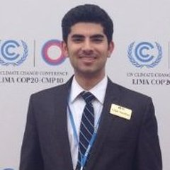
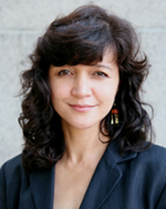
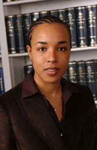
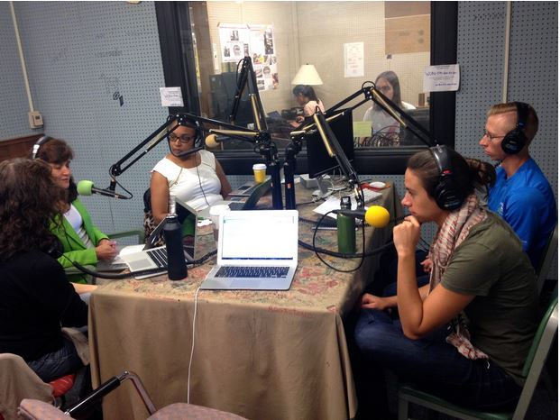
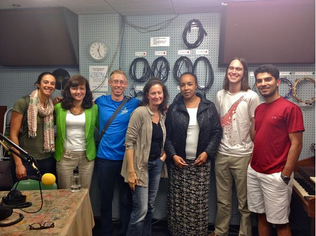

This show brings lively conversation on the challenges of climate change planning, both in Ethiopia and across the diverse governance landscapes of East and North Africa. Tied  with the [Gala case study on climate adaptation in Ethiopia](https://bit.ly/2UYDVHD)  this podcast explores the complexity of crafting effective and equitable adaptation policy. Specifically, we ask how national adaptation plans are made? By and for whom? What are the decision-making criteria? And what could these criteria fail to account for? Bringing together legal, economic, anthropological, and environmental expertise, we take adaptation policy as the starting point for broad-ranging dialogue on climate change impacts, social conflict across ethno-linguistic groups, and national planning as a tool that can either address or worsen marginalization.

<!--more--> Our hosts **Rebecca Hardin** **Katie Browne**, and **Arman Golrokhian** are joined by Returned Peace Corps Volunteer  **Benjamin Morse**, **Dr. Kelly Askew** of the Department of Anthropology and the Department of African and Afroamerican Studies (DAAS), and **Professor Laura Beny** of the Law School.  **Benjamin**’s experience working in Northern Ethiopia are riveting, especially the climate change impacts he witnessed firsthand in rural communities  **Arman** delves more deeply into the nitty-gritty of adaptation planning, specifically the criteria employed by the UN Development Program (UNDP) in selecting and prioritizing specific projects. His pre-recorded interview with **Benjamin Larroquette**, a regional technical advisor for the UNDP,  reveals the decision-making process, how environmental and development priorities are balanced, and what assumptions are built into the analysis.

\[embed\]https://www.youtube.com/watch?v=eIztXaV5rMs\[/embed\]

“Let’s Plant a Tree,” one of a series of collaborative PSAs produced by Ben during his years with Peace Corps in Ethiopia

The discussion also draws upon the expertise of **P****rofessor Laura Beny**, who has written extensively on the challenges of governance in Sudan and South Sudan, and **Dr. Kelly Askew**, whose research has increasingly focused on land rights and economic rights of Maa-speaking peoples in Tanzania. **Dr. Beny** highlights challenges faced by the world’s youngest country, South Sudan, particularly along its borders where migration, conflict over resources, and questions of citizenship have contributed to chronic instability. Emphasizing that national plans often fail to take the interests of marginalized groups into sufficient consideration, **Dr. Beny** warns that current climate plans and projects play into broader challenges of resource access.

\[embed\]https://www.youtube.com/watch?v=U3tzlicivo8\[/embed\]

“Kudung Dance” by Bilpam Akech – a traditional Atuot Dinka dance song recommended by _Professor Laura Beny_

**Dr. Askew** notes the needs of pastoralist and hunter-gatherer groups are routinely disregarded in national planning, often leading to displacement, persecution, and ethnic-based violence, as has unfortunately been the recent case with the Masaai in Tanzania. Climate change poses a particular threat to such marginalized groups as changing weather patterns drive governments to expand agriculture in the name of food security, increasingly compromising access these groups’ access to rangelands and water. Both **Beny** and  **Askew**  call for greater scrutiny of the role of international institutions, who underwrite and sponsor many of the development projects which drive displacement and marginalization. These institutions, they argue, should be held as accountable as national governments for project outcomes.

\[embed\]https://www.youtube.com/embed/8Ac2MlI8oNk\[/embed\]

“Ahled Ale” by Ethiopian artist Tewodros Kassahun, aka “Teddy Afro” – recommendation from _Julie Jarvey_, who recently returned from fieldwork in the Simien Mountains in northern Ethiopia

Further readings can be found below on the controversial “villagisation” process in the Omo Valley in Southern Ethiopia,  linked to widespread displacement and waves of recent violence :

- “We Say the Land is Not Yours” a report and series of interviews by the California-based Oakland Institute on forced displacement: [http://www.oaklandinstitute.org/we-say-land-not-yours-breaking-silence-against-forced-displacement-ethiopia](http://www.oaklandinstitute.org/we-say-land-not-yours-breaking-silence-against-forced-displacement-ethiopia)
- 2012 Human Rights Watch report, “Waiting here for Death:” Forced Displacement and “Villagization” in Ethiopia’s Gambella Region: [http://www.hrw.org/sites/default/files/reports/ethiopia0112webwcover\_0.pdf](http://www.hrw.org/sites/default/files/reports/ethiopia0112webwcover_0.pdf)
- A 2015 Guardian piece on the political climate of torture, oppression, and silencing surrounding the “villagization” program: [http://www.theguardian.com/world/2015/apr/14/ethiopia-villagisation-violence-land-grab](http://www.theguardian.com/world/2015/apr/14/ethiopia-villagisation-violence-land-grab)

**Benjamin Morse**

**Benjamin** is a Behavior, Education and Communication Master of Science from SEAS and a Master of Public Policy Candidate at the Gerald R. Ford School of Public Policy at the University of Michigan. While attending school, **Benjamin** worked as a Campus Recruiter for the Peace Corps on University of Michigan's campus and as the Social Media Director for Detroit Digital Advertising; an automotive digital advertising rep firm located in Detroit. He's  now working with Academic Innovation at UM, producing online courses and "teach outs" on timely topics. Originally from Colorado, Benjamin  has lived in Australia, Costa Rica and Ethiopia and the Republic of Korea.

* * *

**Arman Golrokhian** is also a dual degree master’s student at the University of Michigan in SEAS and the Ford School of Public Policy. He has participated in international climate change meetings, including the 2014 and 2015 Bonn Climate Change conferences and the 2015 20th Conference of Parties of the United Nations Convention Framework on Climate Change. Arman is passionate about creating more sustainable societies by applying his understanding of the natural resources system and working with decision makers to come up with innovative decision-making processes. In that spirit, since graduating Arman has been   working as a strategist for DTE Energy in Detroit, and is transitioning  there to renewable energy strategy.

**Kelly Askew** is the former  Director of the African Studies Center and Professor of Anthropology and the Department of African and Afroamerican Studies (DAAS). She has worked for over two decades in Tanzania and Kenya. In addition to her research in East Africa on performance, nationalism, media, postsocialism, and the privatization of property rights. Kelly's writings and film projects span two primary research areas: poetic arts as vehicles for populist engagement with politics, and the formalization of property rights. She is Co-Principal Investigator on a $1.5 million grant from USAID to strengthen engineering education in Liberia, part of an $18.5 million effort titled Excellence in Higher Education for Liberian Development (EHELD), which constitutes a collaboration between the University of Michigan, Rutgers, North Carolina State, Kwame Nkrumah University for Science and Technology and RTI International.

* * *

**Laura Beny** is a professor at University of Michigan Law School, teaching in Corporate Finance, Enterprise Organization, International Finance, the Public Corporation, Law and Development, and Law and Finance. Her research interests include a wide range of subjects in law and economics, finance, political economy, and international development. Her research has been published in the American Economic Review, American Law and Economics Review, Journal of Corporation Law, and Harvard Business Law Review, among others. Laura is co-editor with Sondra Hale of the  critical volume _Sudan's Killing Fields: Political Violence and Fragmentation_ (Red Sea Press).In addition to her scholarly work, **Dr. Beny** has published numerous opinion pieces on Sudan and South Sudan in various international media, such as Newsweek International, Africa.com, and Al Jazeera, among others. She also has served as a legal consultant on numerous projects in the United States and Africa. Before coming to Michigan, she practiced private and pro bono law at Debevoise & Plimpton, an international law firm based in New York City. She is currently Associate Director of the UM Center for African Studies.

* * *

**Benjamin Larroquette** is the Regional Technical Advisor of [United Nations Development Programme - Global Environment Facility (UNDP-GEF)](http://web.undp.org/gef/). He provides oversight and technical support to 15 African countries on implementing Climate Information and Early Warning Systems Strengthening Livelihoods and Disaster Risk Reduction and adaptation to Climate Change.In our show, we played a prerecorded interview that **Arman** did with **Mr. Larroquette** about National Adaptation Programme of Action (NAPA).

\[caption id="" align="alignnone" width="621"\] This week’s guests and hosts in Studio: (from L to R) Dr. Rebecca Hardin, Dr. Kelly Askew, Professor Laura Beny, Benjamin Morse, and Katie Browne.\[/caption\]

\[caption id="" align="alignnone" width="616"\] This week’s full production team: (from L to R) Katie Browne, Dr. Kelly Askew, Benjamin Morse, Dr. Rebecca Hardin, Professor Laura Beny, Cameron Bothner, and Arman Golrokhian.\[/caption\]

Don't forget to enjoy this music proposed by It's Hot in Here founder and previous cohost Professor Jennifer Johnson -- "Eyekesekesenge Fekerhe" by Bezunesh Bekele, the "Aretha Franklin of Ethiopia":

\[embed\]https://www.youtube.com/embed/\_evIMzYS\_hk\[/embed\]
