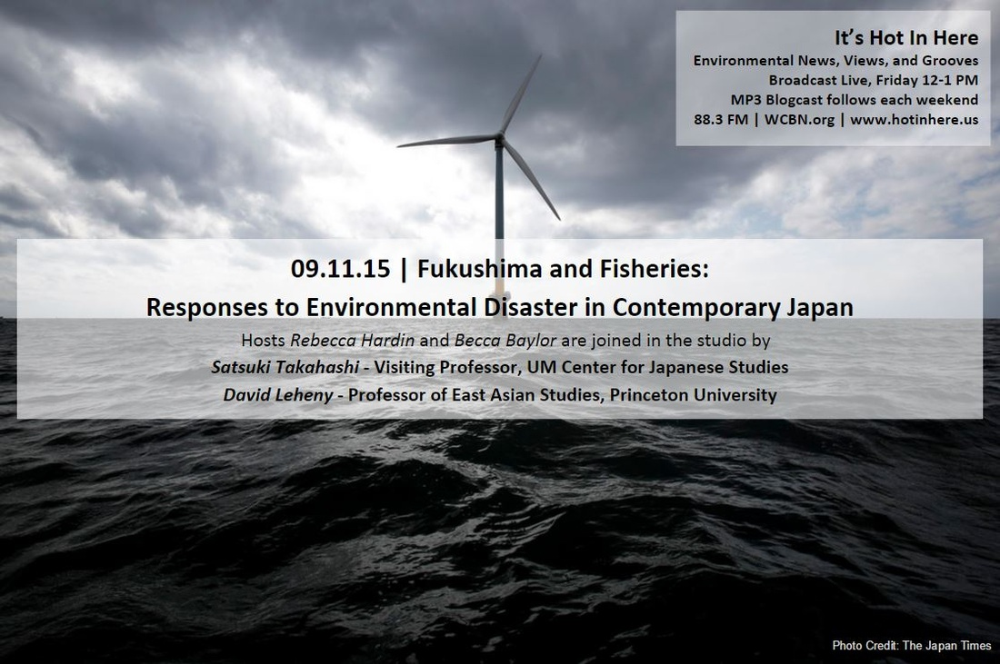
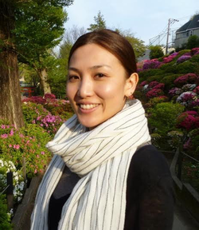

This week we have two very special guests in studio with us, and one on the phone lines, to talk about Environmental Disaster, Fisheries, and the Future in Japan.

First up, Satsuki Takahashi, is an environmental Anthropologist who is Assistant Professor of Anthropology at George Mason University. Dr. Takahashi is the latest in a long line of self-described “Girl Fish Geeks” on It’s Hot in Here (cf. Ellen Spooner on [wrangling Muskies on Lake Saint Claire](http://www.hotinhere.us/1/post/2014/10/10242014-freshwater-health.html), and [Jennifer Johnson](http://biotically.blogspot.com/2014/05/gender-diversity-and-legality-in.html) who <!--more-->has done a great [interview on this show](http://www.hotinhere.us/1/post/2012/01/01092012-groundcover-news-uganda.html) about her work on fishing for Nile Perch in “what English speakers call” Lake Victoria, in Uganda).The IHIH production team was lucky to have a conversation with Satsuki about her work with fisheries along the coast in Japan near the Fukushima nuclear plant, and how it came to be a baseline study for pre-disaster life as well as a testimonial to the challenges of life after the combined tsunami, earthquake, and reactor malfunction that has caused so much fear and damage since March 11, 2011. Dr. Takahashi stayed after the show to read a few pages from her book manuscript in process, as well:

 

* * *

Dr. Takahashi reading from her book manuscript in progress.

<iframe src="https://archive.org/embed/SNREHotInHere/2015-09-11-Supplement_with_Satsuki_Takahashi.mp3" width="500" height="30" frameborder="0" allowfullscreen="allowfullscreen"></iframe>

The song in the background is Ii Jikan by Evisbeats, the lyrics of which are as follows:

この 時間のせい ? Is it the fault of our time? この 天気のせい ? Is it the fault of this weather? この 景色のせい ? It it because of the scenery? この 年齢のせい ? It it because of my age?

訪れた いま いい時間 Visiting now, it’s a good time. 久々の いい時間 A long time coming, a good time. 訪れた いま いい時間 Visiting now, it’s a good time. もしかして いま いい時間 Maybe now is a good time.

A second guest called in to talk with us about exactly what happened that fateful day, and to reflect with IHIH producer Arman Golrokhian about shifting understandings of the Fukushima disaster by communities within Japan, Japanese government circles, and wider networks of environmentalists. Hisashi Saito represents a sustainability NGO, [Iuventum](http://www.iuventum.org/), to the United Nations Office in Geneva. He actively participated in the climate change discussions of UNFCCC such as COP19 and SB40. He frequently attends the Human Rights Council and UNCTAD sessions, covering human rights and sustainability. As a strong advocate of the right to health, he has been following the situation in Fukushima after the nuclear disasters in 2011, along with other nuclear situations around the world where vigilance is needed about radiation health damage.

Our third guest, David Leheny, is the Henry Wendt III ’55 Prof of East Asian Studies at Princeton University. David chimes in from his vantage point as a scholar of politics in Japan, commending his colleagues at universities there for their work on hope in the wake of the tsunami and related disasters. He cautions us, however, us to think critically about the high tech message of hope being emitted by the Japanese government these days, as wind turbines dot the coast and become emblems for a green future that can somehow rectify the radioactivity and other damage done by the Fukushima disaster.

Such sweeping gestures of hope, he notes, can foreclose on the important feelings of rage, fear, horror, and anger that can and do accompany such a disaster. Can such feelings be part of creating other paths forward? Perhaps even ones that are less focused on technological solutions and more on the challenges of even deeper social change in energy use, food systems, coastal built environments, and our understandings—still so limited—of how our actions and technologies shape marine and coastal ecosystems? David is a Toyota Visiting Professor at the UM Center for Japan Studies this year, who is offering a course and thinking critically about emerging concerns with security and terror in the Japanese context.

During this “Japan” show, we listened to a wide range of music, from Frank Sinatra to several Japanese hip hop artists, including the tune released right after the Fukushima disaster “But This Is Way” by s.l.a.c.k., known for his staccato mixing style and quirky, unique persona. Another hip hop song by s.l.a.c.k. with a great video is [“NEXT.”](https://www.youtube.com/watch?v=RIKHqcScsTM) When you hear Dr. Takahashi reading her descriptions of fishermen still living in temporary housing, shopping for food and missing their old homes closer to the breezes and sights of the coast, you might think about the way this video also evokes a kind of stuffy, solitary urban life of alienation, control by government sanctioned officialdom, and social stratification, but also humor, whimsy, and possibility.

<iframe src="https://www.youtube.com/embed/RIKHqcScsTM" width="420" height="315" frameborder="0" allowfullscreen="allowfullscreen"></iframe>

Also featuring close ups of interior living space, is from rapper and beats maker EVISBEATS who is seems more laid back and optimistic, though the camera also offers us stark images of rail lines that bisect Japanese landscapes and interrupt the intricate cadence of just walking a straight line, or riding around on a bicycle alone, or with friends. Is it a stretch to note an undercurrent of skepticism and frustration in these shorts, where bicycles appear as the mode of mobility of the little guy, faced with regular and widespread controls by uniformed officers and contrasted with the clanging and rushing of trains in a world of efficiency, high-tech solutions, and “progress?”  What is clear is that both scholars and artists and activists from Japan are making themselves heard on these issues. Let’s listen.

<iframe src="https://www.youtube.com/embed/nE1nzTE5ESA" width="420" height="315" frameborder="0" allowfullscreen="allowfullscreen"></iframe>
