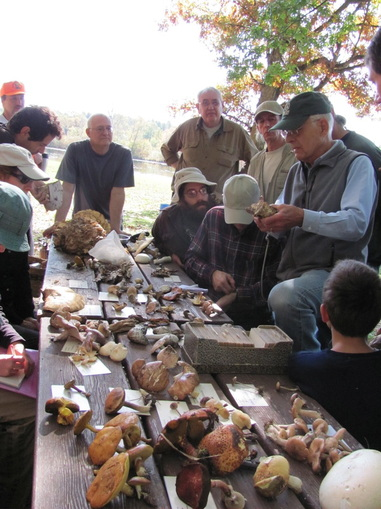

This week our special in studio guest is Philip Tedischi, Past President and current Vice President of the Michigan Mushroom Hunters Club, Phil is a "real fungi." We learned during our time in studio that he served as engineer for WCBN FM back in his days as an undergraduate at UM in the 1960s, but also boasts a total of 5 advanced degrees from the university of MI, including a PhD in Computer Science. Phil was joined on the mike by contemporary DJ Rodney, a Saline, MI resident who stopped on his way out of the studios after his show to ask a few choice questions about Morrell mushrooms. Tune in and learn along with Rodney! Phil is a real authority, and leads mushroom hunts on many fall weekends.

<!--more-->

Phil was joined on the phone lines by Chris Wright, who is the Executive Director of Midwest American Mycological Information (MAMI), and owner of Easy Grow Mushrooms, an outfit selling do it yourself mushroom kits at the Ann Arbor Farmer's market. Chris is a Doctoral Candidate at MSU, and he talks with us about changing norms in Michigan for mushroom identification in the interest of commercialization. Gradually markets are growing up and avid mushroom hunters with expert knowledge can pursue a path to become agents of mushroom certification for markets. This is affecting the distribution of wild mushrooms on lots of Michigan markets, which can be a boon to rural communities and consumers alike.

Both Chris and Phil, as well as Hot in Here co-host Rebecca Hardin have learned much from formal study and field study with former UM mycologist Robert Shaffer (pictured). There is a close knit community of people in this area who love to get out in the woods and find fungi; many go together in order to confer and make absolutely certain they know what kinds of mushrooms they are collecting! Co-host Becca Baylor notes she is heading out on the weekends this time of year whenever possible; at the time of this writing she had been cooking with chanterelles she gathered last weekend!

Both our guests and our hosts echo Professors Shaffer's admonition about edible mushrooms: They are edible by most people, most of the time, if properly prepared. Some of the most unmistakeable and safest mushrooms include puffballs (white spheres that can be made into a good mushroom soup as long as they are still white inside!) and hen of the woods. As you learn more, remember the cautionary note of our experts, but we hope you also catch their enthusiasm for the abundance and variety of Michigan Mushrooms, and learn more on their websites about the expertise needed to gather and consumer wild mushrooms safely (for instance, they must never be consumed raw!)

Our soundtrack today ranges from the brilliant, iconoclastic John Cage--himself a mushroom enthusiast (and survivor of a "mushroom mistake") to the Kinks (who may well have made other kinds of "mushroom mistakes"). Learn about the nutritional benefits, ecological particularities and recreational opportunities with Michigan's fall mushrooms: listen in!

For more information, check out the following links:

- Anthropologist Ann Tsing's [website](http://www.matsutakeworlds.org/).
- [The Michigan Mushroom Hunters Club](http://michiganmushroomhunters.org)
- [Easygrow (no space!) Mushrooms](http://www.easygrowmushrooms.com/)
-  [MAMI](http://www.midwestmycology.org/)

