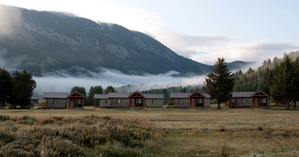

# About Camp Davis

 

*Cabins at Camp Davis*

Nestled in the mountains 19 miles south of Jackson Hole, Wyoming and tucked between the Hoback River and Bridger Teton National Forest, [Camp Davis Rocky Mountain Field Station](https://lsa.umich.edu/earth/camp-davis/camp-davis-faq.html) is a research and teaching facility owned and operated by the University of Michigan and managed by the Department of Earth & Environmental Science. Camp Davis has provided an unparalleled learning experience each summer since 1929. Camp Davis offers courses in Introductory Geology, Geological Mapping, Ecosystem Science and the History and Literature of the West. Located within the Greater Yellowstone Ecosystem and nearby Grand Teton National Park, our location provides a wealth of instructional opportunities.<!--more-->

Camp Davis allows students to fulfill their Practical Experience requirements for their respective majors. Two of the most common majors that require Practical Experience are the Program in the Environment and Earth and Environmental Sciences. The Practical Experience requirement is an opportunity for students to learn through action and not just listening to lectures. It is essential for students to get into the field and experience first-hand the issues that are affecting the plant. This includes a research component that pushes students to engage with a wide variety of environmental and human issues through question formulation, data collection, analysis and in-depth discussion. This opportunity gives students valuable experiences that can help them land their first job or get into their graduate school of choice. Other regular field experiences to choose from include the [U of M Biological Station](http://www.lsa.umich.edu/umbs) in Northern Michigan (which includes courses for non UM Students!), the [New English Literature Program](https://www.lsa.umich.edu/english/nelp/), the [Michigan in Washington Program](http://www.lsa.umich.edu/michinwash), and the [Semester in Detroit](http://lsa.umich.edu/sid).

* * *

 

*History and Literature of the West class on a hike in Cascade Canyon, Grand Teton Nat'l Park*

*Bailey Schneider in the Tetons while at Camp Davis*

Our host, **Bailey Schneider**, has taken two courses at Camp Davis. In the summer of 2014, she took an Introductory Geology course thats covers all aspects of modern earth sciences. Students in this course learn about rocks, minerals, and fossils, both in the classroom and in a variety of natural settings, which leads to discussion and understanding of topics such as volcanic eruptions, earthquakes, geo-environmental problems, pale-oceanography, and tectonic processes. This past summer, she took History and Literature of the Rockies, which was taught by **Gregg Crane** and **Phil Deloria**. This course examines a range of human experiences and expressions of place, centered on the Camp Davis region and Grand Teton and Yellowstone National Parks. This course also examines human histories and landscapes, tracing these from the first inhabitants to contemporary development, management, and recreational issues, as well as human expressions of place captured in literature, art, and landscape. As she put it on air (after admitting she got in trouble for carving her name in a cabin!)  "It made me want to live with more purpose...it actually DID change my life."

* * *

Another guest in studio, new IHIH production team member  and PITE major Harry Rice was listening intently. He asked a few hard hitting questions of his own, since he plans to attend Camp Davis this coming year.  We also all listened to and loved a spectacular, quiet cover of "This Land is Your Land" by My Morning Jacket to Eddie Vedder's "Society" and "Blame it on the Tetons" by Modest Mouse. These tunes helped us think about leaving society as we know it behind in order to either sit in a special place, or travel through landscapes as part of learning: those with the travel bug might like Joe Trumpey's [Ecoexplorers](http://stamps.umich.edu/ecoexplorers/About_Eco-Explorers.html) courses which in recent years have expanded from the Sonoran Desert or Four Corners region of the U.S. to include sites in Madagascar, Tanzania, and [Gabon](http://www.hotinhere.us/1/post/2015/08/08142015-mackinac-pipeline-project-in-gabon-ihih-summer-vamping.html).

* * *

  
  
  *Rendezvous Peak, Grand Teton Nat'l Park*

*History and Literature of the West class in Yellowstone Nat'l Park*

*Hayden Valley, Yellowstone Nat'l Park (Taken by Phil Deloria)*

## Our Guest: Phil Deloria

[Professor Phil Deloria](https://www.lsa.umich.edu/ac/people/americanculturefaculty/ci.deloriaphilipj_ci.detail) is the Carroll Smith-Rosenberg Collegiate Professor of American Culture and History, former LSA Associate Dean of Undergraduate Education, and past Director of the Program in American Culture and the AC Native American Studies program. He has served as president of the American Studies Association, a council member of the Organization of American Historians, and a Trustee of the Smithsonian National Museum of the American Indian. He holds a joint appointment in the [Department of American Culture](http://www.lsa.umich.edu/ac/people/americanculturefaculty) and the [Department of History](http://www.lsa.umich.edu/history/people/faculty/ci.deloriaphilipj_ci.detail). Phil's research interests include issues of culture and representation particularly concerning American Indian people, social and cultural relations in contact situations, and environmental and Western American history. Phil and [Gregg Crane](http://www.lsa.umich.edu/english/people/profile.asp?ID=982) teach the History and Literature of the West course at Camp Davis Rocky Mountain Field Station. Our host, **Bailey Schneider**, vouches that Phil is one of the best and most knowledgable professors at U of M--listen in and find out why!
