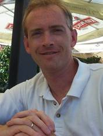
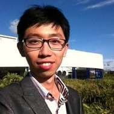
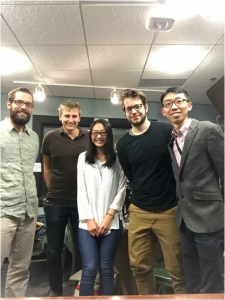

This week we are on the phone with **Dr. Brian D. Fath**, professor in the Department of Biological Sciences at Towson University, and a major contributor to the newly published book, [_Flourishing Within Limits to Growth: Following nature's way_](https://books.google.com/books?id=6QcXCgAAQBAJ&pg=PR1&lpg=PR1&dq=flourishing+within+limits+to+growth&source=bl&ots=MhDX3BuDZ9&sig=6qLKRFHeiDDfhdk9LoBh3YFpDSA&hl=en&sa=X&ved=0CCgQ6AEwAWoVChMIvv-11OC6yAIVAVQ-Ch391QIH#v=onepage&q=flourishing%20within%20limits%20to%20growth&f=false). We are joined in the studio by **Joey Zhouyuan Li**, a Ph.D student in the School of Environment at Tsinghua University, China, who is currently a visiting scholar at Towson under **Professor Fath**. We also welcome two new additions to the IHIH team: first-year SNRE master's students **Alex Truelove** and **Ed Waisanen**. **Alex** recently transitioned to SNRE from a career in music and is studying Sustainable Systems at SNRE. **Ed** is an Ann Arbor native who has recently returned to Michigan to study Environmental Policy and Planning.

<!--more-->

We started our conversation with **Joey Li** who is doing his dissertation on grassland systems in Western China. We learned that China’s vast grassland resources have experienced a great deal of degradation, but which, in the last two decades, are being restored. **Joey** is monitoring this process and explained that China's government has launched numerous restoration projects that combine technology and ecology, including reintroducing wolves. We noted that wolves have also been a hot topic in Michigan since being reintroduced.

With **Professor Fath** on the line our conversation turned to _Flourishing Within Limits to Growth: Following nature's way_. The book is a modern recasting of the landmark 1972 book [_The Limits to Growth_](https://en.wikipedia.org/wiki/The_Limits_to_Growth), which modeled world population, industrialization, pollution, food production, and resource depletion; simulating the interactions between human and ecological systems. Like _The Limits to Growth_, _Flourishing_ concludes that infinite growth cannot continue on earth: there are limits. **Professor Fath** sees flourishing as a "reframing of priorities" away from measures like GDP and towards experiential indicators.

**Professor Fath** explained that _The Limits to Growth_ came out just as our view of the earth was changing: Astronauts on Apollo 17 captured [The Blue Marble](https://en.wikipedia.org/wiki/The_Blue_Marble), a photograph of the earth from space. These kinds of images brought to mind the notion that the earth was finite. The book was poorly received, he said, in part because of its pessimistic framing. _Flourishing_ uses these concepts but casts them in a different light: limits are an opportunity rather than a crisis. Ecosystems are subject to physical limits (solar energy, etc.) but flourish under these conditions.

At the end of the conversation, **Professor Fath** stressed the difference between growth and development; growth being a measure of economic success, and development a measure of well-being. He left us with the following quote by **Robert Kennedy**, which is also included in _Flourishing Within Limits to Growth_:

> Yet the gross national product does not allow for the health of our children, the quality of their education or the joy of their play. It does not include the beauty of our poetry or the strength of our marriages, the intelligence of our public debate or the integrity of our public officials. It measures neither our wit nor our courage, neither our wisdom nor our learning, neither our compassion nor our devotion to our country, it measures everything in short, except that which makes life worthwhile.

At the close of the program, we asked **Joey** about _Joey’s Lab_, a subscription newsletter service that he organizes via WeChat (a popular Chinese messaging service). Through _Joey’s Lab_, he provides instruction and training on how to do research, including academic reading, writing, and data analyzing in a strategic and efficient way. The aim of _Joey’s Lab_ is to make these academic skills accessible to a wider audience. Unfortunately our non-Chinese-speaking audience, an English version is yet to come!

Musical selections this week included a collection of classical pieces selected by **Professor Fath**, which depict nature and invoke the notion of "following nature's way." We heard pieces from **Beethoven**, **Strauss**, **Vivaldi**, and **Liszt** amongst others.

## Our Guests

**Dr. Brian D. Fath**

**Dr. Brian D. Fath** is a professor in Department of Biological Sciences at Towson University in Maryland and editor-in-chief of Ecological Modeling Journal. He a major contributor to the newly published book, "Flourishing within Limits to Growth: Following Nature's Way." **Professor Fath** serves as a research scholar in the Advanced Systems Analysis Program at International Institute for Applied Systems Analysis (IIASA) in Austria, and the scientific coordinator in Young Scientists Summer Program at IIASA.

Dr. Brian D. Fath's page on Towson University: [http://pages.towson.edu/bfath/](http://pages.towson.edu/bfath/) Club of Siena: [http://clubofsiena.eco-soft.dk/](http://clubofsiena.eco-soft.dk/) International Institute for Applied Systems Analysis (IIASA): [http://www.iiasa.ac.at/web/home/research/Advanced-Systems-Analysis.en.html](http://www.iiasa.ac.at/web/home/research/Advanced-Systems-Analysis.en.html)

* * *

**Joey Zhouyuan Li**

**Joey Zhouyuan Li** is a Ph.D student in the School of Environment at Tsinghua University, China. He is currently in the US as a visiting scholar for the Fall semester under Professor Brian Fath. He is working on a doctoral dissertation about progress in ecological restoration and regional climate change in China's grassland ecosystems. **Joey** recently published his research on Environmental Science and Technology by April this year.

Online presence links of Joey and his teamwork projects: [https://www.linkedin.com/pub/joey-zhouyuan-li/35/508/9](https://www.linkedin.com/pub/joey-zhouyuan-li/35/508/9) [http://www.researchgate.net/profile/Zhouyuan\_Li2](http://www.researchgate.net/profile/Zhouyuan_Li2) [http://tsinghua.academia.edu/joeylab](http://tsinghua.academia.edu/joeylab)

_Joey’s Lab_ WeChat public page number: joeyslab. To subscribe: [http://chuansong.me/account/joeyslab](http://chuansong.me/account/joeyslab)

Joey's recent publications about his dissertation research project: [http://pubs.acs.org/doi/abs/10.1021/es505985q?journalCode=esthag](http://pubs.acs.org/doi/abs/10.1021/es505985q?journalCode=esthag)

* * *

###### This week's in-studio production team: 

\[caption id="attachment\_112" align="alignnone" width="225"\] Left to right: Engineer Jason Adam Voss, Ed Waisanen, Pearl Zeng, Alex Truelove, and Joey Li.\[/caption\]
