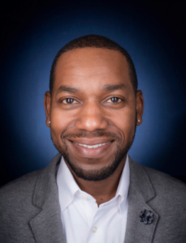
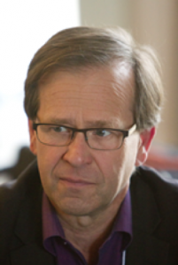
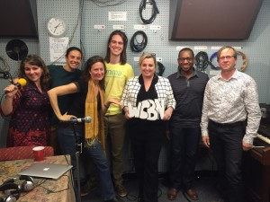

Today’s show, the second in a three part climate change series, discusses climate justice in cities from Detroit to Paris, site of the upcoming United Nations Conference of Parties on  Climate Change. In other news, the studio may just never have been this hot before; we were tempted to pour our water over our heads. <!--more-->

The show kicked off with a discussion between Dr. Tony Reames and our hosts about the disparities between developed and developing countries regarding who should be responsible for reducing greenhouse gas emissions, and who suffers most when no one does. 

A postdoctoral research fellow in the School of Natural Resources and Environment (SNRE) at the University of Michigan. Tony has a PhD in public administration from the University of Kansas. He is a licensed Professional Engineer (PE) with a Masters in engineering management from Kansas State University, and a Bachelor of Science in civil engineering from North Carolina Agricultural and Technical State University. Dr. Reames’s overarching research agenda explores questions intersecting the areas of intergovernmental relations, environmental and social policy, and community change. His current research examines these topics in the context of residential energy consumption and affordability disparities, focusing on inequality in household energy efficiency by race, class, and place.To learn more about Tony and the work he is doing, check out [his site](http://greenscholar.com).

Beyond global asymmetries between those most responsible and those most vulnerable, we also talked at the neighborhood level about climate injustice faced by those minorities living in urban heat islands due to lack of resources and support to insulate their homes and otherwise prepare for climate extremes. Tony has worked on these issues not only in Kansas City, but also in Greenland, but he just keeps getting "Greener":

<iframe style="border-radius:12px" src="https://open.spotify.com/embed/track/3oYV3PvvVJjbGl5KoKanOW?utm_source=generator" width="100%" height="352" frameBorder="0" allowfullscreen="" allow="autoplay; clipboard-write; encrypted-media; fullscreen; picture-in-picture" loading="lazy"></iframe>

Can the upcoming talks in Paris address such challenges? [Dr. Paul Edwards](https://www.si.umich.edu/people/paul-edwards), a professor in the [School of Information](http://www.si.umich.edu/) (SI) and the [Dept. of History](http://www.lsa.umich.edu/history/) at the [U of M](http://www.umich.edu/) conducts research on the history, politics, and cultural aspects of computers, information infrastructures, and global climate science. His most recent book is [_A Vast Machine: Computer Models, Climate Data, and the Politics of Global Warming_](http://pne.people.si.umich.edu/vastmachine/index.html) (MIT Press, 2010). 

He lent  us a nice historical perspective on the negotiations that have happened before, including the Kyoto Protocol. The thing connecting all of these previous cases is the difficulty in getting people to take action on these agreements, andthen to monitor their compliance with intended actions.

The COP in 2009 in Copenhagen was the last time  people had very high expectations for the outcomes of the meetings; looking ahead to Paris, that hope has returned. However, Paul mentioned very big points of contention including the actual mitigation of these practices, the financing of the new programs, and how these outcomes will be put in place, especially in contexts like the US where climate skeptics remain widespread. The Fogerty tune "Who'll Stop the Rain" alludes wryly to "five year plans" and other efforts at human collaboration to face big challenges--a perfect theme.   

<iframe style="border-radius:12px" src="https://open.spotify.com/embed/track/7HpFPKFmHWDTduzkdc1B2i?utm_source=generator" width="100%" height="352" frameBorder="0" allowfullscreen="" allow="autoplay; clipboard-write; encrypted-media; fullscreen; picture-in-picture" loading="lazy"></iframe>

Nancy Skinner dropped into the studio for this broadcast, bringing expertise and insight from her  new show Climate Talk Radio on Washington, DC's new progressive talk station, WPWC 1480 AM on Sundays from 10 a.m. to noon ET, which she broadcasts from the Detroit area. Nancy also appears frequently as a progressive voice on Fox News and Fox Business.received an award from the Clinton administration, presented to her by Vice President Al Gore, for her work on rebuilding flooded Midwestern communities as models of environmental sustainability during the 1990s. For more info see her twitter, [@climatetalker](http://twitter.com/climatetalker), her show’s [Facebook page](https://www.facebook.com/climatetalkradio?fref=ts), and her  [personal page](https://www.facebook.com/nancyskinnerlive/info/?tab=page_info). She reminded listeners for the need to combat skepticism and inaction on these issues, and modeled passionate committed energy from start to finish. 

Our passionate voices on the phone today included the southern drawl of Dr. Ricky Rood, a Professor of Atmospheric, Oceanic and Space Sciences; Prior to 2005, he held several leadership positions at NASA’s Goddard Space Flight Center. Ricky summed up the University’s historical presence at COP events, noting that forty-eight people from the school went to the talk at Copenhagen for the 2009 talks, and representatives have been attending on behalf of Michigan every year since. Such experiential learning  gives those with a science background the knowledge of how difficult solving these problems socially and politically really is.  Dr. Avik Basu also called in,  heading to France in a few weeks in order to watch the talks between more than 190 countries take place. Over the last decade at University of Michigan, Avik has been part of a collaborative effort to develop a framework known as the Reasonable Person Model (RPM), to help practitioners from various disciplines become better at creating conditions that improve human well-being.  He also earned a Ph.D. in Environmental Psychology and a Master’s in Electrical Engineering--AND he is a talented musician and [dancer with A2Tango.](http://www.a2tango.com/videos.html)  Hot!

But, wait, we were talking about cities...

<iframe style="border-radius:12px" src="https://open.spotify.com/embed/track/69eihm0ByPDKtOnZ2B9mA7?utm_source=generator" width="100%" height="352" frameBorder="0" allowfullscreen="" allow="autoplay; clipboard-write; encrypted-media; fullscreen; picture-in-picture" loading="lazy"></iframe>

As always on our show, things start and end with students.  Matt Bishop and Lizz Ultee are grad students who will be attending the Paris COP delegation. Both are going to the Conference of Parties for the first time this year. Lizz is  a climate scientist studying glaciers as a doctoral candidate in the UM  Climate and Space Science and Engineering Program  is looking forward to learning more about the real life outcomes of her research and the research of other scientists at the university. Matt, also originally having a science background, is a student at the Ford School of Public policy, who speaks with us about the intricate interfaces of policy and science knowledge needed for more effective  to enhance climate adaptation and mitigation in the future.

Lizz, while not filling us in on climate and pipleine politics in her native Canada (shout out to Hot [Hugh Stimson](http://hughstimson.org/)!), hooked us up with the environmental messaging of Kenyan-Canadian artist Shad, with “We, Myself, and I”:

<iframe style="border-radius:12px" src="https://open.spotify.com/embed/track/4WQlwxF392SuMEZEWnvxKK?utm_source=generator" width="100%" height="352" frameBorder="0" allowfullscreen="" allow="autoplay; clipboard-write; encrypted-media; fullscreen; picture-in-picture" loading="lazy"></iframe>

We must also thank the  students who put this whole thing together:  David Hyland, Daphne Mendez, Lena Hamelin, Ben Sonnega who were a remarkable pre-production team doing research on basic definitional debates about climate justice, contrasting European and U.S. popular attitudes toward climate change, and setting us up with many of the tunes on this excellent soundtrack.

Students, if you want to learn more, check out the following course taught by Ricky Rood: Climate change problem solving. This is a graduate class, taught in concert with the School of Natural Resources and Environment. The class includes business students, policy students, as well as students from several science and engineering departments. Also, in 2014,  Paul Edwards and Ricky introduced a new course called Climate Informatics.  The challenge of global climate change presents crucial issues that demand the expertise of both scientists and information professionals. Among these are: Retrieving and presenting complex climate data to non-expert users with specific needs; Building decision-support tools for planning and management; Communicating climate science to broader audiences through simulations, games, or educational software; Establishing reputation and trustworthiness for web-based information sources managing vast Earth system datasets, including curation, provenance, metadata,openness and reproducibility; Designing green IT, such as power-aware computing, smart controllers and smart grids.

Or, if you’re interested in the things happening in our own backyard check out last years Hot shows about [climate justice in Detroit with Will Copeland](http://www.hotinhere.us/2014/11/11-7-2014-climate-week/), and [Climate Change Negotiations, Morality and Solar Energy](http://www.hotinhere.us/2015/06/6-26-2015-climate-change-negotiations-morality-and-solar-energy/).  Or tune in Friday at noon to hear how cherry farmers and vintners in Michigan's northern reaches are adapting to climate change, with roving reporters Ed Waisanen and Alex Truelove.
