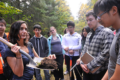

It's the finale of our three part series on climate change. This week our hosts Becca Baylor, Ed Waisanen, and Alex Truelove investigate the implications of climate change on agriculture, especially on cherries in northern Michigan.  They are joined on the phone by Jim Nugent, the director of the Leelanau Conservancy; Nikki Rothwell, the coordinator of the Northwestern Michigan Horticultural Research Station; and in studio by Dr. Paige Fischer,  Assistant Professor in the School of Natural Resources and Environment. <!--more-->Dr. Fischer holds her Ph.D. and M.S. in Forest Resources social science from Oregon State University. Prior to that she completed a bachelor’s degree in Cultural Anthropology at Hampshire College. Her current [research](http://www.snre.umich.edu/profile/paige_fischer_phd) aims to increase scientific understanding of human behavior regarding the sustainability of socio-ecological systems. Dr. Fischer made a recent trip to Traverse City possible for a group of students, including our hosts Alex and Ed, to visit cherry producing sites and learn about adaptation in the cherry industry in Northern Michigan: Today with 3.8 million tart cherry trees, [Michigan produces 70 to 75 percent of the tart cherries grown in the United States](http://www.traversecity.com/area/about-traverse-city/cherry-industry/). Yet, they are getting harder and [harder to find](http://www.leelanaunews.com/news/2015-07-30/Front_Page/Great_prices_few_cherries.html).

\[gallery type="rectangular" link="file" columns="2" size="medium" ids="956,954,957"\]

How to start a show about climate change impacts in our own backyard? Of course, with Ann Arbor native Shigeto's mesmerizing tune "Huron River Drive" which conjures that ribbon of road along the banks up to the "just like up north" towns of Dexter, Pinckney, Hamburg and Whitmore Lake.

\[embed\]https://www.youtube.com/watch?v=9DGfFDTJyI4\[/embed\]

Just like the Huron River landscape, this team is not new to the trees in agroecological systems. We revisited an interview with University of Toronto Professor and Canada Research Chair, Dr. Marney Isaac, which originally aired this [January](http://www.hotinhere.us/2015/01/1-16-2015-agroecology/), in which she explains to Sam Molnar (and both Beccas) how trees anchor stable ecologies, thus creating more predictable production quotas for farmers. Beyond that, they can be like a "pension plan" for farmers, storing carbon in their roots, in addition to generating income from fruit. These economic and ecological principles link the landscapes of cherry growers in Michigan with those we have discussed in other areas in this series on climate (like small island nations or European settings—even Africa!) Ella's dulcet vocals on her classic “Heat Wave" keep it hot, reminding us that in spite of the best efforts of trees worldwide, we are facing of more and more volatile climate extremes. At the time of this writing November temperatures in our area are climbing toward seventy degrees…heat wave indeed!

\[embed\]https://www.youtube.com/watch?v=57qy7MCzLXA\[/embed\]

Not to be out shined by the incredible jazz music, our hosts spice up the conversation by bringing in cherry expert Jim Nugent to assess the climate adaptations occurring in northern Michigan. Retired as District Horticultural Agent, MSU Extension and Coordinator of the NW Michigan Horticultural Research Station, Jim has served as a leader in statewide cherryprogramming. He has co-authored many publications and articles, the most recent being _Early 21st Century Cherry Varieties for the Great Lakes & Eastern North America_.   Having grown up on a farm on Northwestern Michigan, farming is all in the family for Jim and his  wife, Toddy Rieger, who is also a fruit grower. They have three grown children raised against a backdrop of Michigan Farms. More information about Jim and his work can be seen on the [Leelanau Conservancy page](http://leelanauconservancy.org/blog/person/jim-nugent-director/#sthash.1zp3QW6E.dpuf).

Jim brings along another expert, Dr. Nikki Rothwell, recently named Coordinator of the [Northwest Michigan Horticultural Research Center](http://agbioresearch.msu.edu/centers/nwmihort) (NWMHRC) and District Extension Horticulture Educator. This position constitutes a split appointment with Michigan Agricultural Research Station (45%) and [Michigan State University Extension](http://msue.anr.msu.edu/) (55%).  Dr. Rothwell heats up our conversation with reports of serious crop losses that have been occurring in the past decade. Nikki and Jim agree that spring frosts (often indicated by early blooms) are often a huge problem to the cherry industry, and these have been getting stronger year after year. Yet, she notes, Michigan farmers have been very receptive to climate change information, and are key in the research on agricultural adaptations to the rising temperatures. They are piloting solutions including diversifying their crops (hey…we think Marney Isaac would love that!) and putting in irrigation systems. But farms struggle as many options are expensive and include investments in what amount to large natural experiments. Soundtrack?  Local band Third Coast Kings and their hit song Birds & Bees:

\[embed\]https://www.youtube.com/watch?v=eee4\_QlJKEE\[/embed\]

Not that demand for cherries is decreasing. Researchers have found that tart cherries help with sleep, muscle recovery, and gout. These are three of the current known benefits of the fruit, but more and more research is being done to asses the [positive benefits of cherries](http://www.choosecherries.com/).  To meet this rising demand many other countries are increasing their cherry production. With these players comes a stronger global market, and if volatile events continue to threaten Michigan's productivity, how will the economy rebound? An anthem for an integrated economy, “Landsailor” by Vienna Teng,  stands in tribute to the power and damage that comes from globalization and technological change.  This video finds her musing on grad school in a joint program at SNRE and the Ross School at UM, before delivering to an audience in Singapore her lyrics about “a storm outside your door.”  Lucky Detroit, Michigan is now her Mission Control, and those of us who miss her on campus are glad she has not gone far.

\[embed\]https://www.youtube.com/watch?v=6AWWnkD\_xrc\[/embed\]

Closing conversations between Dr. Fischer, her students in studio, and her colleagues from cherry producing  communities showcase the power of experiential learning for creating better connections and resources for collaboration.  We may not be able to control the weather (ask Ann Arbor native Mayer Hawthorne, below, about that!), but we can work faster and better together to understand and respond to it.

\[embed\]https://www.youtube.com/watch?v=JYHYAwvdHzY\[/embed\]

While production has been decreasing and the stakes have never been higher,  there are still plenty of cherry jams to go around. The last song on the turntables is the wonderful Neil Diamond’s Cherry Cherry.

https://www.youtube.com/watch?v=vvXCYqd8AAs&feature=youtu.be&t=20

Thanks for tuning in to the third and final part of the Climate Change series.

* * *

We are so in love with trilogies we are going to start another one next week: on alcohol. That's right, Friday November 6 we'll start with breweries in our area, then move to wine the following Friday and end up with the hard stuff for the Thanksgiving holidays. Join us, and learn who is making liquor in the Mitten, and how. Til next Friday at noon,  keep it hot!
