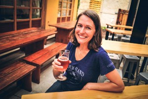
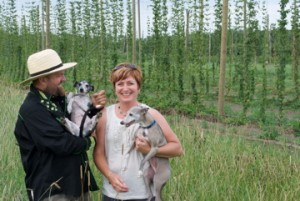
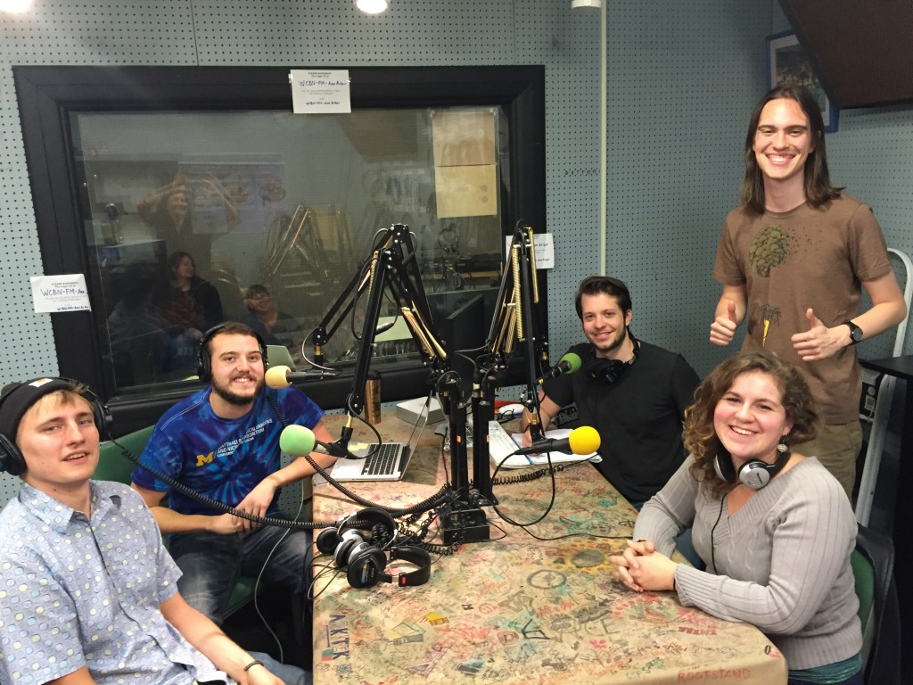

In this first episode of our three part series called "Please, Drink Sustainably,” our guests Kris Spaulding, co-founder of [Brewery Vivant](http://www.breweryvivant.com/), and Brian Tennis, owner and operator of the [Michigan Hop Alliance](http://michiganhopalliance.com/) taught hosts Harry Rice, Becca Baylor, Ed Waisanen, and Alex Truelove all about the sustainability innovations in beer production happening right here in the mitten.

<!--more-->

Kris manages the “people” and “planet” aspects of Vivant’s triple-bottom-line focus while her husband and business partner Jason concentrates on the company’s profitability. She was the driving force in the pursuit of Vivant’s [LEED](http://www.usgbc.org/leed) and [B Corporation](https://www.bcorporation.net/) certifications and is an advocate for businesses engaging with their community in a meaningful and impactful way. Kris plays an active role in building the [West Michigan B Corporation Network](http://www.mlive.com/business/west-michigan/index.ssf/2014/08/brewery_vivant_is_latest_west.html) and is also on the board of her neighborhood association.

Kris received her undergraduate degree from the University of Michigan's School of Natural Resources and Environment. Before founding the brewery, she worked in the non-profit sector for a few years, and then spent 12 years at Herman Miller, where she first met Brian Tennis.

Their previous work relationship benefits the two of them to this day, as Brian currently supplies Kris and Brewery Vivant with their hops. The plot being planted for Vivant is a French style hop, but Brian's team currently grows over 50 acres with a great variety of hops, seeing as there are [many different strains](http://michiganhopalliance.com/product-category/all-hops/).

Along with Brewery Vivant, Brian and his wife Amy supply Short's Brewing, Founders Brewing, and New Holland Brewing. They currently own and operate the Michigan Hop Alliance and [New Mission Organics](http://www.newmissionorganics.com/about-new-mission-organics).  They have a small 30 acre farm that specializes in organic and sustainably grown hops. As a member of the MHA, they are able to take the hops from cones to pellets and provide Michigan craft-brewers with the best tasting and most aromatic hops available.

Vivant and the MHA are in a very _hoppy_ relationship, and that all relates back to the true mission of these companies. Both do everything in their power to keep their businesses as sustainable as possible, and they are constantly working towards a better future for everyone while providing us with amazing product. Kris and her team are on the forefront of [brewery sustainability](http://media.wix.com/ugd/cb5d17_9cfaba03f31e48dcbd820ea06e473e9a.pdf), and the Hop Alliance is right there with them growing [environmentally friendly crops](http://michiganhopalliance.com/plants-coming-soon/).

Both of these organizations are working towards a cultural shift to more sustainable beer, and it is a necessary one in an industry worth more than $100 billion. One fifth of that total comes from the more than 3,500 [craft breweries](https://www.brewersassociation.org/statistics/craft-brewer-defined/) in the country, and 159 of those are [Michigan-based](http://www.mibeer.com/beer-tourism), including several breweries around Ann Arbor. As Kris and Brian discussed, small businesses have unique challenges, but they also have the freedom to lead on the path toward sustainability.

\[caption id="attachment\_1015" align="alignnone" width="474"\] The production team in the studio!\[/caption\]

* * *

We’re excited to announce that we’ll be kicking off a new endeavor, coming at you with a mid-week update from the field in a series called _It's Hot Out There_! Look for a short video interview with Matt Gacioch, an SNRE student who spend some time working at Shorts Brewery.

Plus, you know what they say: “beer before wine, feelin’ fine.” Get ready for part two of “Please, Drink Sustainably,” when we’ll discuss the wine industry in Michigan! Tune in Friday for another Hot show!
