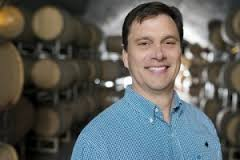

Our second segment in the three part series, "Please, Drink Sustainably" takes our hosts Alex Truelove, Becca Baylor, and Rebecca Hardin to the vineyards of Michigan with the help of [Black Star Farms](http://www.blackstarfarms.com/)' managing member and winemaker, Lee Lutes, and principal and co-founder of [5 Lakes Energy](http://5lakesenergy.com/), Liesl Clark.

<!--more-->

Lee oversees winemaking operations for two processing facilities on the Leelanau and Old Mission Peninsulas. He is also the director of the distillation program that produces European style fruit brandies and dessert wines. Lee is proud to be a self-taught winemaker with 25 years of experience in various regions around the world. He served as an assistant winemaker at Abbazia di Valle Chiara in the Piedmont region of Northern Italy prior to moving back to his native Northern Michigan in 1993.

Lee's work in the industry in Michigan brought him "through the grapevine" to work with Liesl on The [Michigan Grape and Wine Industry Council](http://www.michiganwines.com/about-council#sthash.11rxGPJH.dpbs). They have been thinking  and drinking together ever since. Liesl is Vice President for Policy and Business Development for the Michigan Energy Innovation Business Council. At 5 Lakes Energy, Liesl leads a client group that manages external business relationships, legislative communications and government outreach. Prior to 5 Lakes Energy, Liesl worked in Governor Granholm’s office where she served as policy adviser for energy, agriculture, environment and natural resources and was involved in negotiating the 2008 Clean, Renewable, and Efficient Energy Act. 

Both agreed with our guests from [last week's show on Craft Beers](http://www.hotinhere.us/podcast/a-cultural-shift-to-conservation-craft-beer-in-michigan/): sustainability is a hot issue in beverage industries.  5 Lakes actually conducted a wide ranging [feasibility study](http://5lakesenergy.com/wp-content/uploads/2015/09/5LE_WineSustainabilityReport_081915_bleed2.pdf) on the challenges that wineries are currently facing, as producers have to worry not only about waste warter disposal and other production issues, but also about sourcing from consistent grape crops under the looming [threat](http://www.sciencedirect.com/science/article/pii/S2212977414000222) of climate change  in the region. This is a huge problem when you consider that Michigan has 15,000 acres of vineyards, making it the fourth largest grape-growing state in the USA. Lee noted these challenges, combined with rising residential land prices up north, mean that if systematic changes are not made, the [future](http://www.mlive.com/business/west-michigan/index.ssf/2015/10/wine_may_be_scarce_from_northe.html) will not look so bright.  

To enjoy the very best of the 1.4 million gallons of wine annually produced in Michigan right now, you can stop into a concept local wine bar linked with Black Star, the [Vin Bar](http://www.vinbara2.com/) in downtown Ann Arbor. It recently opened, to complement  Ann Arbor's longer standing wine bar, [Vinology](http://vinologya2.com/).  What will you find? Most Michigan wines are classified under vinifera varieties;  think Chardonnay, Riesling, Pinot Noir, Pinot Grigio/Gris and Cabernet Franc. In fact since 1997, 90% of the new plantings in Michigan have been vinifera. Lee notes that Michigan is growing more and more Pinot Noir, despite some of the viticultural challenges associated with our humid region.  That should please a connoisseur like Paul Giamatti's character  in the film Sideways, which actually created an uptick in Pinot sales! 

\[embed\]https://www.youtube.com/watch?v=QCS1Gnwbtp0\[/embed\]

If that clip didn't leave quite the right finish on your palate,  try the more robust  "Peeno Noir" music video from Unbreakable Kimmy Schmidt:

\[embed\]https://www.youtube.com/watch?v=A6yttOfIvOw\[/embed\]

Sure, fun and games can come along with drinking,  but remember to drink responsibly and "Please, Drink Sustainably." We'll tell you even more about how on Friday November 20 in our last segment of this series, on distilled spirits. Until then, be on the lookout for our second segment of [It's Hot Out There,](https://www.youtube.com/watch?v=Gcsz5Z0afco) and if you missed the first installment, see it. We shot it live at [ABC,](http://www.arborbrewing.com/) the brewpub that started it all in our town.  Keep it hot (this is our year: 65 degrees at the time of this writing on Sunday November 15 ?!?!)  and keep it locked on WCBN FM, Ann Arbor.
