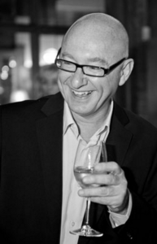

Our hosts Alex Truelove, Ed Waisanen, and Bailey Schneider  wrapped up our three part series, “Please, Drink Sustainably” with a vibrant discussion on distilled spirits with distiller and marketing director at [Journeyman Distillery](http://www.journeymandistillery.com/) in Three Oaks, Michigan, Nick Yoder, and co-owner and operator of [Cafe Zola](http://www.cafezola.com/) in Ann Arbor, Michigan, Alan Zakalik.

[Journeyman Distillery](http://journeymandistillery.com) is an Organic Spirits Distillery, located in the EK Warren Historic Featherbone Factory, in Three Oaks, Michigan. They offer a variety of organic spirits such as vodka, gin and rum but mainly focus on whiskey.  The spirits are distilled, bottled, labeled, and packaged at their distillery. Journeyman Distillery puts a strong emphasis on maintaining sustainability in their practices from their location in a historic reclaimed factory to their spirits. This distillery started four years ago and has focused on being a sustainable and innovative business ever since. The spirits are made using certified organic ingredients sourced from the local farmers. The Journeyman Distillery Tasting Room offers a variety of food items, all made with organic ingredients from local farms.

Nick helps Journeyman Distillery share the tales of its journey with the world. Nick is in charge of raising customer awareness and bringing consumers to the distillery to experience the spirits first hand. He pridefully proclaims to have extensive knowledge of spirits from his experience of distilling once a week.

Alan Zakalik has owned and operated Café Zola alongside Hediye Batu since 1996.  Alan and Hediye deliberately choose their suppliers to ensure that they serve the highest possible quality of food and beverages. Alan emphasizes that they try to buy local and organic when possible. Café Zola has an exquisite bar menu and serves many craft liqueurs. Alan discussed traditional polish cherry liqueur making, something that anyone can do at home.

Sustainability in the local alcohol industry has remained a constant throughout this series. Producing distilled spirits requires more energy than beer and wine production, and almost of the water used in the distillation process ends up as waste. To combat this, many local distillers are purchasing grain from local organic farmers, reusing liqueur barrels, and turning their waste into energy.

\[embed\]https://play.spotify.com/user/1227568484/playlist/0TMNJGoVuvLI6pYDMgaLhL\[/embed\]
