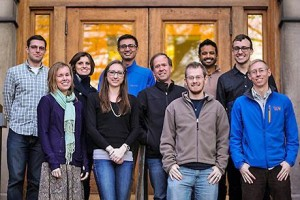
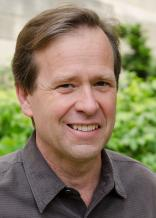

This week's show gave our listeners insight into the [21st Conference of Parties (COP21),](http://www.cop21paris.org/) a conference of world leaders under the United Nations Framework Convention on Climate Change (UNFCCC). Our hosts, _Harry Rice, Ed Waisanen, Bailey Schneider,_ and _Rebecca Hardin_ were joined in studio by members of the [University of Michigan Climate Change Delegation](https://climateblueum.wordpress.com/2009/11/23/um-cop-15/) and the ground control team that's supporting them at the climate negotiations in Paris. We were also joined by _V Epshteyn_ and _Ellen Loubert_ from [UM Divest and Invest](http://www.divestum.org/) to hear about some local action that is taking place on the University of Michigan campus and in Ann Arbor.

COP 21 just wrapped up its first week in Le Bourget, Paris and will extend until December 11. The goal of the conference is to reach a legally binding and universal [agreement](http://unfccc.int/files/meetings/paris_nov_2015/in-session/application/pdf/_adp_compilation_3dec15.pdf) to combat climate change and reduce greenhouse gas emissions to limit global warming to 2°C above pre-industrial levels. Over 50,000 participants including government leaders, environmental advocates, NGOs, UN agencies, and academics will be in attendance.

*The Michigan Team heading to COP 21*

The participants are categorized as negotiators or delegates. Ten University of Michigan and faculty members will participate as delegates. The [UM delegates](https://climateblueum.wordpress.com/2009/11/23/um-cop-15/) are given the duty to report on what happens at the conference and to ensure that the negotiations are transparent. The UM delegation is part of an elite group of universities that can attend the COP conference. You can follow them on [twitter.](https://twitter.com/ClimateBlue?ref_src=twsrc%5Etfw) <!--more-->

*Dr. Paul Edwards*

We featured a clip from the second part of our climate series which ran earlier this year, entitled "City Limits to Climate Change." Here are _Katie Brown_ and _Becca Baylor_ interviewing _Dr. Paul Edwards_ about the history of the negotiations and what's at stake at this year's conference.

Divest and Invest is a "coalition of students, faculty, staff and alumni at the University of Michigan dedicated to divestment of fossil fuel financial assets." You can follow them on [facebook](https://www.facebook.com/divestandinvest?_rdr=p) and [twitter](https://twitter.com/divestandinvest).  To keep fossil fuels in the ground and promote renewable energy resources, join Divest and Invest at the [Michigan Climate March](http://act.350.org/event/D12-solidarity_attend/11510) on Saturday, December 12 at 2:00 PM in front of the Federal Building in Ann Arbor.

*Divest and Invest will be hosting events all week to promote renewable energy*
