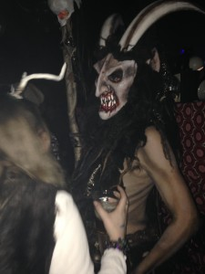
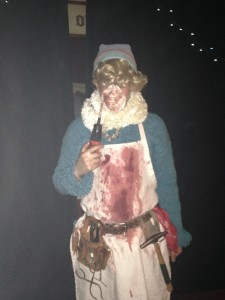
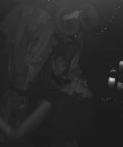

\[embed\]https://youtu.be/AH27LEFtbiA\[/embed\]

This episode of It's Hot Out There brings us to downtown Ypsilanti for the annual Krampus Ball. This free holiday event, open to the public, includes several DJs, a puppet show, and a walk down Michigan Avenue. An amazing party,  with many working  to make it happen:  from steadfast [Mark Maynard](http://markmaynard.com/2015/12/krampus-is-returning-to-ypsi-this-saturday-night-so-youd-best-start-sewing-your-pelts-and-practicing-your-dance-moves/) at the tap, to the DJ's flinging confetti on the dancers while pointing the strobe at the outlandish costumes;  the puppeteer used both hands to make his creatures dance on the beat while his friends speared sausage chunks into his mouth.

<!--more-->A contest midway through the party recognized the best costume. One was a full body sheepskin with horns that made the place feel like part barnyard, part hell mouth. The most disturbingly gorgeous one (photo above) was made by  [Artist Mary (of Many Monstrosities)](http://migeekscene.com/marys-monstrosities-at-the-grand-rapids-comic-con-2015/) .  The winner in the costume contest was this terrifying take on the elf pining to be a dentist from the iconic children's  television special Rudolph the Red Nosed Reindeer. 

At the end of the party came the physically excruciating Krampus on makeshift stilts who loomed over us on the dance floor (photo cred, ed) and lumbered beside us in the streets (see the video above).  All of this was a labor of love: created with sweat, and care, and PBR.   

Lit torches signaled the parade's departure from  the Dreamland Theater, and brought bar-goers out into the streets to watch. An electric base  player with portable amplifier offered a sombre beat for the march, woke sleeping dogs and brought Ypsi downtown residents to their windows.  At first  the torches seemed eerily like those of medieval (or early colonial; or white supremacist) mobs terrorizing threatening social outcasts who might be magical--or just different. But as the march moved on under the brightly lit wreaths and tinsel on each lamp post of Ypsilanti's historic Michigan Avenue, the flames started feeling like a fine kind of light by which to move, together, through the darkness of winter and of these weird times.
