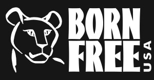
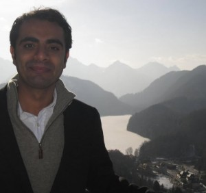
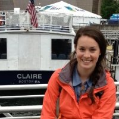

In this week’s broadcast, we dive into a complicated and contentious issue, discussing the increasing militarization of conservation and anti-poaching efforts on the African continent, especially as they relate to broader anti-terrorism agendas.

Host Katie Browne, accompanied by first time co-hosts Mike Burbidge and Claire Poelking, introduce this week’s topic with discussion of the new Global Anti-Poaching Act ([H.R.2494](https://www.congress.gov/bill/114th-congress/house-bill/2494/text)), currently under debate in the US Senate, which calls for support of anti-poaching efforts, strengthening of partner country capacity to counter wildlife trafficking, and designation of major wildlife trafficking countries. <!--more-->We are then joined by call-in guest Adam Roberts, CEO of [Born Free USA](http://www.bornfreeusa.org/), a strong supporter of the bill, who argues that militarized enforcement is the only viable response to increasingly organized and well-funded poaching across the continent.

Shortly thereafter, our hosts are joined by Dr. Meredith Gore, a [conservation criminologist](http://conservationcriminology.msu.edu/) from Michigan State University, who draws upon her fieldwork in Madagascar and elsewhere in Africa to argue for the need for multidisciplinary approach to understanding poaching. Dr. Gore, whose research integrates the fields of criminal justice and natural resource management, offers a theoretical perspective on the poaching crisis as linked to broader environmental crimes and risks. Understanding these risks, she argues, is necessary to framing appropriate interventions.

Finally, our show features an interview with Dr. Jatin Dua, a socio-cultural anthropologist whose work focuses on issues of governance related to maritime piracy in the Indian Ocean. Dr. Dua contributes comments on the parallels between the international community’s response to piracy, particularly as it originates in the “failed state” of Somalia, and its increasingly militarized response to poaching in Central and East Africa. The narratives that surround failed states, Dr. Dua asserts, have their own productivity in these contexts.

**This Week's Guests:**

**Adam Roberts,** [**Born Free USA**](http://www.bornfreeusa.org/index.php)

 Adam Roberts was named CEO of [Born Free USA](https://www.facebook.com/BornFreeUSA) in 2014, after holding the position of Executive Vice President since helping launch the organization’s American branch in 2002. Adam has significant expertise and more than two decades experience in international wildlife trade and captive wild animals. He also serves on the board of the [Species Survival Network](http://www.ssn.org/) (SSN) and is current chairman of the board of the [Global Federation of Animal Sanctuaries](http://www.sanctuaryfederation.org/gfas/), a nonprofit organization dedicated to developing species-specific humane standards of care for animals held in sanctuaries. Adam has written more than fifty articles for various medical, legal, scientific and advocacy organization publications. He also writes a monthly [blog](http://www.bornfreeusa.org/bfusablog.php).

**Dr. Meredith Gore, Michigan State University**

Dr. Meredith Gore is an assistant professor in the [Department of Fisheries and Wildlife](http://www.fw.msu.edu/) and the [School of Criminal Justice](http://cj.msu.edu/) at Michigan State University. She holds a PhD in Natural Resource Policy and Management from Cornell University, a MA in Environment and Resource Policy from the George Washington University, and a BA in Anthropology from Brandeis University. She is a social scientist working not only to improve the effectiveness of environmental governance but also reduce risk to people and the environment. Dr. Gore’s field research is focused primarily in the Indian Ocean nation of [Madagascar](http://www.conservationcriminology.com/uncategorized/msu-faculty-voicemeredithlgore/), and works through the unique research framework of [Conservation Criminology](http://www.conservationcriminology.msu.edu/index.php). Conservation Criminology is currently an online certificate program offered at Michigan State University at the Master's level.  Dr. Gore also teaches undergraduate courses, including "Introduction to Environmental Crime" and a study abroad course entitled: _Paradise in Peril: Exploring Madagascar's Biodiversity Crisis_

**Dr. Jatin Dua, The University of Michigan**

Dr. Jatin Dua is an Assistant Professor of Anthropology at the University of Michigan, whose research focuses on maritime piracy in the Indian Ocean and projects and processes of governance, law, and economy along the East African coast. Dr. Dua’s current book project explores maritime piracy in the Western Indian Ocean within frameworks of protection, risk, and regulation by moving between worlds of coastal communities in northern Somalia, maritime insurance adjustors in London, and the global shipping industry.

 

**This Week's Hosts:**

**Michael Burbidge**

Mike is a master’s student at the School of Natural Resources and Environment in the environmental justice track.  His research interests involve issues involved with the management of protected areas on the African continent, primarily illegal wildlife trade and human-wildlife conflict.  Previous to attending SNRE he was an Agroforestry Peace Corp Volunteer in the East of Cameroon.

**Claire Poelking**

Claire is a master’s student at the School of Natural Resources and Environment in the environmental justice and environmental informatics tracks.  Her research focuses on shared landscapes between humans and wildlife, primarily in the East African context.  Before attending the SNRE she worked as a GIS Analyst for an environmental consulting firm and as field researcher for the Bioko Biodiversity Protection Program in Equatorial Guinea.

**Katie Browne**

Katie Browne is a recent graduate of the School of Natural Resources and Environment and an increasingly frequent contributor to It’s Hot in Here. When she isn’t in Gabon, Katie produces podcasts in conjunction with “Michigan Sustainability Cases” on topics of climate change and climate justice, conservation, and nonprofit management. Before coming to Michigan, Katie served three years with the Peace Corps in Madagascar. She is from one of the two Carolinas; which one depends on the day you ask.
