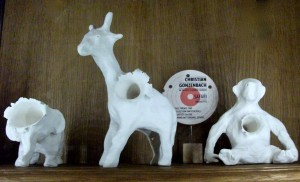
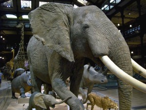

This week's It's Hot Out There segment features [Kate Brooks](http://www.katebrooks.com/). We reached her in Geneva, at the CITES (or Convention on International Trade in Endangered Species) meetings, where she is shooting a final for her film on wildlife poaching (a topic we talked about on last Friday's episode [Its Hot in Here](http://www.hotinhere.us/podcast/militarization-of-conservation-narratives-of-poaching/)). Talking to kate brings back memories for Rebecca:  

We are sitting in the Sweetwaters Cafe on Ashley one winter afternoon in 2013, watching fat snowflakes fall on the wreaths outside Ann Arbor's Downtown Home and Garden. Kate Brooks is missing her apartment in Beirut, and nursing a cold in the Michigan winter. She wraps her hands tighter around a hot mug of tea and lets loose these words: "I don't know, this title just came to me last night: The Last Animals. I love it because--listen to this--here is the definition of animalis..it is having the breath of life or life force....We are literally destroying the most ancient life force on the planet with this wave of poaching and I think I could make either a series or a feature length documentary about it. Will you help me?"

<!--more-->Kate was then a fellow at the [University of Michigan's Knight Wallace Fellows Program](http://www.mjfellows.org/index.html), an academic refuge for journalists seeking to reflect on and redirect their careers. She had come to the program spent from years as a photojournalist working in Afghanistan, Pakistan and across the Middle East. Having  recently published an abridged memoir [In the Light of Darkness,](http://www.amazon.com/In-The-Light-Darkness-Photographers/dp/9053307583) and after years of publishing photos in Time, Newsweek, The New Yorker, Smithsonian, and other publications, she had one question. Could a war journalist become a conservation journalist?

Within her first weeks here, we had tossed out that question. Conservation, in many parts of the African continent, had already become, or was becoming, a war. But could someone whose career was built on a mix of bravery, visual acuity and a strong sense of poignant context in photography become a filmmaker? Of course she had the right skill set for capturing footage and functioning in those contexts. But there were other, troubling questions: could she do justice to these very complex issues in a compelling narrative film arc? And could she attend to the cruel contradictions of armed conservation today?

>  This piece by Christian Gonzenbach, himself from Geneva, is entitled "Safari." It reminds us of the violence embedded not only in poaching (variously defined) but also in perfectly legal leisure pursuits, like trophy hunting. Hardin took this photo during a visit to the [Musee de la Chasse et de la Nature in Paris,](http://www.chassenature.org/) which showcases artists working on these themes.

Kate  had been a contributing cinematographer on the multi award winning feature documentary film [The Boxing Girls of Kabul](http://www.katebrooks.com/doc-film--the-boxing-girls-of-kabul/). She had fallen in love with the medium. She wondered: could the University of Michigan offer seed funding for her film idea on wildlife wars, with both boots on the ground and book smarts? Go Blue. Can do.

Kate was the Knight Wallace’s Ford transportation, technology and environment fellow and was an established war correspondent. It made sense for the Graham Sustainability Institute, working with Rebecca and other faculty to develop courses on landscape management in Kenya,  to engage her for some investigative journalism on the links between ivory and terrorism that were plaguing rural populations in East Africa. They provided initial funds for Kate to shoot this footage from Kenya, which she posted a few months later on Kickstarter to launch her first independent funding campaign. It was successful.

<iframe width="480" height="270" src="https://www.kickstarter.com/projects/1804540752/the-last-animals/widget/video.html" frameborder="0" scrolling="no"></iframe>

Fast forward to September 2013 :Kate has  just completed several rounds of meetings in NY, DC and London where she searched  for a production partner and prepared field expeditions to Chad. Rebecca meets her Paris and suggests she photograph the magnificent elephants at the National Museum of Natural History in Paris. We are also interview personnel and scholars there about challenges of keeping ivory safe in a world where museums are increasingly broken into and the valuable tusks stolen.

During our visit to the famous [Deyrolle taxidermy shop](http://www.deyrolle.com/) we realize grimly that no more real ivory is on display there; too risky. They only display fake tusks made of resins and composites. But some personnel of Deyrolle have recently travelled to Congo (Brazzaville) to create partnerships with field conservation efforts. They feel hopeful that forest elephants, at least, may still exist in the wild for some time in larger numbers, despite the decimation of their savannah-dwelling kindred. Once back outside the dimly lit galleries and brightly lit shops Kate and I drink to that hope; we huddle under outdoor heaters at cafes with hot wine to fortify us against the wet wind. Kate talks of further obstacles to getting the film finished, and we part ways with the hope that, somehow, she will.

> Photograph by UM graduate Hannah Drews; see http://www.hannahdrewsphotography.com/

Six months later, an exhausted Kate had done two trips to Chad, the second of which entailed a month of traveling around the country in search of the country’s last elephants, exploring its borderlands with the Central African Republic and Cameroon. It's Hot out There. The best time to find elephants is in the middle of the day, when they are too hot to move and seek shade.

But more than physical exhaustion, Kate was battling grief—for these animals,  for many of the people in rural Africa whose lives are intertwined with theirs, and for many of her respected colleagues who have died in the line of duty. One of these, Matt Power, was a friend and himself a previous Knight Wallace fellow who had been instrumental in her applying for the fellowship. Tragically, he died from what might have been preventable dehydration on an especially rigorous assignment in Africa just as Kate was wrapping up the assignment in Chad in similar conditions. Was it worth continuing?

Fast forward again: Fall 2015, and the answer is yes. Kate has filmed officials burning ivory stockpiles in North America, sat through funerals alongside bereft families of poachers killed in Mozambique, walked the front lines of anti-poaching patrols. She has forged sometimes frustrating and sometimes fruitful agreements with wildlife conservation organizations on the continent. And she has interviewed researchers from all over the world about their estimates for population viability, poaching rates, and probable outcomes, she is alight with her feeling that, still, all this is right. In fact, she is close enough to wrapping filming that she's been invited to screen footage for a projects in the pipeline panel at the famous Jackson, Wyoming Wildlife Film Festival and Conservation Summit.

She has built an ever stronger [team for the film production](http://thelastanimals.com/team). The end is in sight. But she wants to ensure that the educational release is provided for, and that educational materials can be prepared with adequate care for learner/viewer experience, and also for the nuances of these complicated situations. Since a team of African and Africanist Michigan students created educational materials for a related film, [Milking the Rhino,](http://www.bullfrogfilms.com/guides/milkguide.pdf) might we be able to do something similar for The Last Animals? Go Blue. Can Do.

As a first step, listen in to our next in the series on the militarization of conservation, scheduled for Friday, January 22. Kate will try to call in (where in the world will she be?)  We hope she will join in conversation with the prominent scientist and adamant advocate for lion conservation, [Craig Packer,](http://www.nytimes.com/2015/12/29/science/lions-hunting-africa-craig-packer.html?_r=0) who will be visiting the SNRE conservation ecology seminar that day.  We hope the show will help our listeners understand just how the struggle for protection of particular valuable species is heating up, as it races against skyrocketing demand for wildlife commodities, and faces increasing calls for caution about human rights in the deployment of force to resolve these challenges.
