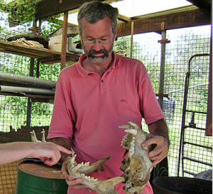
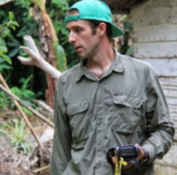

This week on “It’s Hot in Here,” hosts **_Mike Burbidge, Claire Poelking,_** and **_Katie Browne_** continued with the second part of the [Conservation Series](http://www.hotinhere.us/podcast/militarization-of-conservation-narratives-of-poaching/) with an in-depth discussion of ongoing efforts to curb poaching in Africa. Inspired by the visit of reknowned conservationist **_Craig Packer_** to the University of Michigan, we spoke with photojournalist and documentary filmmaker **_Kate Brooks_** about her first-hand experience at the epicenter of poaching, as well as with **_Drew Cronin_**, a researcher exploring how bushmeat off-take is affecting the abundance of primates in Equatorial Guinea.<!--more-->

Calling-in from the United Kingdom, Kate Brooks provided insights from her work on the poaching epidemic over the past three years in Kenya, Chad, and the Democratic Republic of Congo. After an early career photographing in war zones across the Middle East, Kate adopted a new tack after spending a year at the University of Michigan as a [Knight-Wallace Fellow](http://www.mjfellows.org/index.html) and is currently filming her forthcoming documentary “The Last Animals.” **_Kate_** discussed what park officials and community members are saying about poaching and what efforts and resources are needed to limit wildlife declines. She also pointed to the small successes in protecting African megafauna, while calling attention to the lack of legislation to address poaching systemically at the recent annual assembly of [CITES](https://www.cites.org/) in Geneva. For more on Kate’s work with “The Last Animals,” visit last week’s “It’s Hot Out There.

**_Dr. Drew Cronin_** joined us via phone from Drexel University to share his experience in Equatorial Guinea with the Bioko Biodiversity Protection Program (BBPP) and his research on the bushmeat trade.  **_Drew_** spent the past eight years studying both the effects of hunting on wildlife, particularly within primate populations, and demand-side drivers in the bushmeat market.  He discussed the transition on the island of bushmeat from a subsistence based harvest to a commercially driven luxury item.  He went on to explain the conservation efforts employed by the BBPP including economically sustainable education programs, research programs, and tourism ventures that demonstrate the greater value of wildlife alive, than dead as bushmeat.  For more information on Drew and the BBPP, visit [bioko.org](http://bioko.org/).

**Guests and Features**

  **Kate Brooks**

[**_Kate Brooks_**](http://katebrooks.com/) began her expansive career in Russia documenting the plight of orphans and starting a non-profit aid group at an institution outside of Moscow.  Since then she has worked as an international freelance photojournalists and war correspondent.  Shortly after 9/11, she moved to Pakistan to live and travel throughout the Middle East capturing the civilian costs of war.  Some of what she captured was released in her first book, [“In the Light of Darkness: A Photographer’s Journey After 9/11”](http://www.amazon.com/Light-Darkness-Photographers-Journey-After/dp/9053307583).  Since then she has continued to work extensively across the great Middle East photographing political turmoil and the impact of conflict on civilian populations.  In 2012-13, Brooks was a Knight Wallace Fellow at the University of Michigan, where she researched the poaching of elephants and rhinos for the documentary film project she is currently directing:  [“The Last Animals”](http://www.thelastanimals.com).  For more information on the soon to be released film check out their [facebook page](https://www.facebook.com/TheLastAnimals/) and [twitter account](https://twitter.com/thelastanimals).    

**Dr. Craig Packer**

**_Dr. Craig Packer_** is one of the foremost lion researchers in the world.  He is a Professor of Ecology, Evolution, and Behavior at the University of Minnesota and the Director of the [Lion Research Center](http://cbs.umn.edu/research/labs/lionresearch). Craig’s interests include ecology of infectious diseases, ecosystem processes in African savannas, and conservation strategies for mitigating problem-animal conflicts. His work has revealed the [evolutionary function of manes](http://cbs.umn.edu/research/labs/lionresearch/research/mane-research), the influence of prey density on the size of a pride’s territory, and the effects of drought on the spread of canine distemper virus in Africa.  Craig is the author of “Into Africa,” which won the 1995 John Burroughs medal and most recently [Lions in the Balance:  Man-Eaters, Manes, and Men with Guns](http://www.press.uchicago.edu/ucp/books/book/chicago/L/bo17372975.html) (a copy of which he graciously donated to the It’s Hot in Here family).  Beyond books, Craig has authored more than 100 scientific articles, most of which are about lions.

**Dr. Drew Cronin,** [Bioko Biodiversity Protection Program](http://bioko.org/about/)

**_[Drew Cronin](http://www.drewtcronin.com/)_** is a postdoctoral researcher with the Bioko Biodiversity Protection Program (BBPP) in the Biology Department at Drexel University. His research focuses on understanding the drivers and dynamics of bushmeat hunting and their impacts on primate populations on Bioko Island, Equatorial Guinea. Recently, he has been focusing on applied conservation, leveraging field data collected the by the BBPP to instigate the development of a management plan and targeted conservation interventions on Bioko. His other research interests include avian diversity and the ecology of Pennant's red colobus (_Precolobus pennanti_). Drew currently serves on the IUCN/SSC Primate Specialist Group, Africa Section and the Conservation Committee for the International Primatological Society.
