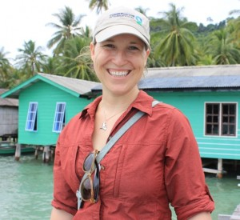

This week’s broadcast debuts a new partnership between IHIH and Michigan Sustainability Cases (MSC), a new case-based learning platform which integrates podcasts into sustainability curriculum. Hosts Katie Browne and Andrea Kraus first speak with Laure Katz of Conservation International about her role managing the transition of the Bird’s Head Seascape, from donor-supported to fully financially self-sustaining — in four short years. Suffice to say the demands of such a challenge live little time for sleep.

We are then joined in studio by Peter Pellitier, a student of both coral and soil, who conducted research in Papua New Guinea and the Coral Triangle a year ago. Peter speaks to the importance of protecting marine biodiversity, as a foundation of livelihoods and buffer against climate change, and the difficulty of sustaining homegrown conservation initiative.<!--more-->

### Laure Katz

Laure Katz is Director of the Seascapes Program at Conservation International, leading the Bird’s Head Seascape’s transition and fundraising efforts. Laure has a B.S. (Earth Systems, Oceans Track) and M.S. (Marine Ecology and Marine Policy) from Stanford, and is completing the final semester of her MBA in Global Business from the University of Virginia Darden School of Business.

### Peter Pellitier

Peter Pellitier is a first-year PhD student in the School of Natural Resources and Environment. After graduating from Pomona College in 2014, Peter was awarded a Fulbright research grant to travel to Kavieng, Papua New Guinea to study parrotfish diversity in coral reefs. While in Papua New Guinea, the bulk of Peter’s research shifted to understanding coral population diversity.

_Featured Image Credit:_ © Conservation International/photo by Sterling Zumbrunn.
