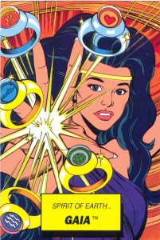

This week we took a break from the [exciting](http://www.hotinhere.us/2016/01/maintaining-the-lions-den-with-craig-packer/)\-but-[heavy](http://www.hotinhere.us/podcast/financing-biodiversity-conservation-the-case-of-the-birds-head-seascape/) [subject matter](http://www.hotinhere.us/podcast/last-animals-lasting-solutions-lions-the-last-animals-and-conservation-strategies/) that has occupied the It's Hot in Here crew as of late, in order to mull-over the legacy of Captain Planet--perhaps the most recognizable environmentally-themed character of the 21st century, the product of a children's television show no less!

\[caption id="attachment\_1272" align="alignright" width="201"\] Gaia - Captain Planet Dunkin Donuts Card (Photo by Mark Anderson)\[/caption\]

Although the show ceased production in the mid-90s, our blue-skinned, green-haired hero still pops-up at Halloween parties and climate rallies to this day.  What should we make of Captain Planet's legacy?  Is the show just a cheesy relic from the heyday of Saturday morning cartoons or can it also offer us a meaningful glimpse of popular environmentalism's past and present?

To this end, we sat down with three environmental thinkers to ponder clips from the show:<!--more-->

 **Bilal Butt**, an assistant professor at the University of Michigan School of Natural Resources and Environment (SNRE), talked about simplistic environmental narratives, starting with a discussion of a Captain Planet episode called [The Population Bomb](https://www.youtube.com/watch?v=oQ6jm13jH_k) (which references themes from a well-known [1968 work](https://en.wikipedia.org/wiki/The_Population_Bomb) by the same name).  He also discussed way in which popular children’s narratives about the African savannah predetermine who and what belongs on the landscape.

\[embed\]https://www.youtube.com/watch?v=iMZtug7zNyk\[/embed\]

**Mitchell Young**, a graduate student in nuclear engineering at UM and passionate advocate of nuclear energy as a means of limiting greenhouse gas emissions, shared his reaction to [Meltdown Syndrome](https://www.youtube.com/watch?v=qBdOFMXHUdw), a heavy-handed anti-nuclear polemic that nonetheless projects many of our collective fears about nuclear power.

\[In the segment we also mentioned a briefing by the [Union of Concerned Scientists](http://www.ucsusa.org/nuclear-power#.VrkPS_krLWI)\]

**Sara Goto**, a Phd student studying environmental decision-making at the SNRE, graciously watched several of [the PSA](https://youtu.be/6BzDhZ3zTUE?t=3)s shown at the end of each Captain Planet episode and reported back her impressions.  She went on to discuss how we decide to take everyday environmental actions, and the way in which policymakers "nudge" us onto team planet.

<iframe src="https://www.youtube.com/embed/6BzDhZ3zTUE" width="560" height="315" frameborder="0" allowfullscreen="allowfullscreen"></iframe>

This week's episode featured a [classy cover of the Captain Planet theme song](https://www.youtube.com/watch?v=_RNXXiY4KSg) by Zeek Power.

_Banner Photo by [Joe Brusky](https://www.flickr.com/photos/40969298@N05/12896651754/in/photolist-kDCHfJ-7iZnxh-s7BNeK-8y9MuJ-8y6JVz-kDAxur-ajF2gp-7xCfix-kDCKHj-hgHbxP-4gvkbS-kDwHyR-kDBs8b-7iZn9s-kDuuLk-7xd1KX-kDt2rx-8y9MD7-kDCXuq-kDuC4r-kDtRkD-kDwnC9-6no9R-9Y17Mf-7iZstL-kDsPEP-9wpJGj-9wpKrJ-7iVCbF-7iZqPf-7iZqiA-7iZtEy-7xvVqQ-9wmLez-7iZpH9-bZ4Ddq-9XXeUe-7iVyhT-9sEGox-4x11ic-7iZuew-9sEGMR-9sHGR9-9sHFC3-9sHHbG-9sHF93-9wmJ38-bZ4CzE-7iZDQA-7iZrwq)_
