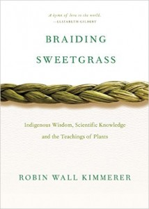
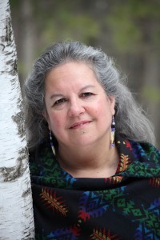
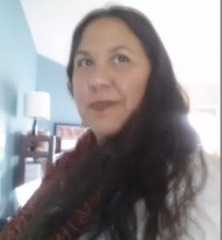
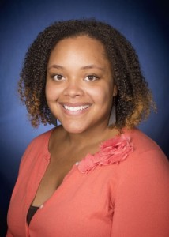

This week’s show wraps up a series of events at the University of Michigan School of Natural Resources & Environment featuring Dr. Robin Wall Kimmerer, author, teacher, and member of the Citizen Potawatomi Nation. A prominent voice in botany and restoration practices, Dr. Kimmerer is the author of the books [_Braiding Sweetgrass_](https://www.goodreads.com/book/show/17465709-braiding-sweetgrass) and [_Gathering Moss_](http://www.goodreads.com/book/show/87040.Gathering_Moss). As the focus of our show this week, _Braiding Sweetgrass_ informed our conversations about the interweaving of the traditional knowledges of science, ecology, and the teaching of plants.

Dr. Kimmerer beautifully articulates the importance of recognizing multiple knowledge sources and discusses the privileges and challenges of collaborations between different ways of knowing. The dialogue addresses how we might work towards environmental restoration: grieving the destruction of beloved land, respecting one another, and getting our hands in the earth to move toward healing and restoring our relationship with the land. Dr. Kimmerer reads an excerpt from her book, explaining the principles of reciprocity and the responsibility of language to promote that message.<!--more-->

Along with rich conversation, this show features a line-up of beautiful and powerful songs expressing themes of justice, hope and activism. One of the featured artists, The Chippewa Travelers, have been invited to the drum competition here in Ann Arbor at the [44th annual UM Dance for Mother Earth Powwow](http://powwow.umich.edu) on April 2nd and 3rd (see the previous IHIH episode [“Dance and Divest for Mother Earth”](http://www.hotinhere.us/1/post/2014/04/04042014-dance-divest-for-mother-earth.html) for coverage of this event a few years ago).

We want to thank Dr. Robin Kimmerer for generously sharing her time, thoughts, and writing with all of us involved in producing and listening to this episode of It’s Hot in Here! For more IHIH coverage of similar topics see our previous show, [“Traditional Ecological Knowledge.](http://www.hotinhere.us/1/post/2015/04/04032015-traditional-ecological-knowledge.html)” We hope this past episode, “Reciprocity with the Living Land” is one of many conversations to be had about ways to weave traditional ecological and scientific knowledges with the teachings of plants, and we hope you tune in next week for our Love Fest and some coverage of this week's food summit.

**Bios:**

Dr. Kimmerer is a Distinguished Teaching Professor at SUNY in Environmental Science and Forestry, and the Director of the [Center for Native Peoples and the Environment](http://www.esf.edu/nativepeoples/). She is a mother, a plant ecologist, and an award-winning writer. Dr. Kimmerer is the author of the books “Gathering Moss” and “Braiding Sweetgrass” in addition to many scientific and literary articles. She teaches courses at SUNY on botany, ecology, ethnobotany, and indigenous environmental issues, including a seminar on the application of traditional ecological knowledges to conservation. She is the co-founder and past president of the Traditional Ecological Knowledge section of the Ecological Society of America. Of European and Anishinaabe ancestry, Dr. Kimmerer is an enrolled member of the Citizen Potawatomi Nation. She lives on an old farm in upstate New York, tending gardens both cultivated and wild. Her work focuses not only on the restoration of ecological communities, but also the restoration of our relationships to land.

 

Carla May Dhillon is a PhD candidate in environmental social sciences at the University of Michigan School of Natural Resources & Environment, and a licensed Civil Engineer. Her doctoral research focuses on climate change, environmental inequality, and Indigenous-Settler studies. Carla has also researched uses of citizen science to pursue environmental justice in urban Southern California. She has over ten years of professional experience in engineering, green/ecological building, and appropriate technologies. Carla’s current research investigates collaborations in climate change science networks, and inequalities in climate adaptation.

Whitney Smith, a native Detroiter, is a second year Masters student in the School of Natural Resource and Environment. She received her BA in Environmental Studies at Wellesley College. Before attending Michigan she taught food justice and garden education in several African Centered Schools in Detroit, MI. Whitney is passionate about environmental justice, critical race theory, food justice, and ethnobotany of the African diaspora. Whitney also loves cooking and dance- especially West African and other diaspora dance traditions. After she graduates, she plans to continue to work with grassroots environmental justice movements.

Faith Cole is an undergraduate student in her second year at the University of Michigan. She is studying Spanish and International Studies with a focus on Global Environment and Health, ultimately hoping to study holistic approaches to issues of global and environmental health. From the Upper Peninsula of Michigan, Faith has a passion for the outdoors and the beauty of the Great Lakes region.
