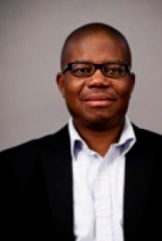
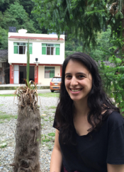
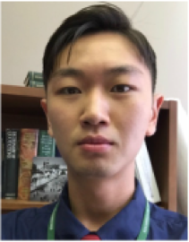

This week on _It’s Hot in Here_, hosts Amanda Kaminsky, Neal McKenna, and Brendan Wu discuss China-Africa relations with Dr. Omolade Adunbi, an Assistant Professor in the University of Michigan’s Department of Afroamerican and African Studies. Amanda, Neal and Brendan are all students in Dr. Adunbi’s new winter course, _When China Comes to Town: Environment and the Politics of Development_ (AAS 458)_._ The course covers Chinese foreign development policy in Africa and across the Global South.

Our show features a conversation about the social and environmental implications of Chinese infrastructural investment across the African continent. We begin by discussing Dr. Adunbi’s research on wealth distribution in the Niger Delta, which he investigates extensively in his new book [_Oil Wealth and Insurgency in Nigeria_.](http://www.amazon.com/Wealth-Insurgency-Nigeria-Omolade-Adunbi/dp/0253015731) Our conversation focuses on urban reconstruction in Lagos and Chinese investment in a new project called the [Lekki Free Trade Zone](https://www.eiseverywhere.com/file_uploads/4c89fc4ccf7b9b01305474f571ba12b3_LFZ_InvestmentGuide.pdf). Next, we examine the cultural dynamics of South Africa’s longstanding Chinese communities, drawing from a lecture given by Dr. Yoon Jung Park in New York in 2012 (watch the full lecture [here](https://www.youtube.com/watch?v=hqLW6XymO9k)). Finally, we explore the economic and environmental implications of China’s rising middle class through the eyes of Amanda, Neal, and Brendan, each of whom spent several years living in China. For more information on China-Africa relations, including podcasts and the latest news stories, check out [The China Africa Project](http://www.chinaafricaproject.com/).

The show features music from artists who have embraced global cultural exchange, including Beijing-based Mongolian rock band [Hanggai](https://www.youtube.com/watch?v=TT3yP8DPGDg), Nigerian singer [Stephen Uwechue](https://www.youtube.com/watch?v=SOTKypcKCaA) who has become a pop sensation in China, and dub/reggae group [Laohei](https://soundcloud.com/the-sound-stage/3lhljxuyntrk) from the southwestern Chinese province of Yunnan.<!--more-->

### Guests and Hosts

**Dr. Omolade Adunbi i**s a political anthropologist and Assistant Professor at the Department of Afroamerican and African Studies (DAAS). His areas of interest include resource distribution, governance, human and environmental rights, multinational corporations and the postcolonial state. His current research explores wealth and power in the oil-rich communities of the Niger Delta region, where he examines transnational capital and civil society organizations. His newest book, [_Oil Wealth and Insurgency in Nigeria_](http://www.amazon.com/Wealth-Insurgency-Nigeria-Omolade-Adunbi/dp/0253015731), investigates contestations over wealth within Nigeria’s oil industry and how they are producing unique forms of power, governance, and belonging.

**Amanda Kaminsky** is a master’s student in the School of Natural Resources and Environment. She spent two years living in several Chinese cities working as an education consultant and interning with The Nature Conservancy. Her academic interests include China-Africa relations, animal studies, and the ethics of nature conservation. She is currently researching the Chinese nature-based tourism industry in Kenya. 

**Neal McKenna** is an M.A. Candidate at the Lieberthal-Rogel Center for Chinese Studies. He lived in Beijing for two years and developed an interest in Chinese media and how different media can challenge or reinforce the authority of the Chinese Communist Party. His current research focuses on how social media affects notions of nationalism and political efficacy among Chinese citizens.

**Brendan Wu** is an undergraduate in the LSA College studying political science and international studies. Prior to university, he spent four years living in Beijing where he became interested in the politics of China and its place as a rising economy in the world.
