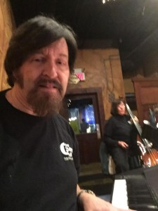
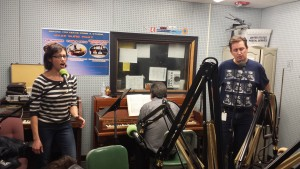

Remember that edgy ["out there" episode](http://www.hotinhere.us/podcast/urinetown-arts-in-our-parks-and-the-future-of-peecycling/) of Its Hot in Here where talented artists sang live tunes from the Tony Award winning musical Urinetown, while talented scientists talked to us about  research  on "peecycling" (or the recovery on nutrients from urine for use in agricultural fertilization?)  Along the way we considered infrastructure (including urinals!) in our greenways and parks, and how more art and science can be showcased in our public spaces.

Well,  they're back. For the dead of winter spring break in our studios we welcomed the talent behind the  [Penny Seats Theatre Company](http://www.pennyseats.org/)’s recent cabaret style show  _Jacques Brel is Alive and Well and Living in Paris._  Fresh from their sold out, critically acclaimed performances at the downtown pub [Connor O Neill's,](http://www.conoroneills.com/annarbor/) we head from guests including _c_ast members **Lauren London** and **Roy Sexton**, show director **Laura Sagolla**, and musical director **Richard Alder**.

[Jacques Brel](https://en.wikipedia.org/wiki/Jacques_Brel) is a famous Belgian singer-songwriter who wrote his songs in French during the 1960s. Through his art he became extremely well-known in France, to the degree that the French recognize Brel the way Americans know Bob Dylan or Joni Mitchell. The show, originally produced in 1968 off broadway, is a revue of Jacques Brel's music and explores the universal emotions of love, loss, fear, obsession, and hope. Brel's work is laden with pathos, yet also lighthearted.<!--more-->

During our one hour radio show the cast and crew offer insights and takeaways from the _Jacques Brel_ _is Alive and Well and Living in Paris_ show. They go into the origin of the show and the story behind the production, including why they brought the show onto the local stage and how the music came together. **Laura** shares with us her story of being moved by Jacques Brel songs growing up, how it resonated with her and why she brought the show to the Penny Seats.  **Roy** and **Lauren**, with **Rich** playing piano in the background, bring their characters to life through on-air musical performances while also delving into their impressions of the characters they reenact. Their insights are a must hear and the tunes include _Amsterdam_, _I Loved_, _Mathilde_, _Marieke_, and _If We Only Have Love_.Learn even more from their press release: [The Penny Seats announces upcoming season](http://www.encoremichigan.com/2015/11/the-penny-seats-announces-upcoming-season/) and [Penny Seats adds a performance of “Jacques Brel” in Ann Arbor](http://reelroyreviews.com/2016/02/27/frank-weir-photographs-february-25-jacques-brel-performance/). For pictures of the show, refer to [this post on Reel Roy Reviews](http://reelroyreviews.com/2016/02/27/frank-weir-photographs-february-25-jacques-brel-performance/).

The Penny Seats produce wintertime shows  in intimate settings and summertime shows in Ann Arbor's City Parks,  in  a crusade to bring quality theatre experiences to the Ann Arbor community at or less than the cost of a movie ticket.  Two distinctly  hilarious and entertaining shows for this summer at West Park are:

- The Canterbury Tales, adapted from the book by Geoffrey Chaucer - on stage Thurs, Fri, and Sat, June 16 – July 2

- Xanadu, book by Douglas Carter Beane; Music and Lyrics by Jeff Lynne and John Farrar; the 2007 Broadway Musical Comedy Xanadu, based on the 1980 film of the same name - on stage July 7-23.

You can get involved,  find out more about auditioning or production work for the Penny Seats Theatre Company, and check out ticket availability at http://www.pennyseats.org/.

### Guest Bios

**Richard Alder**

**Rich Alder** is the Musical Director for _Jacques Brel is Alive and Well and Living Paris_. **Alder** is from Westland, MI, which serves as his base of operations for performing with theatre groups across southeast Michigan. He has been involved in more than 370 productions with different groups. _Jacques Brel_ is his second show with the Penny Seats Theatre Company and his first show was the _Urinetown_ in July 2015. **Alder** will also serve as the Musical Director for Penny Seats' upcoming 2016 summer shows. Alder is a graduate of the University of Michigan School of Music and a retired public school music teacher. He frequently engages as a substitute church organist, woodwind clinician, and solo and ensemble accompanist.

**Lauren London**

**Lauren London** is the co-founder and President of the Penny Seats Theater Company and works year-round to create local partnerships and performance opportunities for the group.  She has been a performer for over 25 years and has appeared in numerous professional, amateur, and community theater productions in Virginia, Maryland, Wisconsin, and Michigan, with an emphasis on musical theater. **London** acted as the main character in the _Jacques Brel_ show and her recent roles with The Penny Seats include Belle in _Little Me_, Constance in _Goodnight_, Desdemona in _Good Morning, Juliet_, and Amalia in _She Loves Me_. In addition, Lauren directed the Penny Seats' _Urinetown_ and _Tomfoolery_ productions 2015.  By day, she is the Associate General Counsel at Eastern Michigan University.

**Roy Sexton**

**Roy Sexton** is the co-founder and board member of the Penny Seats Theater Company. He is a main character in the _Jacques Brel_ show and other shows he involved with the Penny Seats include _Urinetown_, _Tomfoolery_, _Little Me_, _She Loves Me_, _What Corbin Knew_, and _Goodnight Desdemona_. **Sexton** has published two books under the title [Reel Roy Reviews](http://www.reelroyreview.com). Sexton holds a B.A. in English and Theatre from the Ohio State University and an M.B.A. from the University of Michigan and is now in the Senior Vice President role for Corporate Affairs at Trott Law, P.C., Farmington Hills, MI.

**Laura Sagolla** 

**Laura Sagolla**  is the director of the _Jacquis Brel_ show which ultimately brought it to the Penny Seats Theatre Company.  **Sagolla** is the Vice Chair of the Penny Seats Board of Directors and a past performer in Penny Seats shows, such as _She Loves Me_ and _Tomfoolery_. She also is a jazz vocalist, and by day an attorney with the United States Department of Justice.

**Pictures from today's show:**

\[caption id="attachment\_1315" align="alignnone" width="300"\] Lauren singing Marieke from the Jacques Brel show in Dutch, with Roy singing in the background, and Rich playing the piano.\[/caption\]

\[caption id="attachment\_1316" align="alignnone" width="300"\] Our guest Laura and in studio audience David enjoying Lauren and Roy's performance.\[/caption\]

\[caption id="attachment\_1317" align="alignnone" width="300"\] In studio production pictures by Roy.\[/caption\]

\[caption id="attachment\_1327" align="alignnone" width="474"\] Today's production team - from left to right, host Pearl Zeng, audio engineer Cameron Bothner, guest Laura Sagolla, guest Lauren London, guest Rich Alder, guest Roy Sexton, and host Sam Molnar.\[/caption\]
