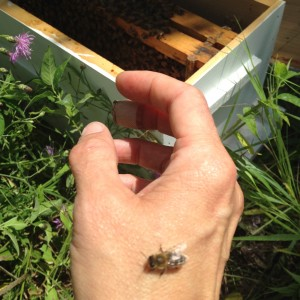
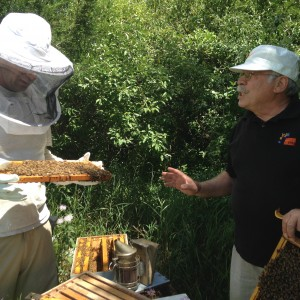
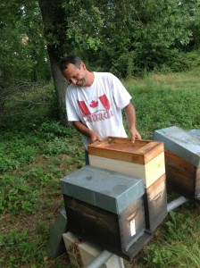
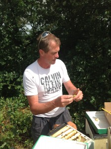

Last week we rebroadcast an [interview from two springs ago](http://www.hotinhere.us/podcast/3-28-14-buzzzzzz-whats-that-sound-its-the-um-bees/) with Rich Wieske of [Green Toe Gardens](http://greentoegardens.com/site/) in Detroit, and Mike Bianco, who is one of the founding members of the buzzing [UMBee](https://www.facebook.com/UMBees/)[s Group](https://www.facebook.com/UMBees/) .  Mike is now pursuing his apicultural activism in a PhD program in Australia. The UMBees group is still active on our campus and its botanical gardens and farm.

Not up to date on the perils of "big pollen" for our bee population? Not sure why bee colonies aren't actually hierarchies that follow a "queen" but actually bend to the will of their workers, which is what makes them sucessful? Wondering why Michigan is a key site for keeping northern bee populations strong enough to resist extreme weather eventsl? Listen and learn...

Those who heard this interview the first time around will be glad to know that the honeybees we called the  "Detroit Girls" who Rich brought out to Grass Lake Michigan to live on Joe Trumpey's [Sandy Acres Farm](http://www.jtrumpey.com/project/sandy-acres-farm/) overwintered again, for the third year in a row! Photos are from last spring's inspection of the colonies by Rebecca, Joe and Rich, who came out to the country to select a frame of brood. He was happy to take young from these strong girls back to the city colonies who were rearing queens, so as to promote whatever genetic traits are making these girls so good at getting through the winters.  Sure, this  year was less tricky than the last few severe winters, but it is still a triumph when colony loss rates are so high all around us.   These days the Detroit Girls are out working hard  with the early spring nectar flow, making Grass Lake's farms more productive. 

Rebecca hopes to head over to France this summer for another field visit with her friends [Philippe Huau and Jean Francois Mallein](https://www.facebook.com/Altigoo-Apiculture-137665102935240/timeline), pictured above, founders of the outrageously productive [Ruchers de Cocagne](http://www.altigoo.com/?lang=fr) in the countryside around Toulouse, France. Their queens are stemming the tide of colony loss across Europe, while their large scale, scientifically oriented operation develops in partnership with local farmers, but also amidst debates about the limits of manipulation of bees in the face of colony collapse disorder and other challenges.  Stay tuned for a video glimpse of how hot it is out there in the beeyards of southern France, coming up soon.
