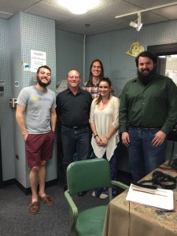
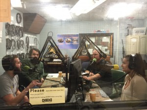

This week's It's Hot in Here segment delves  into the state of dams across our country's river systems.  We are joined on this expedition by Dr. [Paul Moore](https://www.bgsu.edu/arts-and-sciences/biological-sciences/faculty-and-staff/alphabetical-listing/paul-moore.html), who brought members of his research team  up from [Bowling Green State University](https://www.bgsu.edu/) to shore up our knowledge before their teaching and fieldwork at the UM Biostation this summer.

<!--more-->Paul Moore received a B.S. in Oceanography from University of Michigan in 1986, and a Ph.D. in Marine Biology from Boston University in 1990. He joined Bowling Green State University as an Assistant Professor of Biology in 1994. Next, he became an associate professor in 1999 and a full professor in 2002. During this time, he began working at the biological station, and started teaching there in 2000. Working up north, he has taught courses in streams and rivers and limnology. His expertise is in crustacean biology and chemical ecology, and he has published almost 100 papers on related topics.  Also, he currently has a popular science book (published last year) on the sense of smell called “[The Hidden Power of Smell: How Chemicals Influence Our Lives and Behavior](http://www.amazon.com/The-Hidden-Power-Smell-Chemicals/dp/3319156500)” which is available on amazon.

Alex Neal is pursuing her PhD in the Laboratory for Sensory Ecology at BGSU.   Ecotoxicology is her primary research interest and will be the focus of her dissertation in the years to come. Alex is concerned about how ecological research is applicable to the real world and wants to use her knowledge to help bridge the gap between the non-scientific and scientific communities.

Tim Ludington received a B.S. in Ecology and Evolutionary Biology from the University of Michigan in 2014 and a M.S. in Biology from Bowling Green State University this year: “Realistic exposure to a pesticide elicits varying behavioral responses in an aquatic organism depending on flow conditions.” Traditional measures of toxicity do not account for variation in flow in natural settings; Tim has shown varying toxin impact on crayfish behavior, depending on the turbulence of the water in their ecosystem.

 Moore and his colleagues have been gathering data about a dam on Lake Cathleen in northern Michigan. They are conducting the first large scale research project that explores the ecological state of the waterways before and after a dam has been removed. But their work also confronts social difficulties in the decision to either [remove](http://news.nationalgeographic.com/news/2011/10/111028-condit-dam-removal-video/) or repair dams.  Oregon and California have seen these challenges, as they have wavered for some time on removing the dams of the [Klamath River](http://indiancountrytodaymedianetwork.com/2016/04/14/saving-salmon-feds-states-tribes-sign-new-plan-demolish-four-klamath-river-dams-164139) to allow salmon to move up stream.

To hear more about the difficulty in removing dams, and plenty of dam puns, listen to the show! If this hour isn't enough to satisfy, [American Rivers](http://www.americanrivers.org/initiatives/dams/faqs/) is an excellent source of further information. Our next blogcast will hone in on the [exxpedition](http://exxpedition) of women researchers, educators and activists working in summer 2016 to raise awareness about plastics contamination in the Great  Lakes and rivers of our region.   Don't touch that browser...
