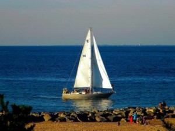
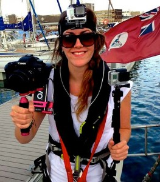

After a journey across the cold waters of the Atlantic Ocean in a small sailboat, [Jen Pate](http://www.jenniferpate.com/), director of [eXXpedition](http://exxpedition.com/): _Seeing the Unseen_, had a breezy time in the studio with hosts Harry Rice and Arman Golrokhian.  Jen was in Ann Arbor to show the documentary as part of the Earth Day Film Festival.  The film follows an all-woman team as they cross the Atlantic Ocean, assessing the load of plastics in the ocean and exploring the burden that toxic chemicals from these plastics place on our bodies.

* * *

> _For more on the science of ocean plastics, check out this conversation with [Melissa Duhaime](http://www-personal.umich.edu/~duhaimem/), Assistant Research Scientist at the University of Michigan Department of Ecology and Evolutionary Biology--produced by undergraduate students of the_ Program in the Environment_:_

\[audio mp3="http://www.hotinhere.us/wp-content/uploads/2016/04/tony-dylan-brianna-environ256-ocean-pollution-podcast.mp3"\]\[/audio\]

_[Download](https://umich.box.com/shared/static/w34532lz7scj73xs1e5lujed6mm7neup.mp3)_

* * *

 

<!--more-->

In studio, we delved deeper into how she found her way aboard the Exxpedition's _SeaDragon_ sailboat with a group of talented women of all agaes and some of the struggles about being on the boat. In particular, we skimmed across the difficulties in capturing footage on the water. Yet, some of the most exciting news came out of their future plans to not only continue these eXXpeditions but also to broaden their scope, bring citizen-science efforts to our own backyard: [the Great Lakes](http://exxpedition.com/greatlakes2016/).

If you want to hear all about the film, what's next for Jen, and ways to impact our planet be sure to check out the show.

Jen is a geographer and filmmaker fascinated by human-environment interaction. She has a BA in Geography and an MSc in Environment, Science & Society (Distinction) from the University College of London. Her research has explored the experiences of 'environmental subjects' in UNESCO Biosphere Reserves, the role of film as an emancipatory pedagogy for environmental education, as well as geographies of health and biological identity. She also owns the [Windmill Lake and Eco Park](http://www.windmill-lake.ca/#!about_us/csgz) and [Your Frontier](http://www.your-frontier.com) film company. We are honored to have had Jen on the show.
