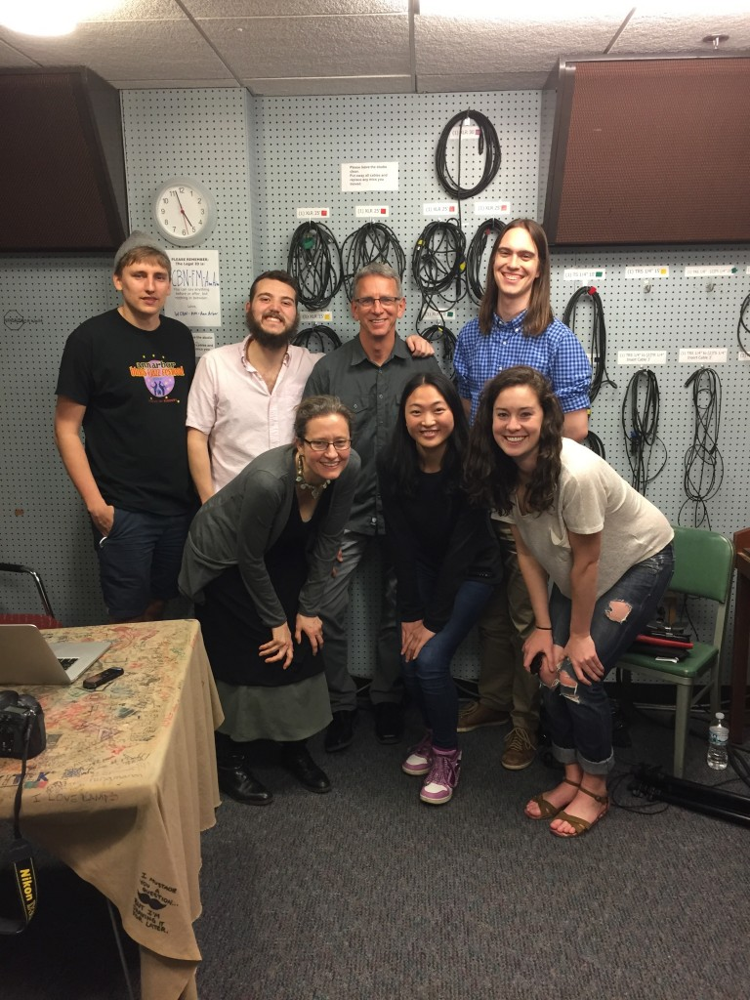

We have all heard of a carbon footprint. But what is an Ecological Handprint? Professor [Rocky Rohwedder](http://www.sonoma.edu/ensp/faculty/faculty/rocky-rohwedder.html) of Sonoma State University, and a University of Michigan alum, joined us here at IHIH to discuss just that.

Rocky Rohwedder has focused his many years of research on environmental science, sustainable development, green technologies, and digital communications. He has recently combined all these areas on interest into an [e-book](https://ecologicalhandprints.atavist.com/) called Ecological Handprints, filled with outstanding photographs and stories of hope, inspiration, and innovation.

<!--more-->

Ecological Handprints, a term coined by Rohwedder, are the integrated solutions to the humanitarian and ecological conditions we face today. Rocky has travelled around the world on [Semester at Sea](http://www.semesteratsea.org/), hopping off the ship to explore communities in developing countries and the innovative ideas they have employed to ecologically combat issues of access to lighting, water, and clean cooking. In this hour, Rocky talks about a few of his favorite Handprints with us, like [Solar Sister](https://www.youtube.com/watch?v=dTjAc46sRIU&feature=player_embedded) – a company that is eradicating energy poverty by empowering women with economic opportunity – and his opinions on the keys to Handprint success: affordable, local, woman empowered, digitally enhanced, and creatively financed.

<iframe width="560" height="315" src="https://www.youtube.com/embed/70FY8UP0HNM?si=gGOVm_hG_Fs-5hlx" title="YouTube video player" frameborder="0" allow="accelerometer; autoplay; clipboard-write; encrypted-media; gyroscope; picture-in-picture; web-share" referrerpolicy="strict-origin-when-cross-origin" allowfullscreen></iframe>

To hear more from Rocky himself, take a look at his [Ted X](https://www.youtube.com/watch?v=70FY8UP0HNM) talk! Check out the stories of hope, inspiration, and innovation in the [Ecological Handprints](https://ecologicalhandprints.atavist.com/) e-book. You can also follow Ecological Handprints or share your own on Ecological Handprints’ [Facebook](https://www.facebook.com/ecologicalhandprints/) and [Twitter](https://twitter.com/EcoHandprints).

 
 Production team: front row left to right: Rebecca Hardin, Pearl Zeng, and Claire Poelking; back row left to right: Ed Waisanen (audio engineer for today's episode), Harry Rice, Rocky Rohwedder, and Cameron Bothner.
