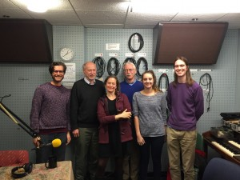

It was hot and heavy in the studio this week as _Rob Wolcott_, retired senior counsel at the Environmental Protection Agency, and _Paul Mohai_, Professor at the School of Natural Resources and Environment, joined hosts Ember McCoy, Austin Martin, and Rebecca Hardin to talk about the decision to mandate removal of lead from gasoline and the enduring, harmful lead levels throughout the country.<!--more-->

Both guests have been pioneers in confronting racial disparities in exposure to harmful pollutants and their discussion about the past, present, and future of these issues, comes in the midst of the ongoing lead contamination crisis in Flint, Michigan.  Our guests shed some light on this specific case but also reminded us that minorities face an increased risk of exposure to lead and other pollutants in many places across the country, adding that we must work to ensure justice for people everywhere.

Mr. Wolcott served as advisor to the EPA Administrator on the topic of environmental justice/equity and chaired the Agency Work Group that produced the 1992 report _Environmental Equity: Reducing Risks for All Communities_. This groundbreaking report was the first acknowledgement by the EPA, or any agency of the federal government, that environmental injustices in the U.S. are a serious problem and that the EPA needed to craft policies to deal with them.

Dr. Paul Mohai's teaching and research interests are focused on environmental justice, public opinion and the environment, and influences on environmental policy making. He is a founder of the Environmental Justice Program at the University of Michigan, and his current research includes understanding the causes of disproportionate environmental burdens in people of color communities and the role that environmental factors play in accounting for racial and socioeconomic disparities in health.
