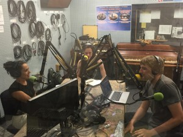

It's summertime and our backyards are abuzz with bees!

This week we took time out to learn about the oft-overlooked wild bee.  We were surprised to learn that there are, in fact, thousands of wild bee species all around us and that, like honeybees, some of these wild species are in decline.  Our guest experts described the trials and tribulations of wild-bee research, the contribution of wild bees to agriculture, how bees do in urban areas, and how we can be better stewards to these unsung heroes (hint: don't mow your lawn!)

We were joined by Maria Carolina Simao_,_ PHD Candidate in the _UM School of Natural Resources and Environment_; Rebecca Tonietto, Postdoctoral Research Fellow at _St. Louis University_; and Michelle Fearon, PHD Candidate in the _UM Department of Ecology and Evolutionary Biology_.

As promised during the broadcast, the following links will aid you on your on your path to becoming a wild bee hero (or at least impressing your friends with your wild bee knowledge):

- More bee information and citizen science at [beespotter.org](http://beespotter.org)
- [The Xerces Society](http://www.xerces.org/) for Invertebrate Conservation
- [Patuxent Wildlife Research Center](http://www.pwrc.usgs.gov/ "Patuxent Wildlife Research Center"), which offers manuals and images for wild bee identification
- [More bee identification!](http://www.discoverlife.org/mp/20q?search=Apoidea)
- Amazing [bee photos by Sam Droege](https://www.flickr.com/people/usgsbiml/) for the USGS Native Bee Inventory and Monitoring Program (including our banner photo)
- [Why are bees important?](http://nativeplants.msu.edu/pollination)
