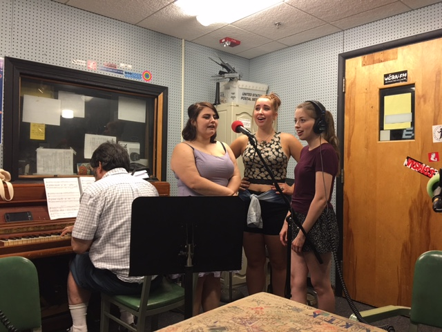
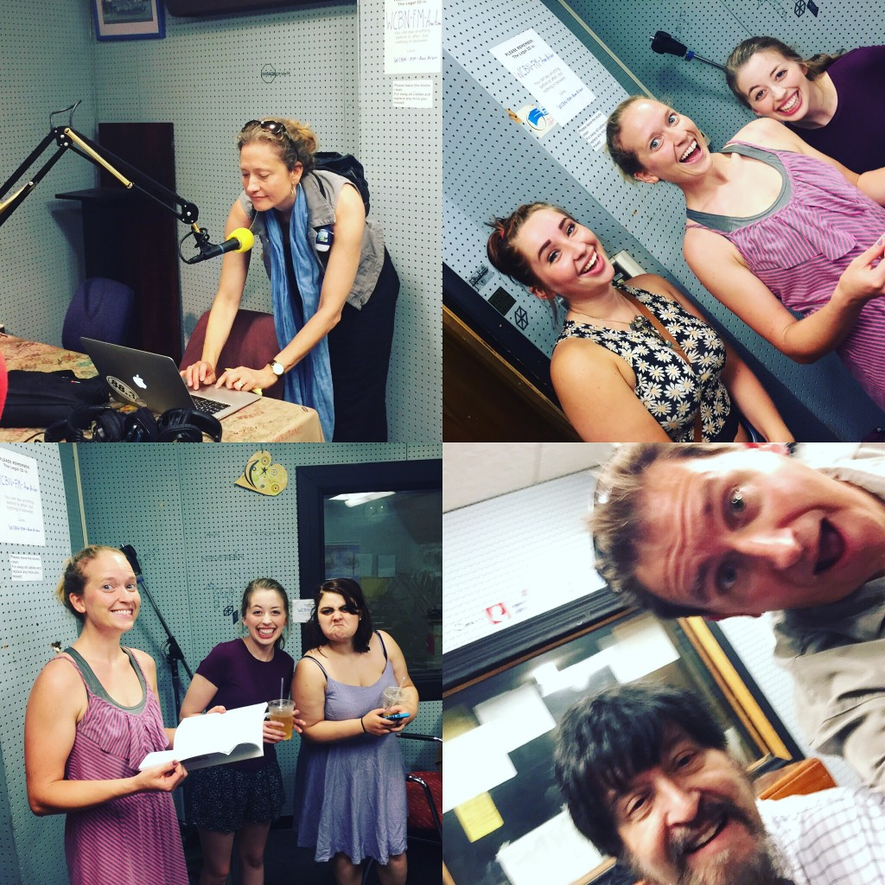
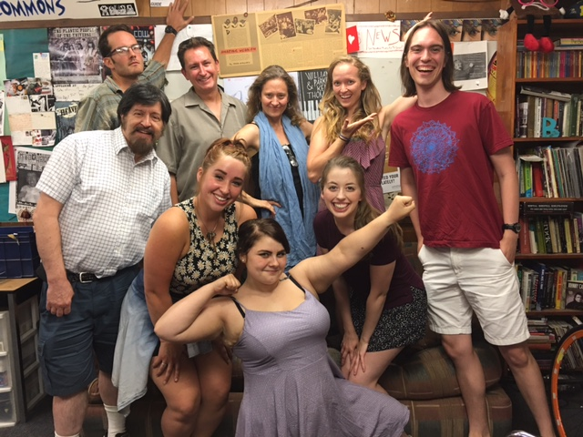

We were delighted once again to welcome members of Ann Arbor’s Penny Seats Theatre Company to talk theater in the parks and perform a few tunes from their ongoing show. Xanadu is an outrageous show that defies simple explanation: suffice it to say the Muses go to Venice Beach to inspire a sidewalk chalk artist to open a roller disco. You really have to see it to believe, but hearing them sing a few numbers and talk about their process on today’s show is sure to pique your interest. Xanadu runs through July 30th, Thurs.–Sat. at 7 PM in the West Park Band Shell. You’ve only got a week left!<!--more-->

Today we welcomed **Allie Simmons**, who graduated in 2015 from Hope College with a BA in Musical Theatre. She’s been working across Michigan over the last year, but we were lucky enough to get her in studio before she moves to Atlanta, GA—only a week after Xanadu closes!—to pursue her acting career. Allie plays Calliope, the ditzy side-kick to **Kasey Donnelly**’s Melpomene, the muse of tragedy. Kasey, a recent EMU grad with a degree in Theatre Arts, was type cast for her role in Xanadu: with a flare for the dramatic, she’s been told she’s a real life “Evil Woman.” Look for her in other productions in this area: she’s blowing up in the MI theatre scene. These two, as well as a couple of “boy muses” who couldn’t make it, are led by **Paige Martin**’s character, Kira, who puts on an Australian accent, as well as roller skates and leg warmers, to blend in with mortals in 1980. Paige is a PhD student in Physics at the U of M who is working with Prof. Brian Arbic on climate dynamics.

We would be remiss not to mention the efforts of **Rich Alder**, the music director for the Penny Seats Theatre Co., whose fingers on the piano are heard more in this broadcast—although listen for his breakdown of the classic film references that underscore the whole show. **Kristin McSweeney**, a recent graduate of EMU theatre, also joined us in the studio. You’ll hear her as a vocalist if you listen close during the songs. And of course we were happy to have **Roy Sexton**, a graduate of the UM School of Business with a number of stage credits to his name, and the man almost entirely to blame for this ebullient show being chosen, cast, and produced in West Park! For previous performances in our studios by Penny Seats talent check out the [Urinetown show from last summer.](http://www.hotinhere.us/podcast/urinetown-arts-in-our-parks-and-the-future-of-peecycling/) For more information about upcoming performance or to get tickets, see the [Penny Seats website.](http://www.pennyseats.org/) 

