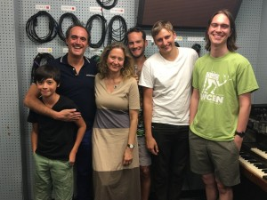
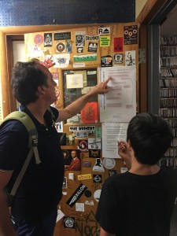

Economist Ghislain Dubois does lots of quantitative analyses of environmental policy and practice, including field studies of households in Europe, and specialized treatments of large datasets. He has taught in Universities from Versailles to the Sorbonne and Aix en Provence and is currently working on projects about the future of water resources in the middle east, as well as running games and surveys to assist families, home owners and businesses with carbon reduction scenarios for their future.

Ghislain came of age in the wake of the first Rio summit, and <!--more-->embraced  a career contributing to better understanding and action on global scale environmental problems. After early works on ecotourism and sustainable development in his native Mediterranean coastal region he completed a PhD in economics. In 2001 he founded [TEC Conseil](http://www.tec-conseil.com/), a  private consulting firm and small research lab investigating energy and climate issues.

Recent TEC projects focus on GHG mitigation policies, climate change adaptation and climate services (analyzing climate related datasets in innovative and accessible ways for both public and private clients).  Ghislain talks frankly  to hosts Rebecca Hardin, Ed Waisanen and Mike Burbidge about the products and processes in his work as a researcher and consultant.  But we also dig deeper, drawing out his nearly 12 year old son about their struggles  to cut their household carbon footprint in half.

How hard was it? How did they do it? Check out the podcast here to get personal AND professional about reducing carbon consumption and planning for climate change.  Or just tune in if you like French wave electronic music and a Marseille-style party soundtrack featuring Nasser, Massilia Sound System, China Man and Goldenberg and Schmuyle, all tracks recommended by our father/son team of bon vivants who are also bienfaisants.  It's hot!
