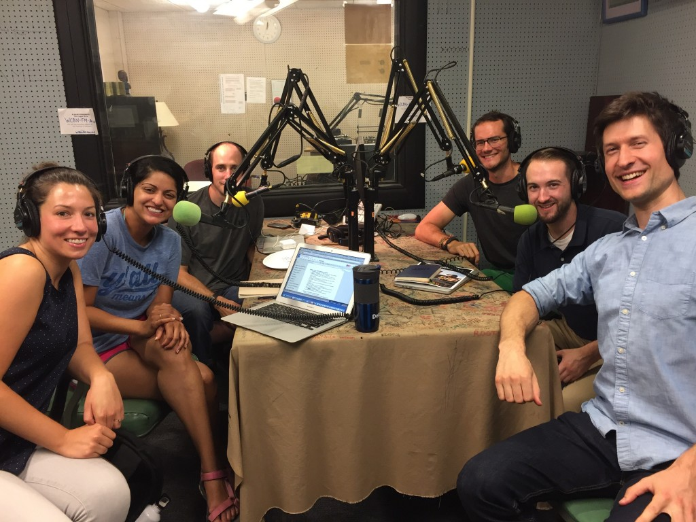
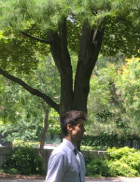

This week’s episode on _It’s Hot in Here_ highlights the 2016 Ross School of Business [iMpact Challenge](http://michiganross.umich.edu/sanger/impact-challenge) and how social entrepreneurship food ventures can address food access and affordability issues in Detroit.  

As part of Ross’s MBA orientation program, incoming students receive a 72-hour challenge to work intensely with their newly formed MBA section, to ideate, create, and pitch a profitable venture with a social mission in Detroit. It begins with a series of workshops, community conversations, team challenges, and pitch competitions that engage more than 400 students across five academic programs at Ross.

In the studio we welcome **Jeff Domagala,** Associate Director for MBA Programs at the Sanger Leadership Center, who helped create this year's iMpact challenge; **Jeff Tenza,** former IHIH host/engineer, who co-led a tour of students to interview Ann Arbor food entrepreneurs at Argus Farm Stop, Washtenaw Food Hub, and Tilian Farm Development Center.  Remaining mics were surrounded by members of the incoming winning section, Section 5: **Vaish Shastry,  Nancy McDermott, and John Barbour**.

We discuss the theme, the experience, the people, and the way a group of initial strangers developed a program which utilizes “cosmetically challenged” food to create prepared meals served on wheels.

<!--more-->

 

**GUESTS**

**Jeff Tenza** grew up in Ann Arbor, studied photovoltaics while earning a Bachelor’s degree in electrical engineering at U of M, and now works for the Ross Registrar’s Office. He has also been a data specialist for the Cleantech Venture Network, a local organic farmer, and a WCBN public affairs host for IHIH and other shows. During the 2016 iMpact Challenge, Jeff co-led a tour of MBA students to interview Ann Arbor food entrepreneurs at Argus Farm Stop, Washtenaw Food Hub, and Tilian Farm Development Center.

**Jeff Domagala** currently serves as the Associate Director for MBA Programs at the Sanger Leadership Center at the Ross School of Business. Although a Michigan native, his most recent leadership development experiences come from his past role coordinating leadership development initiatives at Pace University in New York. His passion is helping others find their potential. Jeff received his Masters degree in College Student Affairs Leadership from Grand Valley State University.

******Vaish Shastry** is a first year MBA at the Ross School of Business. Prior to Ross, Vaish worked as the director of an education nonprofit in the Mississippi Delta for three years. She is also a  Teach For America alumna and has worked in database management and data analytics for KIPP: New Jersey.

**Nancy McDermott** is a first year MBA and has spent the past 8 years working in the nonprofit sector and is is passionate about finding innovative ways to connect individuals to opportunity. Most recently, she worked as the Director of Program at Year Up, a workforce development program that provides training and support to talented young adults in accessing careers in technology. As a first year student at the Ross School of Business, she looks forward to leveraging her MBA to continue her career in Human Capital Management.

**John Barbour** is a first year MBA at the Ross School of Business. Prior to Ross, John worked for eight years in international development focusing on entrepreneurship and food security. He spent three years as a Peace Corps volunteer in the Republic of Guinea and Burkina Faso and five years in Washington, DC working in varying capacities with  agribusiness entrepreneurs in sub-saharan Africa.

**LINKS**

[FoodLab Detroit](https://foodlabdetroit.com/) is a diverse community of food businesses and allies working to make good food a sustainable reality for all Detroiters.

[FoodPLUS](http://foodplusdetroit.org/) Detroit is a local partnership network comprised of business, government, societal, cultural and community organizations and knowledge institutions.

[Ross School of Business](http://michiganross.umich.edu/)
